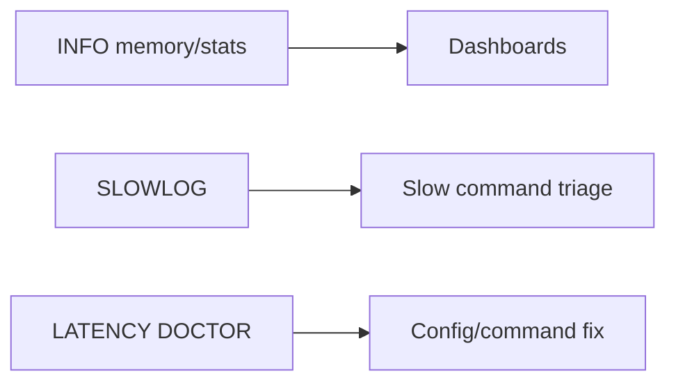
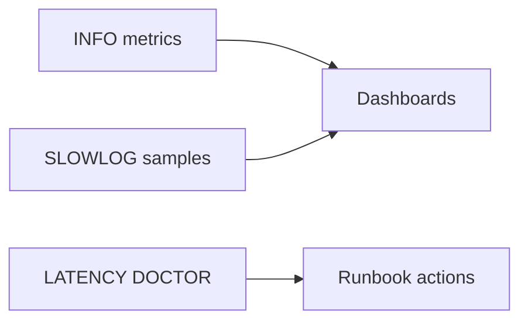

## Quick Revision

- Build dashboards from INFO, slowlog, and latency diagnostics.
- Alert on replication lag, memory pressure, and connection saturation.
- Keep runbooks linked to troubleshooting decision trees.

## Core Concepts

| Signal | Why monitor |
| :--- | :--- |
| Latency by command | Detect event-loop blocking behavior |
| Replication lag | Detect durability and read-freshness risk |
| Memory trend | Detect leak-like growth and fragmentation |
| Reconnect spikes | Detect failover or network instability |

## Internal Working





## Architecture

Monitoring should map directly to SLOs and incident response ownership.

## Design Tradeoffs

| Choice | Tradeoff |
| :--- | :--- |
| Dense metric collection | Better diagnostics, more telemetry cost |
| Frequent polling | Better freshness, more monitoring overhead |

## Production Patterns

- Keep baseline dashboards per deployment topology (standalone, Sentinel, Cluster).
- Include command-family split for latency and volume.

## Scalability

Monitor per-node and per-shard imbalance to detect hidden hot spots.

## Reliability

Alert quality matters more than alert quantity; tie thresholds to user impact.

## Observability

### Folded Command Reference

## Executive Summary

Production **admin**, **key**, and **debug** commands — bookmark this page for on-call.

---

## Core Concepts

| Category | Commands |
| :--- | :--- |
| **Server** | `INFO`, `CONFIG GET/SET`, `SHUTDOWN`, `SLOWLOG` |
| **Keys** | `DEL`, `UNLINK`, `EXISTS`, `SCAN`, `TYPE`, `TTL` |
| **Debug** | `LATENCY DOCTOR`, `MEMORY DOCTOR`, `OBJECT` |
| **Danger** | `FLUSHALL`, `KEYS`, `DEBUG SEGFAULT` |

---

## Quick Reference

```bash
# Health
redis-cli PING
redis-cli INFO server | grep redis_version
redis-cli SLOWLOG GET 10

# Key scan (prod-safe)
redis-cli SCAN 0 MATCH user:* COUNT 100

# Memory
redis-cli MEMORY USAGE mykey
redis-cli MEMORY STATS

# Bulk delete (async free)
redis-cli UNLINK key1 key2

# Client management
redis-cli CLIENT KILL TYPE normal ADDR ...
redis-cli CLIENT PAUSE 5000
```

---

## Snippets

### Safe iteration

```bash
SCAN 0 MATCH cache:* COUNT 500
```

Repeat with returned cursor until 0.

---

## Common Gotchas

| Pitfall | Fix |
| :--- | :--- |
| `KEYS *` | Blocks — `SCAN` |
| `FLUSHALL` without `ASYNC` | Blocks on large datasets |
| `CONFIG SET` without persist | Lost on restart — update `redis.conf` |

---

## Troubleshooting

For runbook trees, see [Troubleshooting](/redis-cheatsheet/06-performance-operations/troubleshooting/).

## Common Mistakes

- Running production diagnostics with disruptive commands.
- Missing per-shard visibility in Cluster environments.

## Architect Notes

Observability architecture should expose both control-plane and data-plane failures.

## What does LATENCY DOCTOR tell you that SLOWLOG alone cannot?

### Short Answer
For this question, the architecturally correct Redis answer is correlating INFO sections, slowlog, and latency doctor before changing config during incidents for: What does LATENCY DOCTOR tell you that SLOWLOG alone cannot.

### Detailed Explanation
INFO exposes memory, stats, replication, and cluster state; SLOWLOG captures commands exceeding threshold for: What does LATENCY DOCTOR tell you that SLOWLOG alone cannot.

### Internal Working
Cluster health requires per-node slot coverage and lag metrics, not only primary CPU for: What does LATENCY DOCTOR tell you that SLOWLOG alone cannot.

### Production Notes
You justify it by proving behavior with INFO, slowlog, and workload replay before changing topology by defining dashboards for memory, ops/sec, lag, rejected connections, and evictions for: What does LATENCY DOCTOR tell you that SLOWLOG alone cannot.

### Common Mistakes
Running MONITOR in production destroys throughput — use targeted telemetry instead for: What does LATENCY DOCTOR tell you that SLOWLOG alone cannot.

### Follow-up Questions
Which three metrics would page you first for: What does LATENCY DOCTOR tell you that SLOWLOG alone cannot, and what thresholds?

---
## What client-side symptoms indicate connection pool exhaustion versus server maxclients?

### Short Answer
For this question, the architecturally correct Redis answer is comparing Redis to alternatives on data model, durability, ops model, and failure semantics — not feature checklists for: What client-side symptoms indicate connection pool exhaustion versus server maxclients.

### Detailed Explanation
Redis offers rich structures and optional persistence; Memcached is simpler cache; Kafka/RabbitMQ excel at durable messaging scale for: What client-side symptoms indicate connection pool exhaustion versus server maxclients.

### Internal Working
Using Redis as a message bus works for moderate throughput with Streams; very large retention or routing complexity may favor dedicated brokers for: What client-side symptoms indicate connection pool exhaustion versus server maxclients.

### Production Notes
You justify it by proving behavior with INFO, slowlog, and workload replay before changing topology by documenting ADR assumptions and exit strategy if load doubles for: What client-side symptoms indicate connection pool exhaustion versus server maxclients.

### Common Mistakes
Resume-driven Redis adoption without ops maturity for Sentinel/Cluster causes painful incidents for: What client-side symptoms indicate connection pool exhaustion versus server maxclients.

### Follow-up Questions
What requirement in: What client-side symptoms indicate connection pool exhaustion versus server maxclients is decisive if throughput numbers are similar across options?

---
## What is your incident checklist when Redis latency breaches SLO but INFO shows low ops/sec?

### Short Answer
The senior-level decision is classifying the symptom (memory, lag, latency, routing) before applying config changes for: What is your incident checklist when Redis latency breaches SLO but INFO shows low ops/sec.

### Detailed Explanation
Hot keys skew CPU on one shard; big keys inflate latency and replication cost — diagnose with `--hotkeys`, memory sampling, and slowlog for: What is your incident checklist when Redis latency breaches SLO but INFO shows low ops/sec.

### Internal Working
Replication lag may be backlog, network, or write spike — not always replica hardware for: What is your incident checklist when Redis latency breaches SLO but INFO shows low ops/sec.

### Production Notes
You justify it by aligning durability settings with business RPO/RTO and client retry contracts with a written runbook and rollback criteria for each remediation step for: What is your incident checklist when Redis latency breaches SLO but INFO shows low ops/sec.

### Common Mistakes
Using KEYS, FLUSHALL without ASYNC, or failover without client drain worsens many incidents for: What is your incident checklist when Redis latency breaches SLO but INFO shows low ops/sec.

### Follow-up Questions
What evidence proves root cause versus symptom for: What is your incident checklist when Redis latency breaches SLO but INFO shows low ops/sec before you close the incident?

---
## What metrics prove your cache hit ratio improvements actually reduced database load?

### Short Answer
The practical Redis answer is matching Redis data type to access pattern — not defaulting everything to JSON strings for: What metrics prove your cache hit ratio improvements actually reduced database load.

### Detailed Explanation
Pick strings for counters/cache blobs, hashes for field updates, sets/ZSETs for uniqueness/ranking, Streams for durable queues for: What metrics prove your cache hit ratio improvements actually reduced database load.

### Internal Working
Encoding upgrades and command complexity (O(N) vs O(1)) follow from type and size choices for: What metrics prove your cache hit ratio improvements actually reduced database load.

### Production Notes
You justify it by measuring p99 latency, memory headroom, and failover behavior under realistic skew by validating command complexity and memory per key for: What metrics prove your cache hit ratio improvements actually reduced database load.

### Common Mistakes
Using `HGETALL` or `SMEMBERS` on large collections blocks the event loop for: What metrics prove your cache hit ratio improvements actually reduced database load.

### Follow-up Questions
Which type would you choose for: What metrics prove your cache hit ratio improvements actually reduced database load, and what command path proves it under peak cardinality?

---
<!-- interview-answers:end -->

---

## What does LATENCY DOCTOR tell you that SLOWLOG alone cannot?

### Short Answer
For this question, the architecturally correct Redis answer is correlating INFO sections, slowlog, and latency doctor before changing config during incidents for: What does LATENCY DOCTOR tell you that SLOWLOG alone cannot.

### Detailed Explanation
INFO exposes memory, stats, replication, and cluster state; SLOWLOG captures commands exceeding threshold for: What does LATENCY DOCTOR tell you that SLOWLOG alone cannot.

### Internal Working
Cluster health requires per-node slot coverage and lag metrics, not only primary CPU for: What does LATENCY DOCTOR tell you that SLOWLOG alone cannot.

### Production Notes
You justify it by proving behavior with INFO, slowlog, and workload replay before changing topology by defining dashboards for memory, ops/sec, lag, rejected connections, and evictions for: What does LATENCY DOCTOR tell you that SLOWLOG alone cannot.

### Common Mistakes
Running MONITOR in production destroys throughput — use targeted telemetry instead for: What does LATENCY DOCTOR tell you that SLOWLOG alone cannot.

### Follow-up Questions
Which three metrics would page you first for: What does LATENCY DOCTOR tell you that SLOWLOG alone cannot, and what thresholds?

---
## What client-side symptoms indicate connection pool exhaustion versus server maxclients?

### Short Answer
For this question, the architecturally correct Redis answer is comparing Redis to alternatives on data model, durability, ops model, and failure semantics — not feature checklists for: What client-side symptoms indicate connection pool exhaustion versus server maxclients.

### Detailed Explanation
Redis offers rich structures and optional persistence; Memcached is simpler cache; Kafka/RabbitMQ excel at durable messaging scale for: What client-side symptoms indicate connection pool exhaustion versus server maxclients.

### Internal Working
Using Redis as a message bus works for moderate throughput with Streams; very large retention or routing complexity may favor dedicated brokers for: What client-side symptoms indicate connection pool exhaustion versus server maxclients.

### Production Notes
You justify it by proving behavior with INFO, slowlog, and workload replay before changing topology by documenting ADR assumptions and exit strategy if load doubles for: What client-side symptoms indicate connection pool exhaustion versus server maxclients.

### Common Mistakes
Resume-driven Redis adoption without ops maturity for Sentinel/Cluster causes painful incidents for: What client-side symptoms indicate connection pool exhaustion versus server maxclients.

### Follow-up Questions
What requirement in: What client-side symptoms indicate connection pool exhaustion versus server maxclients is decisive if throughput numbers are similar across options?

---
## What is your incident checklist when Redis latency breaches SLO but INFO shows low ops/sec?

### Short Answer
The senior-level decision is classifying the symptom (memory, lag, latency, routing) before applying config changes for: What is your incident checklist when Redis latency breaches SLO but INFO shows low ops/sec.

### Detailed Explanation
Hot keys skew CPU on one shard; big keys inflate latency and replication cost — diagnose with `--hotkeys`, memory sampling, and slowlog for: What is your incident checklist when Redis latency breaches SLO but INFO shows low ops/sec.

### Internal Working
Replication lag may be backlog, network, or write spike — not always replica hardware for: What is your incident checklist when Redis latency breaches SLO but INFO shows low ops/sec.

### Production Notes
You justify it by aligning durability settings with business RPO/RTO and client retry contracts with a written runbook and rollback criteria for each remediation step for: What is your incident checklist when Redis latency breaches SLO but INFO shows low ops/sec.

### Common Mistakes
Using KEYS, FLUSHALL without ASYNC, or failover without client drain worsens many incidents for: What is your incident checklist when Redis latency breaches SLO but INFO shows low ops/sec.

### Follow-up Questions
What evidence proves root cause versus symptom for: What is your incident checklist when Redis latency breaches SLO but INFO shows low ops/sec before you close the incident?

---
## What metrics prove your cache hit ratio improvements actually reduced database load?

### Short Answer
The practical Redis answer is matching Redis data type to access pattern — not defaulting everything to JSON strings for: What metrics prove your cache hit ratio improvements actually reduced database load.

### Detailed Explanation
Pick strings for counters/cache blobs, hashes for field updates, sets/ZSETs for uniqueness/ranking, Streams for durable queues for: What metrics prove your cache hit ratio improvements actually reduced database load.

### Internal Working
Encoding upgrades and command complexity (O(N) vs O(1)) follow from type and size choices for: What metrics prove your cache hit ratio improvements actually reduced database load.

### Production Notes
You justify it by measuring p99 latency, memory headroom, and failover behavior under realistic skew by validating command complexity and memory per key for: What metrics prove your cache hit ratio improvements actually reduced database load.

### Common Mistakes
Using `HGETALL` or `SMEMBERS` on large collections blocks the event loop for: What metrics prove your cache hit ratio improvements actually reduced database load.

### Follow-up Questions
Which type would you choose for: What metrics prove your cache hit ratio improvements actually reduced database load, and what command path proves it under peak cardinality?

---
<!-- interview-answers:end -->

---

## What does LATENCY DOCTOR tell you that SLOWLOG alone cannot?

### Short Answer
For this question, the architecturally correct Redis answer is correlating INFO sections, slowlog, and latency doctor before changing config during incidents for: What does LATENCY DOCTOR tell you that SLOWLOG alone cannot.

### Detailed Explanation
INFO exposes memory, stats, replication, and cluster state; SLOWLOG captures commands exceeding threshold for: What does LATENCY DOCTOR tell you that SLOWLOG alone cannot.

### Internal Working
Cluster health requires per-node slot coverage and lag metrics, not only primary CPU for: What does LATENCY DOCTOR tell you that SLOWLOG alone cannot.

### Production Notes
You justify it by proving behavior with INFO, slowlog, and workload replay before changing topology by defining dashboards for memory, ops/sec, lag, rejected connections, and evictions for: What does LATENCY DOCTOR tell you that SLOWLOG alone cannot.

### Common Mistakes
Running MONITOR in production destroys throughput — use targeted telemetry instead for: What does LATENCY DOCTOR tell you that SLOWLOG alone cannot.

### Follow-up Questions
Which three metrics would page you first for: What does LATENCY DOCTOR tell you that SLOWLOG alone cannot, and what thresholds?

---
## What client-side symptoms indicate connection pool exhaustion versus server maxclients?

### Short Answer
For this question, the architecturally correct Redis answer is comparing Redis to alternatives on data model, durability, ops model, and failure semantics — not feature checklists for: What client-side symptoms indicate connection pool exhaustion versus server maxclients.

### Detailed Explanation
Redis offers rich structures and optional persistence; Memcached is simpler cache; Kafka/RabbitMQ excel at durable messaging scale for: What client-side symptoms indicate connection pool exhaustion versus server maxclients.

### Internal Working
Using Redis as a message bus works for moderate throughput with Streams; very large retention or routing complexity may favor dedicated brokers for: What client-side symptoms indicate connection pool exhaustion versus server maxclients.

### Production Notes
You justify it by proving behavior with INFO, slowlog, and workload replay before changing topology by documenting ADR assumptions and exit strategy if load doubles for: What client-side symptoms indicate connection pool exhaustion versus server maxclients.

### Common Mistakes
Resume-driven Redis adoption without ops maturity for Sentinel/Cluster causes painful incidents for: What client-side symptoms indicate connection pool exhaustion versus server maxclients.

### Follow-up Questions
What requirement in: What client-side symptoms indicate connection pool exhaustion versus server maxclients is decisive if throughput numbers are similar across options?

---
## What is your incident checklist when Redis latency breaches SLO but INFO shows low ops/sec?

### Short Answer
The senior-level decision is classifying the symptom (memory, lag, latency, routing) before applying config changes for: What is your incident checklist when Redis latency breaches SLO but INFO shows low ops/sec.

### Detailed Explanation
Hot keys skew CPU on one shard; big keys inflate latency and replication cost — diagnose with `--hotkeys`, memory sampling, and slowlog for: What is your incident checklist when Redis latency breaches SLO but INFO shows low ops/sec.

### Internal Working
Replication lag may be backlog, network, or write spike — not always replica hardware for: What is your incident checklist when Redis latency breaches SLO but INFO shows low ops/sec.

### Production Notes
You justify it by aligning durability settings with business RPO/RTO and client retry contracts with a written runbook and rollback criteria for each remediation step for: What is your incident checklist when Redis latency breaches SLO but INFO shows low ops/sec.

### Common Mistakes
Using KEYS, FLUSHALL without ASYNC, or failover without client drain worsens many incidents for: What is your incident checklist when Redis latency breaches SLO but INFO shows low ops/sec.

### Follow-up Questions
What evidence proves root cause versus symptom for: What is your incident checklist when Redis latency breaches SLO but INFO shows low ops/sec before you close the incident?

---
## What metrics prove your cache hit ratio improvements actually reduced database load?

### Short Answer
The practical Redis answer is matching Redis data type to access pattern — not defaulting everything to JSON strings for: What metrics prove your cache hit ratio improvements actually reduced database load.

### Detailed Explanation
Pick strings for counters/cache blobs, hashes for field updates, sets/ZSETs for uniqueness/ranking, Streams for durable queues for: What metrics prove your cache hit ratio improvements actually reduced database load.

### Internal Working
Encoding upgrades and command complexity (O(N) vs O(1)) follow from type and size choices for: What metrics prove your cache hit ratio improvements actually reduced database load.

### Production Notes
You justify it by measuring p99 latency, memory headroom, and failover behavior under realistic skew by validating command complexity and memory per key for: What metrics prove your cache hit ratio improvements actually reduced database load.

### Common Mistakes
Using `HGETALL` or `SMEMBERS` on large collections blocks the event loop for: What metrics prove your cache hit ratio improvements actually reduced database load.

### Follow-up Questions
Which type would you choose for: What metrics prove your cache hit ratio improvements actually reduced database load, and what command path proves it under peak cardinality?

---
<!-- interview-answers:end -->

---

## What does LATENCY DOCTOR tell you that SLOWLOG alone cannot?

### Short Answer
For this question, the architecturally correct Redis answer is correlating INFO sections, slowlog, and latency doctor before changing config during incidents for: What does LATENCY DOCTOR tell you that SLOWLOG alone cannot.

### Detailed Explanation
INFO exposes memory, stats, replication, and cluster state; SLOWLOG captures commands exceeding threshold for: What does LATENCY DOCTOR tell you that SLOWLOG alone cannot.

### Internal Working
Cluster health requires per-node slot coverage and lag metrics, not only primary CPU for: What does LATENCY DOCTOR tell you that SLOWLOG alone cannot.

### Production Notes
You justify it by proving behavior with INFO, slowlog, and workload replay before changing topology by defining dashboards for memory, ops/sec, lag, rejected connections, and evictions for: What does LATENCY DOCTOR tell you that SLOWLOG alone cannot.

### Common Mistakes
Running MONITOR in production destroys throughput — use targeted telemetry instead for: What does LATENCY DOCTOR tell you that SLOWLOG alone cannot.

### Follow-up Questions
Which three metrics would page you first for: What does LATENCY DOCTOR tell you that SLOWLOG alone cannot, and what thresholds?

---
## What client-side symptoms indicate connection pool exhaustion versus server maxclients?

### Short Answer
For this question, the architecturally correct Redis answer is comparing Redis to alternatives on data model, durability, ops model, and failure semantics — not feature checklists for: What client-side symptoms indicate connection pool exhaustion versus server maxclients.

### Detailed Explanation
Redis offers rich structures and optional persistence; Memcached is simpler cache; Kafka/RabbitMQ excel at durable messaging scale for: What client-side symptoms indicate connection pool exhaustion versus server maxclients.

### Internal Working
Using Redis as a message bus works for moderate throughput with Streams; very large retention or routing complexity may favor dedicated brokers for: What client-side symptoms indicate connection pool exhaustion versus server maxclients.

### Production Notes
You justify it by proving behavior with INFO, slowlog, and workload replay before changing topology by documenting ADR assumptions and exit strategy if load doubles for: What client-side symptoms indicate connection pool exhaustion versus server maxclients.

### Common Mistakes
Resume-driven Redis adoption without ops maturity for Sentinel/Cluster causes painful incidents for: What client-side symptoms indicate connection pool exhaustion versus server maxclients.

### Follow-up Questions
What requirement in: What client-side symptoms indicate connection pool exhaustion versus server maxclients is decisive if throughput numbers are similar across options?

---
## What is your incident checklist when Redis latency breaches SLO but INFO shows low ops/sec?

### Short Answer
The senior-level decision is classifying the symptom (memory, lag, latency, routing) before applying config changes for: What is your incident checklist when Redis latency breaches SLO but INFO shows low ops/sec.

### Detailed Explanation
Hot keys skew CPU on one shard; big keys inflate latency and replication cost — diagnose with `--hotkeys`, memory sampling, and slowlog for: What is your incident checklist when Redis latency breaches SLO but INFO shows low ops/sec.

### Internal Working
Replication lag may be backlog, network, or write spike — not always replica hardware for: What is your incident checklist when Redis latency breaches SLO but INFO shows low ops/sec.

### Production Notes
You justify it by aligning durability settings with business RPO/RTO and client retry contracts with a written runbook and rollback criteria for each remediation step for: What is your incident checklist when Redis latency breaches SLO but INFO shows low ops/sec.

### Common Mistakes
Using KEYS, FLUSHALL without ASYNC, or failover without client drain worsens many incidents for: What is your incident checklist when Redis latency breaches SLO but INFO shows low ops/sec.

### Follow-up Questions
What evidence proves root cause versus symptom for: What is your incident checklist when Redis latency breaches SLO but INFO shows low ops/sec before you close the incident?

---
## What metrics prove your cache hit ratio improvements actually reduced database load?

### Short Answer
The practical Redis answer is matching Redis data type to access pattern — not defaulting everything to JSON strings for: What metrics prove your cache hit ratio improvements actually reduced database load.

### Detailed Explanation
Pick strings for counters/cache blobs, hashes for field updates, sets/ZSETs for uniqueness/ranking, Streams for durable queues for: What metrics prove your cache hit ratio improvements actually reduced database load.

### Internal Working
Encoding upgrades and command complexity (O(N) vs O(1)) follow from type and size choices for: What metrics prove your cache hit ratio improvements actually reduced database load.

### Production Notes
You justify it by measuring p99 latency, memory headroom, and failover behavior under realistic skew by validating command complexity and memory per key for: What metrics prove your cache hit ratio improvements actually reduced database load.

### Common Mistakes
Using `HGETALL` or `SMEMBERS` on large collections blocks the event loop for: What metrics prove your cache hit ratio improvements actually reduced database load.

### Follow-up Questions
Which type would you choose for: What metrics prove your cache hit ratio improvements actually reduced database load, and what command path proves it under peak cardinality?

---
<!-- interview-answers:end -->

---

## See Also

- [Previous: Performance Tuning](/redis-cheatsheet/06-performance-operations/performance-tuning/)
- [Next: Capacity Planning](/redis-cheatsheet/06-performance-operations/capacity-planning/)
- [Redis Handbook Index](/redis-cheatsheet/)
- [Top 150 Interview Questions](/redis-cheatsheet/08-interview-guide/top-150-interview-questions/)
