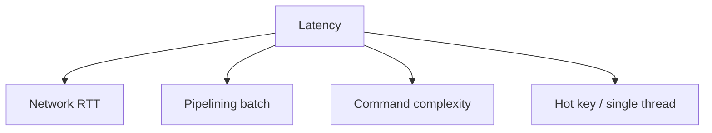
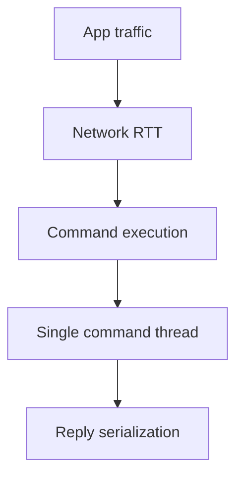

## Quick Revision

- Start with command shape and network round trips before hardware changes.
- Pipeline where safe; avoid O(N) commands on hot paths.
- Validate tuning against p99 latency and error budget.

## Core Concepts

| Lever | Outcome |
| :--- | :--- |
| Pipelining | Fewer RTTs, better throughput |
| Command complexity | Protect event loop from long operations |
| Value sizing | Reduces serialization and network time |
| Connection pooling | Stabilizes client concurrency |

## Internal Working

## Architecture

Performance depends on both client behavior (batching, retries, pools) and server-side command profile.

## Design Tradeoffs

| Choice | Tradeoff |
| :--- | :--- |
| Larger pipeline | Higher throughput, longer tail latency under bursts |
| Fewer large keys | Less key metadata, larger transfer cost |
| More shards | Better parallelism, higher operational complexity |

## Production Patterns

- Batch reads via MGET/pipeline.
- Prefer UNLINK over DEL for large-value cleanup tasks.
- Cap command cardinality in API-layer guards.

## Scalability

If CPU is saturated on one primary after command tuning, evaluate Cluster expansion.

## Reliability

Tune under failover scenarios; retries can inflate load and mask regressions.

## Observability

- p95/p99 latency by command family
- Slowlog trends
- Network throughput and connection churn

## Troubleshooting

Latency with low ops/sec often indicates blocking commands, network jitter, or persistence side effects.

## Common Mistakes

- Benchmarking only average latency.
- Enabling deep pipelines without timeout and backpressure strategy.

## Architect Notes

Treat Redis tuning as a full request-path problem (client + network + command + topology).

## How do you identify commands blocking the event loop beyond SLOWLOG threshold tuning?

### Short Answer
The practical Redis answer is correlating INFO sections, slowlog, and latency doctor before changing config during incidents for: How do you identify commands blocking the event loop beyond SLOWLOG threshold tuning.

### Detailed Explanation
INFO exposes memory, stats, replication, and cluster state; SLOWLOG captures commands exceeding threshold for: How do you identify commands blocking the event loop beyond SLOWLOG threshold tuning.

### Internal Working
Cluster health requires per-node slot coverage and lag metrics, not only primary CPU for: How do you identify commands blocking the event loop beyond SLOWLOG threshold tuning.

### Production Notes
You justify it by measuring p99 latency, memory headroom, and failover behavior under realistic skew by defining dashboards for memory, ops/sec, lag, rejected connections, and evictions for: How do you identify commands blocking the event loop beyond SLOWLOG threshold tuning.

### Common Mistakes
Running MONITOR in production destroys throughput — use targeted telemetry instead for: How do you identify commands blocking the event loop beyond SLOWLOG threshold tuning.

### Follow-up Questions
Which three metrics would page you first for: How do you identify commands blocking the event loop beyond SLOWLOG threshold tuning, and what thresholds?

---
## How does pipelining improve throughput without changing Redis single-threaded execution?

### Short Answer
The practical Redis answer is using MULTI/EXEC for simple atomic batches and Lua for contested hot keys where WATCH abort rates would be high for: How does pipelining improve throughput without changing Redis single-threaded execution.

### Detailed Explanation
MULTI queues commands; EXEC runs them serially without interleaving — failed commands do not roll back earlier commands in the batch for: How does pipelining improve throughput without changing Redis single-threaded execution.

### Internal Working
WATCH provides optimistic locking by aborting EXEC if watched keys changed; pipelines batch without atomicity for: How does pipelining improve throughput without changing Redis single-threaded execution.

### Production Notes
You justify it by measuring p99 latency, memory headroom, and failover behavior under realistic skew by keeping transaction blocks short and preferring Lua for compare-and-set on hot keys for: How does pipelining improve throughput without changing Redis single-threaded execution.

### Common Mistakes
Expecting RDBMS-style rollback or long MULTI blocks on hot keys are common production mistakes for: How does pipelining improve throughput without changing Redis single-threaded execution.

### Follow-up Questions
When would Lua replace MULTI/EXEC for: How does pipelining improve throughput without changing Redis single-threaded execution, and what cluster slot constraints apply?

---
## What pipeline batch size tradeoffs would you test against a 5ms p99 latency SLO?

### Short Answer
For this question, the architecturally correct Redis answer is using RESP over TCP with connection pooling and pipelining to cut round trips without expecting multi-command parallelism on the server for: What pipeline batch size tradeoffs would you test against a 5ms p99 latency SLO.

### Detailed Explanation
Pipelining batches many commands in one RTT while Redis still executes them sequentially — throughput gains come from network efficiency, not parallel command threads for: What pipeline batch size tradeoffs would you test against a 5ms p99 latency SLO.

### Internal Working
Cluster clients must handle MOVED/ASK redirects and maintain slot maps; protocol-level retries differ from application idempotency for: What pipeline batch size tradeoffs would you test against a 5ms p99 latency SLO.

### Production Notes
You justify it by proving behavior with INFO, slowlog, and workload replay before changing topology by profiling client RTT versus server `slowlog` entries for: What pipeline batch size tradeoffs would you test against a 5ms p99 latency SLO.

### Common Mistakes
A frequent mistake is huge pipelines without backpressure, causing timeouts and memory pressure on both client and server for: What pipeline batch size tradeoffs would you test against a 5ms p99 latency SLO.

### Follow-up Questions
What pipeline batch size and timeout would you cap for: What pipeline batch size tradeoffs would you test against a 5ms p99 latency SLO given your p99 SLO?

---
## When does MGET outperform pipelined GET for the same key batch?

### Short Answer
The production-grade Redis answer is using RESP over TCP with connection pooling and pipelining to cut round trips without expecting multi-command parallelism on the server for: When does MGET outperform pipelined GET for the same key batch.

### Detailed Explanation
Pipelining batches many commands in one RTT while Redis still executes them sequentially — throughput gains come from network efficiency, not parallel command threads for: When does MGET outperform pipelined GET for the same key batch.

### Internal Working
Cluster clients must handle MOVED/ASK redirects and maintain slot maps; protocol-level retries differ from application idempotency for: When does MGET outperform pipelined GET for the same key batch.

### Production Notes
You justify it by minimizing hot-key blast radius and single-thread CPU contention by profiling client RTT versus server `slowlog` entries for: When does MGET outperform pipelined GET for the same key batch.

### Common Mistakes
A frequent mistake is huge pipelines without backpressure, causing timeouts and memory pressure on both client and server for: When does MGET outperform pipelined GET for the same key batch.

### Follow-up Questions
What pipeline batch size and timeout would you cap for: When does MGET outperform pipelined GET for the same key batch given your p99 SLO?

---
## What command choices turn O(1) expectations into O(N) event-loop blockers?

### Short Answer
The practical Redis answer is matching Redis data type to access pattern — not defaulting everything to JSON strings for: What command choices turn O(1) expectations into O(N) event-loop blockers.

### Detailed Explanation
Pick strings for counters/cache blobs, hashes for field updates, sets/ZSETs for uniqueness/ranking, Streams for durable queues for: What command choices turn O(1) expectations into O(N) event-loop blockers.

### Internal Working
Encoding upgrades and command complexity (O(N) vs O(1)) follow from type and size choices for: What command choices turn O(1) expectations into O(N) event-loop blockers.

### Production Notes
You justify it by measuring p99 latency, memory headroom, and failover behavior under realistic skew by validating command complexity and memory per key for: What command choices turn O(1) expectations into O(N) event-loop blockers.

### Common Mistakes
Using `HGETALL` or `SMEMBERS` on large collections blocks the event loop for: What command choices turn O(1) expectations into O(N) event-loop blockers.

### Follow-up Questions
Which type would you choose for: What command choices turn O(1) expectations into O(N) event-loop blockers, and what command path proves it under peak cardinality?

---
## How would you benchmark UNLINK versus DEL for bulk key deletion in production maintenance?

### Short Answer
The senior-level decision is comparing Redis to alternatives on data model, durability, ops model, and failure semantics — not feature checklists for: How would you benchmark UNLINK versus DEL for bulk key deletion in production maintenance.

### Detailed Explanation
Redis offers rich structures and optional persistence; Memcached is simpler cache; Kafka/RabbitMQ excel at durable messaging scale for: How would you benchmark UNLINK versus DEL for bulk key deletion in production maintenance.

### Internal Working
Using Redis as a message bus works for moderate throughput with Streams; very large retention or routing complexity may favor dedicated brokers for: How would you benchmark UNLINK versus DEL for bulk key deletion in production maintenance.

### Production Notes
You justify it by aligning durability settings with business RPO/RTO and client retry contracts by documenting ADR assumptions and exit strategy if load doubles for: How would you benchmark UNLINK versus DEL for bulk key deletion in production maintenance.

### Common Mistakes
Resume-driven Redis adoption without ops maturity for Sentinel/Cluster causes painful incidents for: How would you benchmark UNLINK versus DEL for bulk key deletion in production maintenance.

### Follow-up Questions
What requirement in: How would you benchmark UNLINK versus DEL for bulk key deletion in production maintenance is decisive if throughput numbers are similar across options?

---
## What OS-level tuning (transparent huge pages, somaxconn) still matters for Redis in 2026?

### Short Answer
The practical Redis answer is matching Redis data type to access pattern — not defaulting everything to JSON strings for: What OS-level tuning (transparent huge pages, somaxconn) still matters for Redis in 2026.

### Detailed Explanation
Pick strings for counters/cache blobs, hashes for field updates, sets/ZSETs for uniqueness/ranking, Streams for durable queues for: What OS-level tuning (transparent huge pages, somaxconn) still matters for Redis in 2026.

### Internal Working
Encoding upgrades and command complexity (O(N) vs O(1)) follow from type and size choices for: What OS-level tuning (transparent huge pages, somaxconn) still matters for Redis in 2026.

### Production Notes
You justify it by measuring p99 latency, memory headroom, and failover behavior under realistic skew by validating command complexity and memory per key for: What OS-level tuning (transparent huge pages, somaxconn) still matters for Redis in 2026.

### Common Mistakes
Using `HGETALL` or `SMEMBERS` on large collections blocks the event loop for: What OS-level tuning (transparent huge pages, somaxconn) still matters for Redis in 2026.

### Follow-up Questions
Which type would you choose for: What OS-level tuning (transparent huge pages, somaxconn) still matters for Redis in 2026, and what command path proves it under peak cardinality?

---
## What pipeline patterns reduce round trips in bulk session refresh jobs?

### Short Answer
The production-grade Redis answer is using RESP over TCP with connection pooling and pipelining to cut round trips without expecting multi-command parallelism on the server for: What pipeline patterns reduce round trips in bulk session refresh jobs.

### Detailed Explanation
Pipelining batches many commands in one RTT while Redis still executes them sequentially — throughput gains come from network efficiency, not parallel command threads for: What pipeline patterns reduce round trips in bulk session refresh jobs.

### Internal Working
Cluster clients must handle MOVED/ASK redirects and maintain slot maps; protocol-level retries differ from application idempotency for: What pipeline patterns reduce round trips in bulk session refresh jobs.

### Production Notes
You justify it by minimizing hot-key blast radius and single-thread CPU contention by profiling client RTT versus server `slowlog` entries for: What pipeline patterns reduce round trips in bulk session refresh jobs.

### Common Mistakes
A frequent mistake is huge pipelines without backpressure, causing timeouts and memory pressure on both client and server for: What pipeline patterns reduce round trips in bulk session refresh jobs.

### Follow-up Questions
What pipeline batch size and timeout would you cap for: What pipeline patterns reduce round trips in bulk session refresh jobs given your p99 SLO?

---
<!-- interview-answers:end -->

---

## How do you identify commands blocking the event loop beyond SLOWLOG threshold tuning?

### Short Answer
The practical Redis answer is correlating INFO sections, slowlog, and latency doctor before changing config during incidents for: How do you identify commands blocking the event loop beyond SLOWLOG threshold tuning.

### Detailed Explanation
INFO exposes memory, stats, replication, and cluster state; SLOWLOG captures commands exceeding threshold for: How do you identify commands blocking the event loop beyond SLOWLOG threshold tuning.

### Internal Working
Cluster health requires per-node slot coverage and lag metrics, not only primary CPU for: How do you identify commands blocking the event loop beyond SLOWLOG threshold tuning.

### Production Notes
You justify it by measuring p99 latency, memory headroom, and failover behavior under realistic skew by defining dashboards for memory, ops/sec, lag, rejected connections, and evictions for: How do you identify commands blocking the event loop beyond SLOWLOG threshold tuning.

### Common Mistakes
Running MONITOR in production destroys throughput — use targeted telemetry instead for: How do you identify commands blocking the event loop beyond SLOWLOG threshold tuning.

### Follow-up Questions
Which three metrics would page you first for: How do you identify commands blocking the event loop beyond SLOWLOG threshold tuning, and what thresholds?

---
## How does pipelining improve throughput without changing Redis single-threaded execution?

### Short Answer
The practical Redis answer is using MULTI/EXEC for simple atomic batches and Lua for contested hot keys where WATCH abort rates would be high for: How does pipelining improve throughput without changing Redis single-threaded execution.

### Detailed Explanation
MULTI queues commands; EXEC runs them serially without interleaving — failed commands do not roll back earlier commands in the batch for: How does pipelining improve throughput without changing Redis single-threaded execution.

### Internal Working
WATCH provides optimistic locking by aborting EXEC if watched keys changed; pipelines batch without atomicity for: How does pipelining improve throughput without changing Redis single-threaded execution.

### Production Notes
You justify it by measuring p99 latency, memory headroom, and failover behavior under realistic skew by keeping transaction blocks short and preferring Lua for compare-and-set on hot keys for: How does pipelining improve throughput without changing Redis single-threaded execution.

### Common Mistakes
Expecting RDBMS-style rollback or long MULTI blocks on hot keys are common production mistakes for: How does pipelining improve throughput without changing Redis single-threaded execution.

### Follow-up Questions
When would Lua replace MULTI/EXEC for: How does pipelining improve throughput without changing Redis single-threaded execution, and what cluster slot constraints apply?

---
## What pipeline batch size tradeoffs would you test against a 5ms p99 latency SLO?

### Short Answer
For this question, the architecturally correct Redis answer is using RESP over TCP with connection pooling and pipelining to cut round trips without expecting multi-command parallelism on the server for: What pipeline batch size tradeoffs would you test against a 5ms p99 latency SLO.

### Detailed Explanation
Pipelining batches many commands in one RTT while Redis still executes them sequentially — throughput gains come from network efficiency, not parallel command threads for: What pipeline batch size tradeoffs would you test against a 5ms p99 latency SLO.

### Internal Working
Cluster clients must handle MOVED/ASK redirects and maintain slot maps; protocol-level retries differ from application idempotency for: What pipeline batch size tradeoffs would you test against a 5ms p99 latency SLO.

### Production Notes
You justify it by proving behavior with INFO, slowlog, and workload replay before changing topology by profiling client RTT versus server `slowlog` entries for: What pipeline batch size tradeoffs would you test against a 5ms p99 latency SLO.

### Common Mistakes
A frequent mistake is huge pipelines without backpressure, causing timeouts and memory pressure on both client and server for: What pipeline batch size tradeoffs would you test against a 5ms p99 latency SLO.

### Follow-up Questions
What pipeline batch size and timeout would you cap for: What pipeline batch size tradeoffs would you test against a 5ms p99 latency SLO given your p99 SLO?

---
## When does MGET outperform pipelined GET for the same key batch?

### Short Answer
The production-grade Redis answer is using RESP over TCP with connection pooling and pipelining to cut round trips without expecting multi-command parallelism on the server for: When does MGET outperform pipelined GET for the same key batch.

### Detailed Explanation
Pipelining batches many commands in one RTT while Redis still executes them sequentially — throughput gains come from network efficiency, not parallel command threads for: When does MGET outperform pipelined GET for the same key batch.

### Internal Working
Cluster clients must handle MOVED/ASK redirects and maintain slot maps; protocol-level retries differ from application idempotency for: When does MGET outperform pipelined GET for the same key batch.

### Production Notes
You justify it by minimizing hot-key blast radius and single-thread CPU contention by profiling client RTT versus server `slowlog` entries for: When does MGET outperform pipelined GET for the same key batch.

### Common Mistakes
A frequent mistake is huge pipelines without backpressure, causing timeouts and memory pressure on both client and server for: When does MGET outperform pipelined GET for the same key batch.

### Follow-up Questions
What pipeline batch size and timeout would you cap for: When does MGET outperform pipelined GET for the same key batch given your p99 SLO?

---
## What command choices turn O(1) expectations into O(N) event-loop blockers?

### Short Answer
The practical Redis answer is matching Redis data type to access pattern — not defaulting everything to JSON strings for: What command choices turn O(1) expectations into O(N) event-loop blockers.

### Detailed Explanation
Pick strings for counters/cache blobs, hashes for field updates, sets/ZSETs for uniqueness/ranking, Streams for durable queues for: What command choices turn O(1) expectations into O(N) event-loop blockers.

### Internal Working
Encoding upgrades and command complexity (O(N) vs O(1)) follow from type and size choices for: What command choices turn O(1) expectations into O(N) event-loop blockers.

### Production Notes
You justify it by measuring p99 latency, memory headroom, and failover behavior under realistic skew by validating command complexity and memory per key for: What command choices turn O(1) expectations into O(N) event-loop blockers.

### Common Mistakes
Using `HGETALL` or `SMEMBERS` on large collections blocks the event loop for: What command choices turn O(1) expectations into O(N) event-loop blockers.

### Follow-up Questions
Which type would you choose for: What command choices turn O(1) expectations into O(N) event-loop blockers, and what command path proves it under peak cardinality?

---
## How would you benchmark UNLINK versus DEL for bulk key deletion in production maintenance?

### Short Answer
The senior-level decision is comparing Redis to alternatives on data model, durability, ops model, and failure semantics — not feature checklists for: How would you benchmark UNLINK versus DEL for bulk key deletion in production maintenance.

### Detailed Explanation
Redis offers rich structures and optional persistence; Memcached is simpler cache; Kafka/RabbitMQ excel at durable messaging scale for: How would you benchmark UNLINK versus DEL for bulk key deletion in production maintenance.

### Internal Working
Using Redis as a message bus works for moderate throughput with Streams; very large retention or routing complexity may favor dedicated brokers for: How would you benchmark UNLINK versus DEL for bulk key deletion in production maintenance.

### Production Notes
You justify it by aligning durability settings with business RPO/RTO and client retry contracts by documenting ADR assumptions and exit strategy if load doubles for: How would you benchmark UNLINK versus DEL for bulk key deletion in production maintenance.

### Common Mistakes
Resume-driven Redis adoption without ops maturity for Sentinel/Cluster causes painful incidents for: How would you benchmark UNLINK versus DEL for bulk key deletion in production maintenance.

### Follow-up Questions
What requirement in: How would you benchmark UNLINK versus DEL for bulk key deletion in production maintenance is decisive if throughput numbers are similar across options?

---
## What OS-level tuning (transparent huge pages, somaxconn) still matters for Redis in 2026?

### Short Answer
The practical Redis answer is matching Redis data type to access pattern — not defaulting everything to JSON strings for: What OS-level tuning (transparent huge pages, somaxconn) still matters for Redis in 2026.

### Detailed Explanation
Pick strings for counters/cache blobs, hashes for field updates, sets/ZSETs for uniqueness/ranking, Streams for durable queues for: What OS-level tuning (transparent huge pages, somaxconn) still matters for Redis in 2026.

### Internal Working
Encoding upgrades and command complexity (O(N) vs O(1)) follow from type and size choices for: What OS-level tuning (transparent huge pages, somaxconn) still matters for Redis in 2026.

### Production Notes
You justify it by measuring p99 latency, memory headroom, and failover behavior under realistic skew by validating command complexity and memory per key for: What OS-level tuning (transparent huge pages, somaxconn) still matters for Redis in 2026.

### Common Mistakes
Using `HGETALL` or `SMEMBERS` on large collections blocks the event loop for: What OS-level tuning (transparent huge pages, somaxconn) still matters for Redis in 2026.

### Follow-up Questions
Which type would you choose for: What OS-level tuning (transparent huge pages, somaxconn) still matters for Redis in 2026, and what command path proves it under peak cardinality?

---
## What pipeline patterns reduce round trips in bulk session refresh jobs?

### Short Answer
The production-grade Redis answer is using RESP over TCP with connection pooling and pipelining to cut round trips without expecting multi-command parallelism on the server for: What pipeline patterns reduce round trips in bulk session refresh jobs.

### Detailed Explanation
Pipelining batches many commands in one RTT while Redis still executes them sequentially — throughput gains come from network efficiency, not parallel command threads for: What pipeline patterns reduce round trips in bulk session refresh jobs.

### Internal Working
Cluster clients must handle MOVED/ASK redirects and maintain slot maps; protocol-level retries differ from application idempotency for: What pipeline patterns reduce round trips in bulk session refresh jobs.

### Production Notes
You justify it by minimizing hot-key blast radius and single-thread CPU contention by profiling client RTT versus server `slowlog` entries for: What pipeline patterns reduce round trips in bulk session refresh jobs.

### Common Mistakes
A frequent mistake is huge pipelines without backpressure, causing timeouts and memory pressure on both client and server for: What pipeline patterns reduce round trips in bulk session refresh jobs.

### Follow-up Questions
What pipeline batch size and timeout would you cap for: What pipeline patterns reduce round trips in bulk session refresh jobs given your p99 SLO?

---
<!-- interview-answers:end -->

---

## How do you identify commands blocking the event loop beyond SLOWLOG threshold tuning?

### Short Answer
The practical Redis answer is correlating INFO sections, slowlog, and latency doctor before changing config during incidents for: How do you identify commands blocking the event loop beyond SLOWLOG threshold tuning.

### Detailed Explanation
INFO exposes memory, stats, replication, and cluster state; SLOWLOG captures commands exceeding threshold for: How do you identify commands blocking the event loop beyond SLOWLOG threshold tuning.

### Internal Working
Cluster health requires per-node slot coverage and lag metrics, not only primary CPU for: How do you identify commands blocking the event loop beyond SLOWLOG threshold tuning.

### Production Notes
You justify it by measuring p99 latency, memory headroom, and failover behavior under realistic skew by defining dashboards for memory, ops/sec, lag, rejected connections, and evictions for: How do you identify commands blocking the event loop beyond SLOWLOG threshold tuning.

### Common Mistakes
Running MONITOR in production destroys throughput — use targeted telemetry instead for: How do you identify commands blocking the event loop beyond SLOWLOG threshold tuning.

### Follow-up Questions
Which three metrics would page you first for: How do you identify commands blocking the event loop beyond SLOWLOG threshold tuning, and what thresholds?

---
## How does pipelining improve throughput without changing Redis single-threaded execution?

### Short Answer
The practical Redis answer is using MULTI/EXEC for simple atomic batches and Lua for contested hot keys where WATCH abort rates would be high for: How does pipelining improve throughput without changing Redis single-threaded execution.

### Detailed Explanation
MULTI queues commands; EXEC runs them serially without interleaving — failed commands do not roll back earlier commands in the batch for: How does pipelining improve throughput without changing Redis single-threaded execution.

### Internal Working
WATCH provides optimistic locking by aborting EXEC if watched keys changed; pipelines batch without atomicity for: How does pipelining improve throughput without changing Redis single-threaded execution.

### Production Notes
You justify it by measuring p99 latency, memory headroom, and failover behavior under realistic skew by keeping transaction blocks short and preferring Lua for compare-and-set on hot keys for: How does pipelining improve throughput without changing Redis single-threaded execution.

### Common Mistakes
Expecting RDBMS-style rollback or long MULTI blocks on hot keys are common production mistakes for: How does pipelining improve throughput without changing Redis single-threaded execution.

### Follow-up Questions
When would Lua replace MULTI/EXEC for: How does pipelining improve throughput without changing Redis single-threaded execution, and what cluster slot constraints apply?

---
## What pipeline batch size tradeoffs would you test against a 5ms p99 latency SLO?

### Short Answer
For this question, the architecturally correct Redis answer is using RESP over TCP with connection pooling and pipelining to cut round trips without expecting multi-command parallelism on the server for: What pipeline batch size tradeoffs would you test against a 5ms p99 latency SLO.

### Detailed Explanation
Pipelining batches many commands in one RTT while Redis still executes them sequentially — throughput gains come from network efficiency, not parallel command threads for: What pipeline batch size tradeoffs would you test against a 5ms p99 latency SLO.

### Internal Working
Cluster clients must handle MOVED/ASK redirects and maintain slot maps; protocol-level retries differ from application idempotency for: What pipeline batch size tradeoffs would you test against a 5ms p99 latency SLO.

### Production Notes
You justify it by proving behavior with INFO, slowlog, and workload replay before changing topology by profiling client RTT versus server `slowlog` entries for: What pipeline batch size tradeoffs would you test against a 5ms p99 latency SLO.

### Common Mistakes
A frequent mistake is huge pipelines without backpressure, causing timeouts and memory pressure on both client and server for: What pipeline batch size tradeoffs would you test against a 5ms p99 latency SLO.

### Follow-up Questions
What pipeline batch size and timeout would you cap for: What pipeline batch size tradeoffs would you test against a 5ms p99 latency SLO given your p99 SLO?

---
## When does MGET outperform pipelined GET for the same key batch?

### Short Answer
The production-grade Redis answer is using RESP over TCP with connection pooling and pipelining to cut round trips without expecting multi-command parallelism on the server for: When does MGET outperform pipelined GET for the same key batch.

### Detailed Explanation
Pipelining batches many commands in one RTT while Redis still executes them sequentially — throughput gains come from network efficiency, not parallel command threads for: When does MGET outperform pipelined GET for the same key batch.

### Internal Working
Cluster clients must handle MOVED/ASK redirects and maintain slot maps; protocol-level retries differ from application idempotency for: When does MGET outperform pipelined GET for the same key batch.

### Production Notes
You justify it by minimizing hot-key blast radius and single-thread CPU contention by profiling client RTT versus server `slowlog` entries for: When does MGET outperform pipelined GET for the same key batch.

### Common Mistakes
A frequent mistake is huge pipelines without backpressure, causing timeouts and memory pressure on both client and server for: When does MGET outperform pipelined GET for the same key batch.

### Follow-up Questions
What pipeline batch size and timeout would you cap for: When does MGET outperform pipelined GET for the same key batch given your p99 SLO?

---
## What command choices turn O(1) expectations into O(N) event-loop blockers?

### Short Answer
The practical Redis answer is matching Redis data type to access pattern — not defaulting everything to JSON strings for: What command choices turn O(1) expectations into O(N) event-loop blockers.

### Detailed Explanation
Pick strings for counters/cache blobs, hashes for field updates, sets/ZSETs for uniqueness/ranking, Streams for durable queues for: What command choices turn O(1) expectations into O(N) event-loop blockers.

### Internal Working
Encoding upgrades and command complexity (O(N) vs O(1)) follow from type and size choices for: What command choices turn O(1) expectations into O(N) event-loop blockers.

### Production Notes
You justify it by measuring p99 latency, memory headroom, and failover behavior under realistic skew by validating command complexity and memory per key for: What command choices turn O(1) expectations into O(N) event-loop blockers.

### Common Mistakes
Using `HGETALL` or `SMEMBERS` on large collections blocks the event loop for: What command choices turn O(1) expectations into O(N) event-loop blockers.

### Follow-up Questions
Which type would you choose for: What command choices turn O(1) expectations into O(N) event-loop blockers, and what command path proves it under peak cardinality?

---
## How would you benchmark UNLINK versus DEL for bulk key deletion in production maintenance?

### Short Answer
The senior-level decision is comparing Redis to alternatives on data model, durability, ops model, and failure semantics — not feature checklists for: How would you benchmark UNLINK versus DEL for bulk key deletion in production maintenance.

### Detailed Explanation
Redis offers rich structures and optional persistence; Memcached is simpler cache; Kafka/RabbitMQ excel at durable messaging scale for: How would you benchmark UNLINK versus DEL for bulk key deletion in production maintenance.

### Internal Working
Using Redis as a message bus works for moderate throughput with Streams; very large retention or routing complexity may favor dedicated brokers for: How would you benchmark UNLINK versus DEL for bulk key deletion in production maintenance.

### Production Notes
You justify it by aligning durability settings with business RPO/RTO and client retry contracts by documenting ADR assumptions and exit strategy if load doubles for: How would you benchmark UNLINK versus DEL for bulk key deletion in production maintenance.

### Common Mistakes
Resume-driven Redis adoption without ops maturity for Sentinel/Cluster causes painful incidents for: How would you benchmark UNLINK versus DEL for bulk key deletion in production maintenance.

### Follow-up Questions
What requirement in: How would you benchmark UNLINK versus DEL for bulk key deletion in production maintenance is decisive if throughput numbers are similar across options?

---
## What OS-level tuning (transparent huge pages, somaxconn) still matters for Redis in 2026?

### Short Answer
The practical Redis answer is matching Redis data type to access pattern — not defaulting everything to JSON strings for: What OS-level tuning (transparent huge pages, somaxconn) still matters for Redis in 2026.

### Detailed Explanation
Pick strings for counters/cache blobs, hashes for field updates, sets/ZSETs for uniqueness/ranking, Streams for durable queues for: What OS-level tuning (transparent huge pages, somaxconn) still matters for Redis in 2026.

### Internal Working
Encoding upgrades and command complexity (O(N) vs O(1)) follow from type and size choices for: What OS-level tuning (transparent huge pages, somaxconn) still matters for Redis in 2026.

### Production Notes
You justify it by measuring p99 latency, memory headroom, and failover behavior under realistic skew by validating command complexity and memory per key for: What OS-level tuning (transparent huge pages, somaxconn) still matters for Redis in 2026.

### Common Mistakes
Using `HGETALL` or `SMEMBERS` on large collections blocks the event loop for: What OS-level tuning (transparent huge pages, somaxconn) still matters for Redis in 2026.

### Follow-up Questions
Which type would you choose for: What OS-level tuning (transparent huge pages, somaxconn) still matters for Redis in 2026, and what command path proves it under peak cardinality?

---
## What pipeline patterns reduce round trips in bulk session refresh jobs?

### Short Answer
The production-grade Redis answer is using RESP over TCP with connection pooling and pipelining to cut round trips without expecting multi-command parallelism on the server for: What pipeline patterns reduce round trips in bulk session refresh jobs.

### Detailed Explanation
Pipelining batches many commands in one RTT while Redis still executes them sequentially — throughput gains come from network efficiency, not parallel command threads for: What pipeline patterns reduce round trips in bulk session refresh jobs.

### Internal Working
Cluster clients must handle MOVED/ASK redirects and maintain slot maps; protocol-level retries differ from application idempotency for: What pipeline patterns reduce round trips in bulk session refresh jobs.

### Production Notes
You justify it by minimizing hot-key blast radius and single-thread CPU contention by profiling client RTT versus server `slowlog` entries for: What pipeline patterns reduce round trips in bulk session refresh jobs.

### Common Mistakes
A frequent mistake is huge pipelines without backpressure, causing timeouts and memory pressure on both client and server for: What pipeline patterns reduce round trips in bulk session refresh jobs.

### Follow-up Questions
What pipeline batch size and timeout would you cap for: What pipeline patterns reduce round trips in bulk session refresh jobs given your p99 SLO?

---
<!-- interview-answers:end -->

---

## How do you identify commands blocking the event loop beyond SLOWLOG threshold tuning?

### Short Answer
The practical Redis answer is correlating INFO sections, slowlog, and latency doctor before changing config during incidents for: How do you identify commands blocking the event loop beyond SLOWLOG threshold tuning.

### Detailed Explanation
INFO exposes memory, stats, replication, and cluster state; SLOWLOG captures commands exceeding threshold for: How do you identify commands blocking the event loop beyond SLOWLOG threshold tuning.

### Internal Working
Cluster health requires per-node slot coverage and lag metrics, not only primary CPU for: How do you identify commands blocking the event loop beyond SLOWLOG threshold tuning.

### Production Notes
You justify it by measuring p99 latency, memory headroom, and failover behavior under realistic skew by defining dashboards for memory, ops/sec, lag, rejected connections, and evictions for: How do you identify commands blocking the event loop beyond SLOWLOG threshold tuning.

### Common Mistakes
Running MONITOR in production destroys throughput — use targeted telemetry instead for: How do you identify commands blocking the event loop beyond SLOWLOG threshold tuning.

### Follow-up Questions
Which three metrics would page you first for: How do you identify commands blocking the event loop beyond SLOWLOG threshold tuning, and what thresholds?

---
## How does pipelining improve throughput without changing Redis single-threaded execution?

### Short Answer
The practical Redis answer is using MULTI/EXEC for simple atomic batches and Lua for contested hot keys where WATCH abort rates would be high for: How does pipelining improve throughput without changing Redis single-threaded execution.

### Detailed Explanation
MULTI queues commands; EXEC runs them serially without interleaving — failed commands do not roll back earlier commands in the batch for: How does pipelining improve throughput without changing Redis single-threaded execution.

### Internal Working
WATCH provides optimistic locking by aborting EXEC if watched keys changed; pipelines batch without atomicity for: How does pipelining improve throughput without changing Redis single-threaded execution.

### Production Notes
You justify it by measuring p99 latency, memory headroom, and failover behavior under realistic skew by keeping transaction blocks short and preferring Lua for compare-and-set on hot keys for: How does pipelining improve throughput without changing Redis single-threaded execution.

### Common Mistakes
Expecting RDBMS-style rollback or long MULTI blocks on hot keys are common production mistakes for: How does pipelining improve throughput without changing Redis single-threaded execution.

### Follow-up Questions
When would Lua replace MULTI/EXEC for: How does pipelining improve throughput without changing Redis single-threaded execution, and what cluster slot constraints apply?

---
## What pipeline batch size tradeoffs would you test against a 5ms p99 latency SLO?

### Short Answer
For this question, the architecturally correct Redis answer is using RESP over TCP with connection pooling and pipelining to cut round trips without expecting multi-command parallelism on the server for: What pipeline batch size tradeoffs would you test against a 5ms p99 latency SLO.

### Detailed Explanation
Pipelining batches many commands in one RTT while Redis still executes them sequentially — throughput gains come from network efficiency, not parallel command threads for: What pipeline batch size tradeoffs would you test against a 5ms p99 latency SLO.

### Internal Working
Cluster clients must handle MOVED/ASK redirects and maintain slot maps; protocol-level retries differ from application idempotency for: What pipeline batch size tradeoffs would you test against a 5ms p99 latency SLO.

### Production Notes
You justify it by proving behavior with INFO, slowlog, and workload replay before changing topology by profiling client RTT versus server `slowlog` entries for: What pipeline batch size tradeoffs would you test against a 5ms p99 latency SLO.

### Common Mistakes
A frequent mistake is huge pipelines without backpressure, causing timeouts and memory pressure on both client and server for: What pipeline batch size tradeoffs would you test against a 5ms p99 latency SLO.

### Follow-up Questions
What pipeline batch size and timeout would you cap for: What pipeline batch size tradeoffs would you test against a 5ms p99 latency SLO given your p99 SLO?

---
## When does MGET outperform pipelined GET for the same key batch?

### Short Answer
The production-grade Redis answer is using RESP over TCP with connection pooling and pipelining to cut round trips without expecting multi-command parallelism on the server for: When does MGET outperform pipelined GET for the same key batch.

### Detailed Explanation
Pipelining batches many commands in one RTT while Redis still executes them sequentially — throughput gains come from network efficiency, not parallel command threads for: When does MGET outperform pipelined GET for the same key batch.

### Internal Working
Cluster clients must handle MOVED/ASK redirects and maintain slot maps; protocol-level retries differ from application idempotency for: When does MGET outperform pipelined GET for the same key batch.

### Production Notes
You justify it by minimizing hot-key blast radius and single-thread CPU contention by profiling client RTT versus server `slowlog` entries for: When does MGET outperform pipelined GET for the same key batch.

### Common Mistakes
A frequent mistake is huge pipelines without backpressure, causing timeouts and memory pressure on both client and server for: When does MGET outperform pipelined GET for the same key batch.

### Follow-up Questions
What pipeline batch size and timeout would you cap for: When does MGET outperform pipelined GET for the same key batch given your p99 SLO?

---
## What command choices turn O(1) expectations into O(N) event-loop blockers?

### Short Answer
The practical Redis answer is matching Redis data type to access pattern — not defaulting everything to JSON strings for: What command choices turn O(1) expectations into O(N) event-loop blockers.

### Detailed Explanation
Pick strings for counters/cache blobs, hashes for field updates, sets/ZSETs for uniqueness/ranking, Streams for durable queues for: What command choices turn O(1) expectations into O(N) event-loop blockers.

### Internal Working
Encoding upgrades and command complexity (O(N) vs O(1)) follow from type and size choices for: What command choices turn O(1) expectations into O(N) event-loop blockers.

### Production Notes
You justify it by measuring p99 latency, memory headroom, and failover behavior under realistic skew by validating command complexity and memory per key for: What command choices turn O(1) expectations into O(N) event-loop blockers.

### Common Mistakes
Using `HGETALL` or `SMEMBERS` on large collections blocks the event loop for: What command choices turn O(1) expectations into O(N) event-loop blockers.

### Follow-up Questions
Which type would you choose for: What command choices turn O(1) expectations into O(N) event-loop blockers, and what command path proves it under peak cardinality?

---
## How would you benchmark UNLINK versus DEL for bulk key deletion in production maintenance?

### Short Answer
The senior-level decision is comparing Redis to alternatives on data model, durability, ops model, and failure semantics — not feature checklists for: How would you benchmark UNLINK versus DEL for bulk key deletion in production maintenance.

### Detailed Explanation
Redis offers rich structures and optional persistence; Memcached is simpler cache; Kafka/RabbitMQ excel at durable messaging scale for: How would you benchmark UNLINK versus DEL for bulk key deletion in production maintenance.

### Internal Working
Using Redis as a message bus works for moderate throughput with Streams; very large retention or routing complexity may favor dedicated brokers for: How would you benchmark UNLINK versus DEL for bulk key deletion in production maintenance.

### Production Notes
You justify it by aligning durability settings with business RPO/RTO and client retry contracts by documenting ADR assumptions and exit strategy if load doubles for: How would you benchmark UNLINK versus DEL for bulk key deletion in production maintenance.

### Common Mistakes
Resume-driven Redis adoption without ops maturity for Sentinel/Cluster causes painful incidents for: How would you benchmark UNLINK versus DEL for bulk key deletion in production maintenance.

### Follow-up Questions
What requirement in: How would you benchmark UNLINK versus DEL for bulk key deletion in production maintenance is decisive if throughput numbers are similar across options?

---
## What OS-level tuning (transparent huge pages, somaxconn) still matters for Redis in 2026?

### Short Answer
The practical Redis answer is matching Redis data type to access pattern — not defaulting everything to JSON strings for: What OS-level tuning (transparent huge pages, somaxconn) still matters for Redis in 2026.

### Detailed Explanation
Pick strings for counters/cache blobs, hashes for field updates, sets/ZSETs for uniqueness/ranking, Streams for durable queues for: What OS-level tuning (transparent huge pages, somaxconn) still matters for Redis in 2026.

### Internal Working
Encoding upgrades and command complexity (O(N) vs O(1)) follow from type and size choices for: What OS-level tuning (transparent huge pages, somaxconn) still matters for Redis in 2026.

### Production Notes
You justify it by measuring p99 latency, memory headroom, and failover behavior under realistic skew by validating command complexity and memory per key for: What OS-level tuning (transparent huge pages, somaxconn) still matters for Redis in 2026.

### Common Mistakes
Using `HGETALL` or `SMEMBERS` on large collections blocks the event loop for: What OS-level tuning (transparent huge pages, somaxconn) still matters for Redis in 2026.

### Follow-up Questions
Which type would you choose for: What OS-level tuning (transparent huge pages, somaxconn) still matters for Redis in 2026, and what command path proves it under peak cardinality?

---
## What pipeline patterns reduce round trips in bulk session refresh jobs?

### Short Answer
The production-grade Redis answer is using RESP over TCP with connection pooling and pipelining to cut round trips without expecting multi-command parallelism on the server for: What pipeline patterns reduce round trips in bulk session refresh jobs.

### Detailed Explanation
Pipelining batches many commands in one RTT while Redis still executes them sequentially — throughput gains come from network efficiency, not parallel command threads for: What pipeline patterns reduce round trips in bulk session refresh jobs.

### Internal Working
Cluster clients must handle MOVED/ASK redirects and maintain slot maps; protocol-level retries differ from application idempotency for: What pipeline patterns reduce round trips in bulk session refresh jobs.

### Production Notes
You justify it by minimizing hot-key blast radius and single-thread CPU contention by profiling client RTT versus server `slowlog` entries for: What pipeline patterns reduce round trips in bulk session refresh jobs.

### Common Mistakes
A frequent mistake is huge pipelines without backpressure, causing timeouts and memory pressure on both client and server for: What pipeline patterns reduce round trips in bulk session refresh jobs.

### Follow-up Questions
What pipeline batch size and timeout would you cap for: What pipeline patterns reduce round trips in bulk session refresh jobs given your p99 SLO?

---
<!-- interview-answers:end -->

---

## See Also

- [Previous: Eviction Policies](/redis-cheatsheet/06-performance-operations/eviction-policies/)
- [Next: Monitoring](/redis-cheatsheet/06-performance-operations/monitoring/)
- [Redis Handbook Index](/redis-cheatsheet/)
- [Top 150 Interview Questions](/redis-cheatsheet/08-interview-guide/top-150-interview-questions/)
