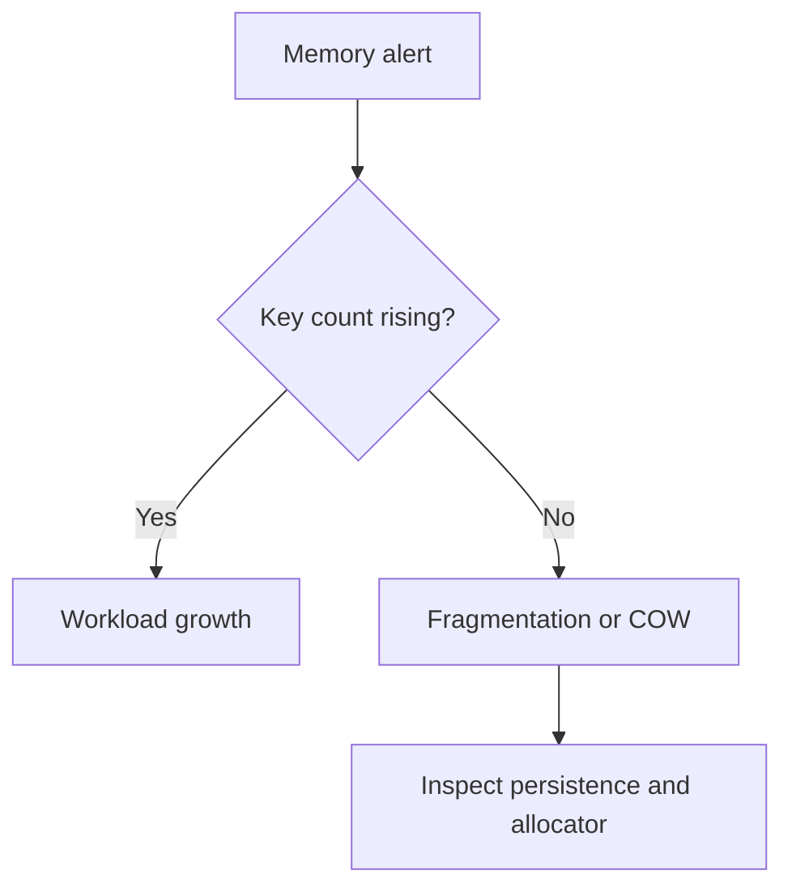
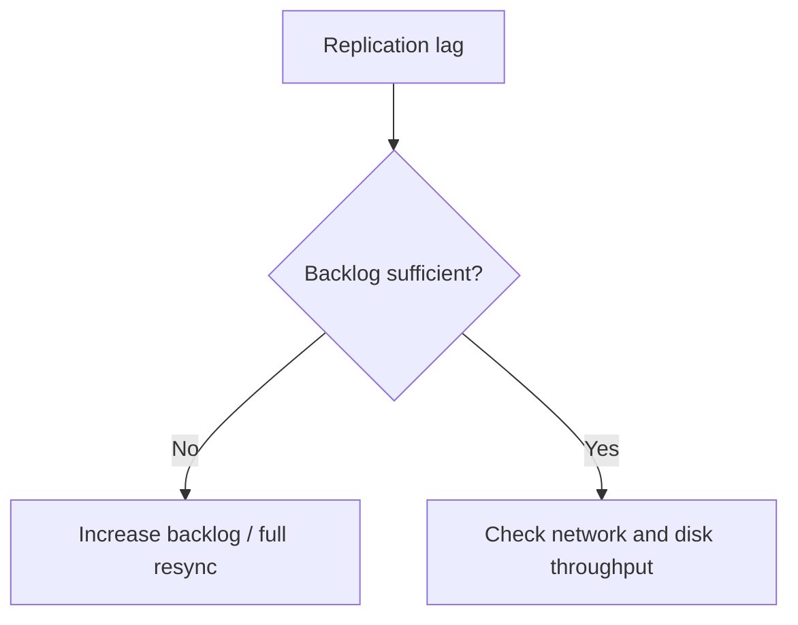
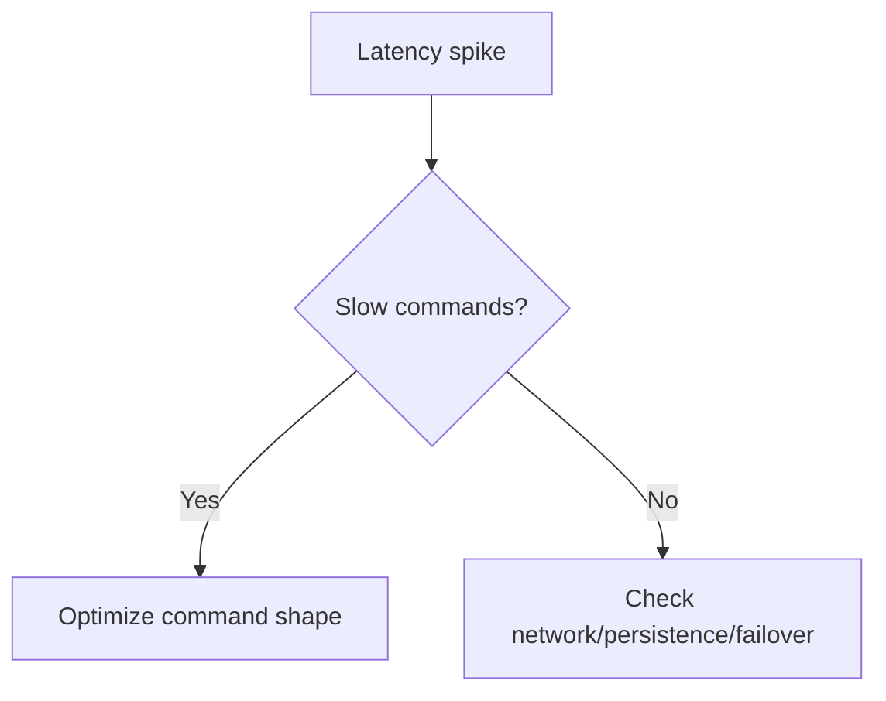

## Quick Revision

- Triage starts with symptom category: memory, latency, replication, or cluster routing.
- Confirm whether impact is node-local, shard-local, or client-wide.
- Apply remediation with rollback-safe operational steps.

## Core Concepts

| Symptom | First check |
| :--- | :--- |
| High memory | used vs rss vs key growth |
| Replication lag | backlog, link health, write spikes |
| High latency | slow commands, persistence activity, network |
| Slot imbalance | shard key patterns and migration state |

## Internal Working

## Architecture

Runbooks should be topology-specific and pre-linked from alerts.

## Design Tradeoffs

| Action | Risk |
| :--- | :--- |
| Immediate failover | Lower outage duration, potential stale state |
| Aggressive key eviction | Faster recovery, hit-ratio regression |
| Fast resharding | Better balance, temporary redirect churn |

## Production Patterns

- Keep diagnostic command allowlist for on-call.
- Store post-incident timelines with command and topology context.

## Scalability

Repeated hot-key incidents usually indicate key design debt, not transient ops noise.

## Reliability

Always verify replica freshness and client retry behavior before closing incidents.

## Observability

Pair this page with [Monitoring](/redis-cheatsheet/06-performance-operations/monitoring/) dashboards.

## Troubleshooting

Apply decision trees by symptom, then drill into related canonical pages.

## Common Mistakes

- Using `KEYS *` during incidents.
- Treating client timeouts as always server CPU problems.

## Architect Notes

A mature Redis platform has codified incident pathways for each failure class.

## How do you triage sudden memory growth when used_memory rises but key count looks stable?

### Short Answer
The production-grade Redis answer is separating logical key growth from allocator overhead using `used_memory`, RSS, and encoding inspection for: How do you triage sudden memory growth when used_memory rises but key count looks stable.

### Detailed Explanation
Redis picks compact encodings (listpack, intset) for small values and upgrades to hashtable/skiplist structures as data grows — memory cliffs often appear at encoding thresholds for: How do you triage sudden memory growth when used_memory rises but key count looks stable.

### Internal Working
`robj` wraps values with type metadata; jemalloc arenas and copy-on-write during persistence amplify RSS beyond `used_memory` for: How do you triage sudden memory growth when used_memory rises but key count looks stable.

### Production Notes
You justify it by minimizing hot-key blast radius and single-thread CPU contention after sampling top keys with `MEMORY USAGE` and reviewing fragmentation ratio trends for: How do you triage sudden memory growth when used_memory rises but key count looks stable.

### Common Mistakes
Teams often optimize value bytes while ignoring metadata overhead, fragmentation, and fork-related RSS spikes for: How do you triage sudden memory growth when used_memory rises but key count looks stable.

### Follow-up Questions
Which encoding upgrade or key-shape change would you test first to reduce memory for: How do you triage sudden memory growth when used_memory rises but key count looks stable?

---
## What steps isolate whether latency spikes are network, slow commands, or fork-related COW pressure?

### Short Answer
The senior-level decision is matching RDB/AOF hybrid settings to acceptable data-loss window and restart time for: What steps isolate whether latency spikes are network, slow commands, or fork-related COW pressure.

### Detailed Explanation
RDB gives compact snapshots; AOF gives finer durability with `appendfsync` tradeoffs — `everysec` is common but can lose ~1s on crash for: What steps isolate whether latency spikes are network, slow commands, or fork-related COW pressure.

### Internal Working
BGSAVE/AOF rewrite forks the process; copy-on-write can double memory pressure during snapshots, affecting latency for: What steps isolate whether latency spikes are network, slow commands, or fork-related COW pressure.

### Production Notes
You justify it by aligning durability settings with business RPO/RTO and client retry contracts by testing crash-recovery drills and measuring fork latency under peak write load for: What steps isolate whether latency spikes are network, slow commands, or fork-related COW pressure.

### Common Mistakes
Dangerous patterns include `SAVE` in production, `appendfsync always` without throughput headroom, and ignoring COW during maintenance for: What steps isolate whether latency spikes are network, slow commands, or fork-related COW pressure.

### Follow-up Questions
What RPO does your chosen persistence mode actually guarantee for: What steps isolate whether latency spikes are network, slow commands, or fork-related COW pressure after a hard kill test?

---
## How would you diagnose replication lag that only appears during peak write hours?

### Short Answer
The practical Redis answer is treating replication as async by default and using `WAIT` or app-level checks only when stronger durability is required for: How would you diagnose replication lag that only appears during peak write hours.

### Detailed Explanation
Replicas tail the replication stream; lag appears when network, disk, or apply speed falls behind write rate — partial resync needs adequate `repl-backlog-size` for: How would you diagnose replication lag that only appears during peak write hours.

### Internal Working
Read-your-writes is not automatic on replicas; clients using replica reads must accept staleness or use primary reads after writes for: How would you diagnose replication lag that only appears during peak write hours.

### Production Notes
You justify it by measuring p99 latency, memory headroom, and failover behavior under realistic skew by correlating `master_repl_offset` with replica offsets and write spikes for: How would you diagnose replication lag that only appears during peak write hours.

### Common Mistakes
Common mistakes include writable replicas, ignoring lag during incidents, and assuming replica reads are fresh for: How would you diagnose replication lag that only appears during peak write hours.

### Follow-up Questions
Which writes in: How would you diagnose replication lag that only appears during peak write hours require synchronous acknowledgment, and how will clients handle failover mid-transaction?

---
## How do you find and remediate hot keys without KEYS or MONITOR in production?

### Short Answer
The production-grade Redis answer is combining TTL jitter, singleflight locks, and stale-while-revalidate to protect origin during: How do you find and remediate hot keys without KEYS or MONITOR in production.

### Detailed Explanation
Breakdown hits when a hot key expires; avalanche when many keys expire together; penetration when misses flood DB for absent keys for: How do you find and remediate hot keys without KEYS or MONITOR in production.

### Internal Working
Mitigations include probabilistic early refresh, Bloom filters or short negative TTL, and request coalescing for: How do you find and remediate hot keys without KEYS or MONITOR in production.

### Production Notes
You justify it by minimizing hot-key blast radius and single-thread CPU contention by load-testing synchronized expiry and hot-key miss scenarios for: How do you find and remediate hot keys without KEYS or MONITOR in production.

### Common Mistakes
Same TTL on all keys and caching null forever are classic self-inflicted outages for: How do you find and remediate hot keys without KEYS or MONITOR in production.

### Follow-up Questions
Which mitigation layer (jitter, lock, Bloom, local cache) is first-line for: How do you find and remediate hot keys without KEYS or MONITOR in production in your architecture?

---
## What symptoms distinguish a big-key problem from a hot-key problem on a single-threaded primary?

### Short Answer
The senior-level decision is treating Redis as a single-threaded command processor with optional I/O threading, then choosing HA topology to match RPO/RTO for: What symptoms distinguish a big-key problem from a hot-key problem on a single-threaded primary.

### Detailed Explanation
Redis throughput scales vertically per primary until CPU, memory, or hot-key skew dominates; Sentinel and Cluster solve availability and horizontal scale, not magic parallelism on one key for: What symptoms distinguish a big-key problem from a hot-key problem on a single-threaded primary.

### Internal Working
Commands execute serially on the event loop, so long operations block all clients on that node — architecture must keep hot paths O(1) and shard before CPU saturates for: What symptoms distinguish a big-key problem from a hot-key problem on a single-threaded primary.

### Production Notes
You justify it by aligning durability settings with business RPO/RTO and client retry contracts when comparing standalone, Sentinel, and Cluster for: What symptoms distinguish a big-key problem from a hot-key problem on a single-threaded primary.

### Common Mistakes
A common mistake is assuming Redis is multi-threaded for commands or colocating unrelated blast-radius workloads on one cluster for: What symptoms distinguish a big-key problem from a hot-key problem on a single-threaded primary.

### Follow-up Questions
What failover time, durability window, and client retry contract would you document before choosing topology for: What symptoms distinguish a big-key problem from a hot-key problem on a single-threaded primary?

---
## How would you troubleshoot Cluster slot imbalance after adding a new primary?

### Short Answer
The practical Redis answer is designing keys around 16384 hash slots, hash tags for multi-key ops, and cluster-aware clients for: How would you troubleshoot Cluster slot imbalance after adding a new primary.

### Detailed Explanation
Slot = CRC16(key) mod 16384; MOVED is permanent redirect, ASK is temporary during migration — resharding moves slot ownership without changing key names for: How would you troubleshoot Cluster slot imbalance after adding a new primary.

### Internal Working
Multi-key commands, Lua, and transactions require all keys in the same slot — `{tag}` hash tags force colocation for: How would you troubleshoot Cluster slot imbalance after adding a new primary.

### Production Notes
You justify it by measuring p99 latency, memory headroom, and failover behavior under realistic skew by monitoring per-node ops/sec, slot distribution, and MOVED/ASK rates during: How would you troubleshoot Cluster slot imbalance after adding a new primary.

### Common Mistakes
Typical failures: non-cluster clients, cross-slot MGET, and hot slots from poor key choice for: How would you troubleshoot Cluster slot imbalance after adding a new primary.

### Follow-up Questions
How would you rebalance slots or split hot keys if: How would you troubleshoot Cluster slot imbalance after adding a new primary appears in production metrics?

---
## What is your runbook when clients report MOVED storms after a resharding operation?

### Short Answer
For this question, the architecturally correct Redis answer is designing keys around 16384 hash slots, hash tags for multi-key ops, and cluster-aware clients for: What is your runbook when clients report MOVED storms after a resharding operation.

### Detailed Explanation
Slot = CRC16(key) mod 16384; MOVED is permanent redirect, ASK is temporary during migration — resharding moves slot ownership without changing key names for: What is your runbook when clients report MOVED storms after a resharding operation.

### Internal Working
Multi-key commands, Lua, and transactions require all keys in the same slot — `{tag}` hash tags force colocation for: What is your runbook when clients report MOVED storms after a resharding operation.

### Production Notes
You justify it by proving behavior with INFO, slowlog, and workload replay before changing topology by monitoring per-node ops/sec, slot distribution, and MOVED/ASK rates during: What is your runbook when clients report MOVED storms after a resharding operation.

### Common Mistakes
Typical failures: non-cluster clients, cross-slot MGET, and hot slots from poor key choice for: What is your runbook when clients report MOVED storms after a resharding operation.

### Follow-up Questions
How would you rebalance slots or split hot keys if: What is your runbook when clients report MOVED storms after a resharding operation appears in production metrics?

---
## How do you debug Sentinel failover loops where primaries flap every few minutes?

### Short Answer
The production-grade Redis answer is deploying an odd number of sentinels with quorum tuned to avoid flapping while enabling automatic failover for: How do you debug Sentinel failover loops where primaries flap every few minutes.

### Detailed Explanation
Sentinel marks subjective/objective down states, elects a new primary, and re-points replicas — clients must discover the new primary via Sentinel-aware drivers for: How do you debug Sentinel failover loops where primaries flap every few minutes.

### Internal Working
Failover promotes a replica with `REPLICAOF NO ONE` then reconfigures the fleet; brief write unavailability and client reconnect storms are expected for: How do you debug Sentinel failover loops where primaries flap every few minutes.

### Production Notes
You justify it by minimizing hot-key blast radius and single-thread CPU contention by running game-day failover tests with connection pool refresh metrics for: How do you debug Sentinel failover loops where primaries flap every few minutes.

### Common Mistakes
Split-brain risk rises with even sentinel counts, stale client caches, and missing `min-replicas-to-write` guards for: How do you debug Sentinel failover loops where primaries flap every few minutes.

### Follow-up Questions
What quorum and `down-after-milliseconds` values would you defend in an ADR for: How do you debug Sentinel failover loops where primaries flap every few minutes?

---
## What causes writes to fail with OOM errors despite setting maxmemory?

### Short Answer
The senior-level decision is setting `maxmemory` below container limit and picking `allkeys-lfu` or `volatile-lru` based on TTL discipline for: What causes writes to fail with OOM errors despite setting maxmemory.

### Detailed Explanation
Eviction is approximate LRU/LFU using sampling (`maxmemory-samples`) — not exact global LRU for: What causes writes to fail with OOM errors despite setting maxmemory.

### Internal Working
`volatile-*` policies only evict keys with TTL; keys without TTL are never evicted under volatile policies for: What causes writes to fail with OOM errors despite setting maxmemory.

### Production Notes
You justify it by aligning durability settings with business RPO/RTO and client retry contracts by alerting before hit ratio collapses and testing eviction under synthetic fill for: What causes writes to fail with OOM errors despite setting maxmemory.

### Common Mistakes
Using `volatile-lru` without TTL on cache keys leads to OOM despite a policy being set for: What causes writes to fail with OOM errors despite setting maxmemory.

### Follow-up Questions
What percentage of keys have TTL in your deployment, and how does that constrain policy choice for: What causes writes to fail with OOM errors despite setting maxmemory?

---
## How do you triage high CPU on Redis when QPS has not increased?

### Short Answer
The practical Redis answer is classifying the symptom (memory, lag, latency, routing) before applying config changes for: How do you triage high CPU on Redis when QPS has not increased.

### Detailed Explanation
Hot keys skew CPU on one shard; big keys inflate latency and replication cost — diagnose with `--hotkeys`, memory sampling, and slowlog for: How do you triage high CPU on Redis when QPS has not increased.

### Internal Working
Replication lag may be backlog, network, or write spike — not always replica hardware for: How do you triage high CPU on Redis when QPS has not increased.

### Production Notes
You justify it by measuring p99 latency, memory headroom, and failover behavior under realistic skew with a written runbook and rollback criteria for each remediation step for: How do you triage high CPU on Redis when QPS has not increased.

### Common Mistakes
Using KEYS, FLUSHALL without ASYNC, or failover without client drain worsens many incidents for: How do you triage high CPU on Redis when QPS has not increased.

### Follow-up Questions
What evidence proves root cause versus symptom for: How do you triage high CPU on Redis when QPS has not increased before you close the incident?

---
## What runbook steps apply when one shard in Cluster hits 100% CPU while others are idle?

### Short Answer
The senior-level decision is designing keys around 16384 hash slots, hash tags for multi-key ops, and cluster-aware clients for: What runbook steps apply when one shard in Cluster hits 100% CPU while others are idle.

### Detailed Explanation
Slot = CRC16(key) mod 16384; MOVED is permanent redirect, ASK is temporary during migration — resharding moves slot ownership without changing key names for: What runbook steps apply when one shard in Cluster hits 100% CPU while others are idle.

### Internal Working
Multi-key commands, Lua, and transactions require all keys in the same slot — `{tag}` hash tags force colocation for: What runbook steps apply when one shard in Cluster hits 100% CPU while others are idle.

### Production Notes
You justify it by aligning durability settings with business RPO/RTO and client retry contracts by monitoring per-node ops/sec, slot distribution, and MOVED/ASK rates during: What runbook steps apply when one shard in Cluster hits 100% CPU while others are idle.

### Common Mistakes
Typical failures: non-cluster clients, cross-slot MGET, and hot slots from poor key choice for: What runbook steps apply when one shard in Cluster hits 100% CPU while others are idle.

### Follow-up Questions
How would you rebalance slots or split hot keys if: What runbook steps apply when one shard in Cluster hits 100% CPU while others are idle appears in production metrics?

---
## What diagnostics differentiate network partition from overloaded primary during timeout storms?

### Short Answer
The senior-level decision is matching Redis data type to access pattern — not defaulting everything to JSON strings for: What diagnostics differentiate network partition from overloaded primary during timeout storms.

### Detailed Explanation
Pick strings for counters/cache blobs, hashes for field updates, sets/ZSETs for uniqueness/ranking, Streams for durable queues for: What diagnostics differentiate network partition from overloaded primary during timeout storms.

### Internal Working
Encoding upgrades and command complexity (O(N) vs O(1)) follow from type and size choices for: What diagnostics differentiate network partition from overloaded primary during timeout storms.

### Production Notes
You justify it by aligning durability settings with business RPO/RTO and client retry contracts by validating command complexity and memory per key for: What diagnostics differentiate network partition from overloaded primary during timeout storms.

### Common Mistakes
Using `HGETALL` or `SMEMBERS` on large collections blocks the event loop for: What diagnostics differentiate network partition from overloaded primary during timeout storms.

### Follow-up Questions
Which type would you choose for: What diagnostics differentiate network partition from overloaded primary during timeout storms, and what command path proves it under peak cardinality?

---
<!-- interview-answers:end -->

---

## How do you triage sudden memory growth when used_memory rises but key count looks stable?

### Short Answer
The production-grade Redis answer is separating logical key growth from allocator overhead using `used_memory`, RSS, and encoding inspection for: How do you triage sudden memory growth when used_memory rises but key count looks stable.

### Detailed Explanation
Redis picks compact encodings (listpack, intset) for small values and upgrades to hashtable/skiplist structures as data grows — memory cliffs often appear at encoding thresholds for: How do you triage sudden memory growth when used_memory rises but key count looks stable.

### Internal Working
`robj` wraps values with type metadata; jemalloc arenas and copy-on-write during persistence amplify RSS beyond `used_memory` for: How do you triage sudden memory growth when used_memory rises but key count looks stable.

### Production Notes
You justify it by minimizing hot-key blast radius and single-thread CPU contention after sampling top keys with `MEMORY USAGE` and reviewing fragmentation ratio trends for: How do you triage sudden memory growth when used_memory rises but key count looks stable.

### Common Mistakes
Teams often optimize value bytes while ignoring metadata overhead, fragmentation, and fork-related RSS spikes for: How do you triage sudden memory growth when used_memory rises but key count looks stable.

### Follow-up Questions
Which encoding upgrade or key-shape change would you test first to reduce memory for: How do you triage sudden memory growth when used_memory rises but key count looks stable?

---
## What steps isolate whether latency spikes are network, slow commands, or fork-related COW pressure?

### Short Answer
The senior-level decision is matching RDB/AOF hybrid settings to acceptable data-loss window and restart time for: What steps isolate whether latency spikes are network, slow commands, or fork-related COW pressure.

### Detailed Explanation
RDB gives compact snapshots; AOF gives finer durability with `appendfsync` tradeoffs — `everysec` is common but can lose ~1s on crash for: What steps isolate whether latency spikes are network, slow commands, or fork-related COW pressure.

### Internal Working
BGSAVE/AOF rewrite forks the process; copy-on-write can double memory pressure during snapshots, affecting latency for: What steps isolate whether latency spikes are network, slow commands, or fork-related COW pressure.

### Production Notes
You justify it by aligning durability settings with business RPO/RTO and client retry contracts by testing crash-recovery drills and measuring fork latency under peak write load for: What steps isolate whether latency spikes are network, slow commands, or fork-related COW pressure.

### Common Mistakes
Dangerous patterns include `SAVE` in production, `appendfsync always` without throughput headroom, and ignoring COW during maintenance for: What steps isolate whether latency spikes are network, slow commands, or fork-related COW pressure.

### Follow-up Questions
What RPO does your chosen persistence mode actually guarantee for: What steps isolate whether latency spikes are network, slow commands, or fork-related COW pressure after a hard kill test?

---
## How would you diagnose replication lag that only appears during peak write hours?

### Short Answer
The practical Redis answer is treating replication as async by default and using `WAIT` or app-level checks only when stronger durability is required for: How would you diagnose replication lag that only appears during peak write hours.

### Detailed Explanation
Replicas tail the replication stream; lag appears when network, disk, or apply speed falls behind write rate — partial resync needs adequate `repl-backlog-size` for: How would you diagnose replication lag that only appears during peak write hours.

### Internal Working
Read-your-writes is not automatic on replicas; clients using replica reads must accept staleness or use primary reads after writes for: How would you diagnose replication lag that only appears during peak write hours.

### Production Notes
You justify it by measuring p99 latency, memory headroom, and failover behavior under realistic skew by correlating `master_repl_offset` with replica offsets and write spikes for: How would you diagnose replication lag that only appears during peak write hours.

### Common Mistakes
Common mistakes include writable replicas, ignoring lag during incidents, and assuming replica reads are fresh for: How would you diagnose replication lag that only appears during peak write hours.

### Follow-up Questions
Which writes in: How would you diagnose replication lag that only appears during peak write hours require synchronous acknowledgment, and how will clients handle failover mid-transaction?

---
## How do you find and remediate hot keys without KEYS or MONITOR in production?

### Short Answer
The production-grade Redis answer is combining TTL jitter, singleflight locks, and stale-while-revalidate to protect origin during: How do you find and remediate hot keys without KEYS or MONITOR in production.

### Detailed Explanation
Breakdown hits when a hot key expires; avalanche when many keys expire together; penetration when misses flood DB for absent keys for: How do you find and remediate hot keys without KEYS or MONITOR in production.

### Internal Working
Mitigations include probabilistic early refresh, Bloom filters or short negative TTL, and request coalescing for: How do you find and remediate hot keys without KEYS or MONITOR in production.

### Production Notes
You justify it by minimizing hot-key blast radius and single-thread CPU contention by load-testing synchronized expiry and hot-key miss scenarios for: How do you find and remediate hot keys without KEYS or MONITOR in production.

### Common Mistakes
Same TTL on all keys and caching null forever are classic self-inflicted outages for: How do you find and remediate hot keys without KEYS or MONITOR in production.

### Follow-up Questions
Which mitigation layer (jitter, lock, Bloom, local cache) is first-line for: How do you find and remediate hot keys without KEYS or MONITOR in production in your architecture?

---
## What symptoms distinguish a big-key problem from a hot-key problem on a single-threaded primary?

### Short Answer
The senior-level decision is treating Redis as a single-threaded command processor with optional I/O threading, then choosing HA topology to match RPO/RTO for: What symptoms distinguish a big-key problem from a hot-key problem on a single-threaded primary.

### Detailed Explanation
Redis throughput scales vertically per primary until CPU, memory, or hot-key skew dominates; Sentinel and Cluster solve availability and horizontal scale, not magic parallelism on one key for: What symptoms distinguish a big-key problem from a hot-key problem on a single-threaded primary.

### Internal Working
Commands execute serially on the event loop, so long operations block all clients on that node — architecture must keep hot paths O(1) and shard before CPU saturates for: What symptoms distinguish a big-key problem from a hot-key problem on a single-threaded primary.

### Production Notes
You justify it by aligning durability settings with business RPO/RTO and client retry contracts when comparing standalone, Sentinel, and Cluster for: What symptoms distinguish a big-key problem from a hot-key problem on a single-threaded primary.

### Common Mistakes
A common mistake is assuming Redis is multi-threaded for commands or colocating unrelated blast-radius workloads on one cluster for: What symptoms distinguish a big-key problem from a hot-key problem on a single-threaded primary.

### Follow-up Questions
What failover time, durability window, and client retry contract would you document before choosing topology for: What symptoms distinguish a big-key problem from a hot-key problem on a single-threaded primary?

---
## How would you troubleshoot Cluster slot imbalance after adding a new primary?

### Short Answer
The practical Redis answer is designing keys around 16384 hash slots, hash tags for multi-key ops, and cluster-aware clients for: How would you troubleshoot Cluster slot imbalance after adding a new primary.

### Detailed Explanation
Slot = CRC16(key) mod 16384; MOVED is permanent redirect, ASK is temporary during migration — resharding moves slot ownership without changing key names for: How would you troubleshoot Cluster slot imbalance after adding a new primary.

### Internal Working
Multi-key commands, Lua, and transactions require all keys in the same slot — `{tag}` hash tags force colocation for: How would you troubleshoot Cluster slot imbalance after adding a new primary.

### Production Notes
You justify it by measuring p99 latency, memory headroom, and failover behavior under realistic skew by monitoring per-node ops/sec, slot distribution, and MOVED/ASK rates during: How would you troubleshoot Cluster slot imbalance after adding a new primary.

### Common Mistakes
Typical failures: non-cluster clients, cross-slot MGET, and hot slots from poor key choice for: How would you troubleshoot Cluster slot imbalance after adding a new primary.

### Follow-up Questions
How would you rebalance slots or split hot keys if: How would you troubleshoot Cluster slot imbalance after adding a new primary appears in production metrics?

---
## What is your runbook when clients report MOVED storms after a resharding operation?

### Short Answer
For this question, the architecturally correct Redis answer is designing keys around 16384 hash slots, hash tags for multi-key ops, and cluster-aware clients for: What is your runbook when clients report MOVED storms after a resharding operation.

### Detailed Explanation
Slot = CRC16(key) mod 16384; MOVED is permanent redirect, ASK is temporary during migration — resharding moves slot ownership without changing key names for: What is your runbook when clients report MOVED storms after a resharding operation.

### Internal Working
Multi-key commands, Lua, and transactions require all keys in the same slot — `{tag}` hash tags force colocation for: What is your runbook when clients report MOVED storms after a resharding operation.

### Production Notes
You justify it by proving behavior with INFO, slowlog, and workload replay before changing topology by monitoring per-node ops/sec, slot distribution, and MOVED/ASK rates during: What is your runbook when clients report MOVED storms after a resharding operation.

### Common Mistakes
Typical failures: non-cluster clients, cross-slot MGET, and hot slots from poor key choice for: What is your runbook when clients report MOVED storms after a resharding operation.

### Follow-up Questions
How would you rebalance slots or split hot keys if: What is your runbook when clients report MOVED storms after a resharding operation appears in production metrics?

---
## How do you debug Sentinel failover loops where primaries flap every few minutes?

### Short Answer
The production-grade Redis answer is deploying an odd number of sentinels with quorum tuned to avoid flapping while enabling automatic failover for: How do you debug Sentinel failover loops where primaries flap every few minutes.

### Detailed Explanation
Sentinel marks subjective/objective down states, elects a new primary, and re-points replicas — clients must discover the new primary via Sentinel-aware drivers for: How do you debug Sentinel failover loops where primaries flap every few minutes.

### Internal Working
Failover promotes a replica with `REPLICAOF NO ONE` then reconfigures the fleet; brief write unavailability and client reconnect storms are expected for: How do you debug Sentinel failover loops where primaries flap every few minutes.

### Production Notes
You justify it by minimizing hot-key blast radius and single-thread CPU contention by running game-day failover tests with connection pool refresh metrics for: How do you debug Sentinel failover loops where primaries flap every few minutes.

### Common Mistakes
Split-brain risk rises with even sentinel counts, stale client caches, and missing `min-replicas-to-write` guards for: How do you debug Sentinel failover loops where primaries flap every few minutes.

### Follow-up Questions
What quorum and `down-after-milliseconds` values would you defend in an ADR for: How do you debug Sentinel failover loops where primaries flap every few minutes?

---
## What causes writes to fail with OOM errors despite setting maxmemory?

### Short Answer
The senior-level decision is setting `maxmemory` below container limit and picking `allkeys-lfu` or `volatile-lru` based on TTL discipline for: What causes writes to fail with OOM errors despite setting maxmemory.

### Detailed Explanation
Eviction is approximate LRU/LFU using sampling (`maxmemory-samples`) — not exact global LRU for: What causes writes to fail with OOM errors despite setting maxmemory.

### Internal Working
`volatile-*` policies only evict keys with TTL; keys without TTL are never evicted under volatile policies for: What causes writes to fail with OOM errors despite setting maxmemory.

### Production Notes
You justify it by aligning durability settings with business RPO/RTO and client retry contracts by alerting before hit ratio collapses and testing eviction under synthetic fill for: What causes writes to fail with OOM errors despite setting maxmemory.

### Common Mistakes
Using `volatile-lru` without TTL on cache keys leads to OOM despite a policy being set for: What causes writes to fail with OOM errors despite setting maxmemory.

### Follow-up Questions
What percentage of keys have TTL in your deployment, and how does that constrain policy choice for: What causes writes to fail with OOM errors despite setting maxmemory?

---
## How do you triage high CPU on Redis when QPS has not increased?

### Short Answer
The practical Redis answer is classifying the symptom (memory, lag, latency, routing) before applying config changes for: How do you triage high CPU on Redis when QPS has not increased.

### Detailed Explanation
Hot keys skew CPU on one shard; big keys inflate latency and replication cost — diagnose with `--hotkeys`, memory sampling, and slowlog for: How do you triage high CPU on Redis when QPS has not increased.

### Internal Working
Replication lag may be backlog, network, or write spike — not always replica hardware for: How do you triage high CPU on Redis when QPS has not increased.

### Production Notes
You justify it by measuring p99 latency, memory headroom, and failover behavior under realistic skew with a written runbook and rollback criteria for each remediation step for: How do you triage high CPU on Redis when QPS has not increased.

### Common Mistakes
Using KEYS, FLUSHALL without ASYNC, or failover without client drain worsens many incidents for: How do you triage high CPU on Redis when QPS has not increased.

### Follow-up Questions
What evidence proves root cause versus symptom for: How do you triage high CPU on Redis when QPS has not increased before you close the incident?

---
## What runbook steps apply when one shard in Cluster hits 100% CPU while others are idle?

### Short Answer
The senior-level decision is designing keys around 16384 hash slots, hash tags for multi-key ops, and cluster-aware clients for: What runbook steps apply when one shard in Cluster hits 100% CPU while others are idle.

### Detailed Explanation
Slot = CRC16(key) mod 16384; MOVED is permanent redirect, ASK is temporary during migration — resharding moves slot ownership without changing key names for: What runbook steps apply when one shard in Cluster hits 100% CPU while others are idle.

### Internal Working
Multi-key commands, Lua, and transactions require all keys in the same slot — `{tag}` hash tags force colocation for: What runbook steps apply when one shard in Cluster hits 100% CPU while others are idle.

### Production Notes
You justify it by aligning durability settings with business RPO/RTO and client retry contracts by monitoring per-node ops/sec, slot distribution, and MOVED/ASK rates during: What runbook steps apply when one shard in Cluster hits 100% CPU while others are idle.

### Common Mistakes
Typical failures: non-cluster clients, cross-slot MGET, and hot slots from poor key choice for: What runbook steps apply when one shard in Cluster hits 100% CPU while others are idle.

### Follow-up Questions
How would you rebalance slots or split hot keys if: What runbook steps apply when one shard in Cluster hits 100% CPU while others are idle appears in production metrics?

---
## What diagnostics differentiate network partition from overloaded primary during timeout storms?

### Short Answer
The senior-level decision is matching Redis data type to access pattern — not defaulting everything to JSON strings for: What diagnostics differentiate network partition from overloaded primary during timeout storms.

### Detailed Explanation
Pick strings for counters/cache blobs, hashes for field updates, sets/ZSETs for uniqueness/ranking, Streams for durable queues for: What diagnostics differentiate network partition from overloaded primary during timeout storms.

### Internal Working
Encoding upgrades and command complexity (O(N) vs O(1)) follow from type and size choices for: What diagnostics differentiate network partition from overloaded primary during timeout storms.

### Production Notes
You justify it by aligning durability settings with business RPO/RTO and client retry contracts by validating command complexity and memory per key for: What diagnostics differentiate network partition from overloaded primary during timeout storms.

### Common Mistakes
Using `HGETALL` or `SMEMBERS` on large collections blocks the event loop for: What diagnostics differentiate network partition from overloaded primary during timeout storms.

### Follow-up Questions
Which type would you choose for: What diagnostics differentiate network partition from overloaded primary during timeout storms, and what command path proves it under peak cardinality?

---
<!-- interview-answers:end -->

---

## How do you triage sudden memory growth when used_memory rises but key count looks stable?

### Short Answer
The production-grade Redis answer is separating logical key growth from allocator overhead using `used_memory`, RSS, and encoding inspection for: How do you triage sudden memory growth when used_memory rises but key count looks stable.

### Detailed Explanation
Redis picks compact encodings (listpack, intset) for small values and upgrades to hashtable/skiplist structures as data grows — memory cliffs often appear at encoding thresholds for: How do you triage sudden memory growth when used_memory rises but key count looks stable.

### Internal Working
`robj` wraps values with type metadata; jemalloc arenas and copy-on-write during persistence amplify RSS beyond `used_memory` for: How do you triage sudden memory growth when used_memory rises but key count looks stable.

### Production Notes
You justify it by minimizing hot-key blast radius and single-thread CPU contention after sampling top keys with `MEMORY USAGE` and reviewing fragmentation ratio trends for: How do you triage sudden memory growth when used_memory rises but key count looks stable.

### Common Mistakes
Teams often optimize value bytes while ignoring metadata overhead, fragmentation, and fork-related RSS spikes for: How do you triage sudden memory growth when used_memory rises but key count looks stable.

### Follow-up Questions
Which encoding upgrade or key-shape change would you test first to reduce memory for: How do you triage sudden memory growth when used_memory rises but key count looks stable?

---
## What steps isolate whether latency spikes are network, slow commands, or fork-related COW pressure?

### Short Answer
The senior-level decision is matching RDB/AOF hybrid settings to acceptable data-loss window and restart time for: What steps isolate whether latency spikes are network, slow commands, or fork-related COW pressure.

### Detailed Explanation
RDB gives compact snapshots; AOF gives finer durability with `appendfsync` tradeoffs — `everysec` is common but can lose ~1s on crash for: What steps isolate whether latency spikes are network, slow commands, or fork-related COW pressure.

### Internal Working
BGSAVE/AOF rewrite forks the process; copy-on-write can double memory pressure during snapshots, affecting latency for: What steps isolate whether latency spikes are network, slow commands, or fork-related COW pressure.

### Production Notes
You justify it by aligning durability settings with business RPO/RTO and client retry contracts by testing crash-recovery drills and measuring fork latency under peak write load for: What steps isolate whether latency spikes are network, slow commands, or fork-related COW pressure.

### Common Mistakes
Dangerous patterns include `SAVE` in production, `appendfsync always` without throughput headroom, and ignoring COW during maintenance for: What steps isolate whether latency spikes are network, slow commands, or fork-related COW pressure.

### Follow-up Questions
What RPO does your chosen persistence mode actually guarantee for: What steps isolate whether latency spikes are network, slow commands, or fork-related COW pressure after a hard kill test?

---
## How would you diagnose replication lag that only appears during peak write hours?

### Short Answer
The practical Redis answer is treating replication as async by default and using `WAIT` or app-level checks only when stronger durability is required for: How would you diagnose replication lag that only appears during peak write hours.

### Detailed Explanation
Replicas tail the replication stream; lag appears when network, disk, or apply speed falls behind write rate — partial resync needs adequate `repl-backlog-size` for: How would you diagnose replication lag that only appears during peak write hours.

### Internal Working
Read-your-writes is not automatic on replicas; clients using replica reads must accept staleness or use primary reads after writes for: How would you diagnose replication lag that only appears during peak write hours.

### Production Notes
You justify it by measuring p99 latency, memory headroom, and failover behavior under realistic skew by correlating `master_repl_offset` with replica offsets and write spikes for: How would you diagnose replication lag that only appears during peak write hours.

### Common Mistakes
Common mistakes include writable replicas, ignoring lag during incidents, and assuming replica reads are fresh for: How would you diagnose replication lag that only appears during peak write hours.

### Follow-up Questions
Which writes in: How would you diagnose replication lag that only appears during peak write hours require synchronous acknowledgment, and how will clients handle failover mid-transaction?

---
## How do you find and remediate hot keys without KEYS or MONITOR in production?

### Short Answer
The production-grade Redis answer is combining TTL jitter, singleflight locks, and stale-while-revalidate to protect origin during: How do you find and remediate hot keys without KEYS or MONITOR in production.

### Detailed Explanation
Breakdown hits when a hot key expires; avalanche when many keys expire together; penetration when misses flood DB for absent keys for: How do you find and remediate hot keys without KEYS or MONITOR in production.

### Internal Working
Mitigations include probabilistic early refresh, Bloom filters or short negative TTL, and request coalescing for: How do you find and remediate hot keys without KEYS or MONITOR in production.

### Production Notes
You justify it by minimizing hot-key blast radius and single-thread CPU contention by load-testing synchronized expiry and hot-key miss scenarios for: How do you find and remediate hot keys without KEYS or MONITOR in production.

### Common Mistakes
Same TTL on all keys and caching null forever are classic self-inflicted outages for: How do you find and remediate hot keys without KEYS or MONITOR in production.

### Follow-up Questions
Which mitigation layer (jitter, lock, Bloom, local cache) is first-line for: How do you find and remediate hot keys without KEYS or MONITOR in production in your architecture?

---
## What symptoms distinguish a big-key problem from a hot-key problem on a single-threaded primary?

### Short Answer
The senior-level decision is treating Redis as a single-threaded command processor with optional I/O threading, then choosing HA topology to match RPO/RTO for: What symptoms distinguish a big-key problem from a hot-key problem on a single-threaded primary.

### Detailed Explanation
Redis throughput scales vertically per primary until CPU, memory, or hot-key skew dominates; Sentinel and Cluster solve availability and horizontal scale, not magic parallelism on one key for: What symptoms distinguish a big-key problem from a hot-key problem on a single-threaded primary.

### Internal Working
Commands execute serially on the event loop, so long operations block all clients on that node — architecture must keep hot paths O(1) and shard before CPU saturates for: What symptoms distinguish a big-key problem from a hot-key problem on a single-threaded primary.

### Production Notes
You justify it by aligning durability settings with business RPO/RTO and client retry contracts when comparing standalone, Sentinel, and Cluster for: What symptoms distinguish a big-key problem from a hot-key problem on a single-threaded primary.

### Common Mistakes
A common mistake is assuming Redis is multi-threaded for commands or colocating unrelated blast-radius workloads on one cluster for: What symptoms distinguish a big-key problem from a hot-key problem on a single-threaded primary.

### Follow-up Questions
What failover time, durability window, and client retry contract would you document before choosing topology for: What symptoms distinguish a big-key problem from a hot-key problem on a single-threaded primary?

---
## How would you troubleshoot Cluster slot imbalance after adding a new primary?

### Short Answer
The practical Redis answer is designing keys around 16384 hash slots, hash tags for multi-key ops, and cluster-aware clients for: How would you troubleshoot Cluster slot imbalance after adding a new primary.

### Detailed Explanation
Slot = CRC16(key) mod 16384; MOVED is permanent redirect, ASK is temporary during migration — resharding moves slot ownership without changing key names for: How would you troubleshoot Cluster slot imbalance after adding a new primary.

### Internal Working
Multi-key commands, Lua, and transactions require all keys in the same slot — `{tag}` hash tags force colocation for: How would you troubleshoot Cluster slot imbalance after adding a new primary.

### Production Notes
You justify it by measuring p99 latency, memory headroom, and failover behavior under realistic skew by monitoring per-node ops/sec, slot distribution, and MOVED/ASK rates during: How would you troubleshoot Cluster slot imbalance after adding a new primary.

### Common Mistakes
Typical failures: non-cluster clients, cross-slot MGET, and hot slots from poor key choice for: How would you troubleshoot Cluster slot imbalance after adding a new primary.

### Follow-up Questions
How would you rebalance slots or split hot keys if: How would you troubleshoot Cluster slot imbalance after adding a new primary appears in production metrics?

---
## What is your runbook when clients report MOVED storms after a resharding operation?

### Short Answer
For this question, the architecturally correct Redis answer is designing keys around 16384 hash slots, hash tags for multi-key ops, and cluster-aware clients for: What is your runbook when clients report MOVED storms after a resharding operation.

### Detailed Explanation
Slot = CRC16(key) mod 16384; MOVED is permanent redirect, ASK is temporary during migration — resharding moves slot ownership without changing key names for: What is your runbook when clients report MOVED storms after a resharding operation.

### Internal Working
Multi-key commands, Lua, and transactions require all keys in the same slot — `{tag}` hash tags force colocation for: What is your runbook when clients report MOVED storms after a resharding operation.

### Production Notes
You justify it by proving behavior with INFO, slowlog, and workload replay before changing topology by monitoring per-node ops/sec, slot distribution, and MOVED/ASK rates during: What is your runbook when clients report MOVED storms after a resharding operation.

### Common Mistakes
Typical failures: non-cluster clients, cross-slot MGET, and hot slots from poor key choice for: What is your runbook when clients report MOVED storms after a resharding operation.

### Follow-up Questions
How would you rebalance slots or split hot keys if: What is your runbook when clients report MOVED storms after a resharding operation appears in production metrics?

---
## How do you debug Sentinel failover loops where primaries flap every few minutes?

### Short Answer
The production-grade Redis answer is deploying an odd number of sentinels with quorum tuned to avoid flapping while enabling automatic failover for: How do you debug Sentinel failover loops where primaries flap every few minutes.

### Detailed Explanation
Sentinel marks subjective/objective down states, elects a new primary, and re-points replicas — clients must discover the new primary via Sentinel-aware drivers for: How do you debug Sentinel failover loops where primaries flap every few minutes.

### Internal Working
Failover promotes a replica with `REPLICAOF NO ONE` then reconfigures the fleet; brief write unavailability and client reconnect storms are expected for: How do you debug Sentinel failover loops where primaries flap every few minutes.

### Production Notes
You justify it by minimizing hot-key blast radius and single-thread CPU contention by running game-day failover tests with connection pool refresh metrics for: How do you debug Sentinel failover loops where primaries flap every few minutes.

### Common Mistakes
Split-brain risk rises with even sentinel counts, stale client caches, and missing `min-replicas-to-write` guards for: How do you debug Sentinel failover loops where primaries flap every few minutes.

### Follow-up Questions
What quorum and `down-after-milliseconds` values would you defend in an ADR for: How do you debug Sentinel failover loops where primaries flap every few minutes?

---
## What causes writes to fail with OOM errors despite setting maxmemory?

### Short Answer
The senior-level decision is setting `maxmemory` below container limit and picking `allkeys-lfu` or `volatile-lru` based on TTL discipline for: What causes writes to fail with OOM errors despite setting maxmemory.

### Detailed Explanation
Eviction is approximate LRU/LFU using sampling (`maxmemory-samples`) — not exact global LRU for: What causes writes to fail with OOM errors despite setting maxmemory.

### Internal Working
`volatile-*` policies only evict keys with TTL; keys without TTL are never evicted under volatile policies for: What causes writes to fail with OOM errors despite setting maxmemory.

### Production Notes
You justify it by aligning durability settings with business RPO/RTO and client retry contracts by alerting before hit ratio collapses and testing eviction under synthetic fill for: What causes writes to fail with OOM errors despite setting maxmemory.

### Common Mistakes
Using `volatile-lru` without TTL on cache keys leads to OOM despite a policy being set for: What causes writes to fail with OOM errors despite setting maxmemory.

### Follow-up Questions
What percentage of keys have TTL in your deployment, and how does that constrain policy choice for: What causes writes to fail with OOM errors despite setting maxmemory?

---
## How do you triage high CPU on Redis when QPS has not increased?

### Short Answer
The practical Redis answer is classifying the symptom (memory, lag, latency, routing) before applying config changes for: How do you triage high CPU on Redis when QPS has not increased.

### Detailed Explanation
Hot keys skew CPU on one shard; big keys inflate latency and replication cost — diagnose with `--hotkeys`, memory sampling, and slowlog for: How do you triage high CPU on Redis when QPS has not increased.

### Internal Working
Replication lag may be backlog, network, or write spike — not always replica hardware for: How do you triage high CPU on Redis when QPS has not increased.

### Production Notes
You justify it by measuring p99 latency, memory headroom, and failover behavior under realistic skew with a written runbook and rollback criteria for each remediation step for: How do you triage high CPU on Redis when QPS has not increased.

### Common Mistakes
Using KEYS, FLUSHALL without ASYNC, or failover without client drain worsens many incidents for: How do you triage high CPU on Redis when QPS has not increased.

### Follow-up Questions
What evidence proves root cause versus symptom for: How do you triage high CPU on Redis when QPS has not increased before you close the incident?

---
## What runbook steps apply when one shard in Cluster hits 100% CPU while others are idle?

### Short Answer
The senior-level decision is designing keys around 16384 hash slots, hash tags for multi-key ops, and cluster-aware clients for: What runbook steps apply when one shard in Cluster hits 100% CPU while others are idle.

### Detailed Explanation
Slot = CRC16(key) mod 16384; MOVED is permanent redirect, ASK is temporary during migration — resharding moves slot ownership without changing key names for: What runbook steps apply when one shard in Cluster hits 100% CPU while others are idle.

### Internal Working
Multi-key commands, Lua, and transactions require all keys in the same slot — `{tag}` hash tags force colocation for: What runbook steps apply when one shard in Cluster hits 100% CPU while others are idle.

### Production Notes
You justify it by aligning durability settings with business RPO/RTO and client retry contracts by monitoring per-node ops/sec, slot distribution, and MOVED/ASK rates during: What runbook steps apply when one shard in Cluster hits 100% CPU while others are idle.

### Common Mistakes
Typical failures: non-cluster clients, cross-slot MGET, and hot slots from poor key choice for: What runbook steps apply when one shard in Cluster hits 100% CPU while others are idle.

### Follow-up Questions
How would you rebalance slots or split hot keys if: What runbook steps apply when one shard in Cluster hits 100% CPU while others are idle appears in production metrics?

---
## What diagnostics differentiate network partition from overloaded primary during timeout storms?

### Short Answer
The senior-level decision is matching Redis data type to access pattern — not defaulting everything to JSON strings for: What diagnostics differentiate network partition from overloaded primary during timeout storms.

### Detailed Explanation
Pick strings for counters/cache blobs, hashes for field updates, sets/ZSETs for uniqueness/ranking, Streams for durable queues for: What diagnostics differentiate network partition from overloaded primary during timeout storms.

### Internal Working
Encoding upgrades and command complexity (O(N) vs O(1)) follow from type and size choices for: What diagnostics differentiate network partition from overloaded primary during timeout storms.

### Production Notes
You justify it by aligning durability settings with business RPO/RTO and client retry contracts by validating command complexity and memory per key for: What diagnostics differentiate network partition from overloaded primary during timeout storms.

### Common Mistakes
Using `HGETALL` or `SMEMBERS` on large collections blocks the event loop for: What diagnostics differentiate network partition from overloaded primary during timeout storms.

### Follow-up Questions
Which type would you choose for: What diagnostics differentiate network partition from overloaded primary during timeout storms, and what command path proves it under peak cardinality?

---
<!-- interview-answers:end -->

---

## How do you triage sudden memory growth when used_memory rises but key count looks stable?

### Short Answer
The production-grade Redis answer is separating logical key growth from allocator overhead using `used_memory`, RSS, and encoding inspection for: How do you triage sudden memory growth when used_memory rises but key count looks stable.

### Detailed Explanation
Redis picks compact encodings (listpack, intset) for small values and upgrades to hashtable/skiplist structures as data grows — memory cliffs often appear at encoding thresholds for: How do you triage sudden memory growth when used_memory rises but key count looks stable.

### Internal Working
`robj` wraps values with type metadata; jemalloc arenas and copy-on-write during persistence amplify RSS beyond `used_memory` for: How do you triage sudden memory growth when used_memory rises but key count looks stable.

### Production Notes
You justify it by minimizing hot-key blast radius and single-thread CPU contention after sampling top keys with `MEMORY USAGE` and reviewing fragmentation ratio trends for: How do you triage sudden memory growth when used_memory rises but key count looks stable.

### Common Mistakes
Teams often optimize value bytes while ignoring metadata overhead, fragmentation, and fork-related RSS spikes for: How do you triage sudden memory growth when used_memory rises but key count looks stable.

### Follow-up Questions
Which encoding upgrade or key-shape change would you test first to reduce memory for: How do you triage sudden memory growth when used_memory rises but key count looks stable?

---
## What steps isolate whether latency spikes are network, slow commands, or fork-related COW pressure?

### Short Answer
The senior-level decision is matching RDB/AOF hybrid settings to acceptable data-loss window and restart time for: What steps isolate whether latency spikes are network, slow commands, or fork-related COW pressure.

### Detailed Explanation
RDB gives compact snapshots; AOF gives finer durability with `appendfsync` tradeoffs — `everysec` is common but can lose ~1s on crash for: What steps isolate whether latency spikes are network, slow commands, or fork-related COW pressure.

### Internal Working
BGSAVE/AOF rewrite forks the process; copy-on-write can double memory pressure during snapshots, affecting latency for: What steps isolate whether latency spikes are network, slow commands, or fork-related COW pressure.

### Production Notes
You justify it by aligning durability settings with business RPO/RTO and client retry contracts by testing crash-recovery drills and measuring fork latency under peak write load for: What steps isolate whether latency spikes are network, slow commands, or fork-related COW pressure.

### Common Mistakes
Dangerous patterns include `SAVE` in production, `appendfsync always` without throughput headroom, and ignoring COW during maintenance for: What steps isolate whether latency spikes are network, slow commands, or fork-related COW pressure.

### Follow-up Questions
What RPO does your chosen persistence mode actually guarantee for: What steps isolate whether latency spikes are network, slow commands, or fork-related COW pressure after a hard kill test?

---
## How would you diagnose replication lag that only appears during peak write hours?

### Short Answer
The practical Redis answer is treating replication as async by default and using `WAIT` or app-level checks only when stronger durability is required for: How would you diagnose replication lag that only appears during peak write hours.

### Detailed Explanation
Replicas tail the replication stream; lag appears when network, disk, or apply speed falls behind write rate — partial resync needs adequate `repl-backlog-size` for: How would you diagnose replication lag that only appears during peak write hours.

### Internal Working
Read-your-writes is not automatic on replicas; clients using replica reads must accept staleness or use primary reads after writes for: How would you diagnose replication lag that only appears during peak write hours.

### Production Notes
You justify it by measuring p99 latency, memory headroom, and failover behavior under realistic skew by correlating `master_repl_offset` with replica offsets and write spikes for: How would you diagnose replication lag that only appears during peak write hours.

### Common Mistakes
Common mistakes include writable replicas, ignoring lag during incidents, and assuming replica reads are fresh for: How would you diagnose replication lag that only appears during peak write hours.

### Follow-up Questions
Which writes in: How would you diagnose replication lag that only appears during peak write hours require synchronous acknowledgment, and how will clients handle failover mid-transaction?

---
## How do you find and remediate hot keys without KEYS or MONITOR in production?

### Short Answer
The production-grade Redis answer is combining TTL jitter, singleflight locks, and stale-while-revalidate to protect origin during: How do you find and remediate hot keys without KEYS or MONITOR in production.

### Detailed Explanation
Breakdown hits when a hot key expires; avalanche when many keys expire together; penetration when misses flood DB for absent keys for: How do you find and remediate hot keys without KEYS or MONITOR in production.

### Internal Working
Mitigations include probabilistic early refresh, Bloom filters or short negative TTL, and request coalescing for: How do you find and remediate hot keys without KEYS or MONITOR in production.

### Production Notes
You justify it by minimizing hot-key blast radius and single-thread CPU contention by load-testing synchronized expiry and hot-key miss scenarios for: How do you find and remediate hot keys without KEYS or MONITOR in production.

### Common Mistakes
Same TTL on all keys and caching null forever are classic self-inflicted outages for: How do you find and remediate hot keys without KEYS or MONITOR in production.

### Follow-up Questions
Which mitigation layer (jitter, lock, Bloom, local cache) is first-line for: How do you find and remediate hot keys without KEYS or MONITOR in production in your architecture?

---
## What symptoms distinguish a big-key problem from a hot-key problem on a single-threaded primary?

### Short Answer
The senior-level decision is treating Redis as a single-threaded command processor with optional I/O threading, then choosing HA topology to match RPO/RTO for: What symptoms distinguish a big-key problem from a hot-key problem on a single-threaded primary.

### Detailed Explanation
Redis throughput scales vertically per primary until CPU, memory, or hot-key skew dominates; Sentinel and Cluster solve availability and horizontal scale, not magic parallelism on one key for: What symptoms distinguish a big-key problem from a hot-key problem on a single-threaded primary.

### Internal Working
Commands execute serially on the event loop, so long operations block all clients on that node — architecture must keep hot paths O(1) and shard before CPU saturates for: What symptoms distinguish a big-key problem from a hot-key problem on a single-threaded primary.

### Production Notes
You justify it by aligning durability settings with business RPO/RTO and client retry contracts when comparing standalone, Sentinel, and Cluster for: What symptoms distinguish a big-key problem from a hot-key problem on a single-threaded primary.

### Common Mistakes
A common mistake is assuming Redis is multi-threaded for commands or colocating unrelated blast-radius workloads on one cluster for: What symptoms distinguish a big-key problem from a hot-key problem on a single-threaded primary.

### Follow-up Questions
What failover time, durability window, and client retry contract would you document before choosing topology for: What symptoms distinguish a big-key problem from a hot-key problem on a single-threaded primary?

---
## How would you troubleshoot Cluster slot imbalance after adding a new primary?

### Short Answer
The practical Redis answer is designing keys around 16384 hash slots, hash tags for multi-key ops, and cluster-aware clients for: How would you troubleshoot Cluster slot imbalance after adding a new primary.

### Detailed Explanation
Slot = CRC16(key) mod 16384; MOVED is permanent redirect, ASK is temporary during migration — resharding moves slot ownership without changing key names for: How would you troubleshoot Cluster slot imbalance after adding a new primary.

### Internal Working
Multi-key commands, Lua, and transactions require all keys in the same slot — `{tag}` hash tags force colocation for: How would you troubleshoot Cluster slot imbalance after adding a new primary.

### Production Notes
You justify it by measuring p99 latency, memory headroom, and failover behavior under realistic skew by monitoring per-node ops/sec, slot distribution, and MOVED/ASK rates during: How would you troubleshoot Cluster slot imbalance after adding a new primary.

### Common Mistakes
Typical failures: non-cluster clients, cross-slot MGET, and hot slots from poor key choice for: How would you troubleshoot Cluster slot imbalance after adding a new primary.

### Follow-up Questions
How would you rebalance slots or split hot keys if: How would you troubleshoot Cluster slot imbalance after adding a new primary appears in production metrics?

---
## What is your runbook when clients report MOVED storms after a resharding operation?

### Short Answer
For this question, the architecturally correct Redis answer is designing keys around 16384 hash slots, hash tags for multi-key ops, and cluster-aware clients for: What is your runbook when clients report MOVED storms after a resharding operation.

### Detailed Explanation
Slot = CRC16(key) mod 16384; MOVED is permanent redirect, ASK is temporary during migration — resharding moves slot ownership without changing key names for: What is your runbook when clients report MOVED storms after a resharding operation.

### Internal Working
Multi-key commands, Lua, and transactions require all keys in the same slot — `{tag}` hash tags force colocation for: What is your runbook when clients report MOVED storms after a resharding operation.

### Production Notes
You justify it by proving behavior with INFO, slowlog, and workload replay before changing topology by monitoring per-node ops/sec, slot distribution, and MOVED/ASK rates during: What is your runbook when clients report MOVED storms after a resharding operation.

### Common Mistakes
Typical failures: non-cluster clients, cross-slot MGET, and hot slots from poor key choice for: What is your runbook when clients report MOVED storms after a resharding operation.

### Follow-up Questions
How would you rebalance slots or split hot keys if: What is your runbook when clients report MOVED storms after a resharding operation appears in production metrics?

---
## How do you debug Sentinel failover loops where primaries flap every few minutes?

### Short Answer
The production-grade Redis answer is deploying an odd number of sentinels with quorum tuned to avoid flapping while enabling automatic failover for: How do you debug Sentinel failover loops where primaries flap every few minutes.

### Detailed Explanation
Sentinel marks subjective/objective down states, elects a new primary, and re-points replicas — clients must discover the new primary via Sentinel-aware drivers for: How do you debug Sentinel failover loops where primaries flap every few minutes.

### Internal Working
Failover promotes a replica with `REPLICAOF NO ONE` then reconfigures the fleet; brief write unavailability and client reconnect storms are expected for: How do you debug Sentinel failover loops where primaries flap every few minutes.

### Production Notes
You justify it by minimizing hot-key blast radius and single-thread CPU contention by running game-day failover tests with connection pool refresh metrics for: How do you debug Sentinel failover loops where primaries flap every few minutes.

### Common Mistakes
Split-brain risk rises with even sentinel counts, stale client caches, and missing `min-replicas-to-write` guards for: How do you debug Sentinel failover loops where primaries flap every few minutes.

### Follow-up Questions
What quorum and `down-after-milliseconds` values would you defend in an ADR for: How do you debug Sentinel failover loops where primaries flap every few minutes?

---
## What causes writes to fail with OOM errors despite setting maxmemory?

### Short Answer
The senior-level decision is setting `maxmemory` below container limit and picking `allkeys-lfu` or `volatile-lru` based on TTL discipline for: What causes writes to fail with OOM errors despite setting maxmemory.

### Detailed Explanation
Eviction is approximate LRU/LFU using sampling (`maxmemory-samples`) — not exact global LRU for: What causes writes to fail with OOM errors despite setting maxmemory.

### Internal Working
`volatile-*` policies only evict keys with TTL; keys without TTL are never evicted under volatile policies for: What causes writes to fail with OOM errors despite setting maxmemory.

### Production Notes
You justify it by aligning durability settings with business RPO/RTO and client retry contracts by alerting before hit ratio collapses and testing eviction under synthetic fill for: What causes writes to fail with OOM errors despite setting maxmemory.

### Common Mistakes
Using `volatile-lru` without TTL on cache keys leads to OOM despite a policy being set for: What causes writes to fail with OOM errors despite setting maxmemory.

### Follow-up Questions
What percentage of keys have TTL in your deployment, and how does that constrain policy choice for: What causes writes to fail with OOM errors despite setting maxmemory?

---
## How do you triage high CPU on Redis when QPS has not increased?

### Short Answer
The practical Redis answer is classifying the symptom (memory, lag, latency, routing) before applying config changes for: How do you triage high CPU on Redis when QPS has not increased.

### Detailed Explanation
Hot keys skew CPU on one shard; big keys inflate latency and replication cost — diagnose with `--hotkeys`, memory sampling, and slowlog for: How do you triage high CPU on Redis when QPS has not increased.

### Internal Working
Replication lag may be backlog, network, or write spike — not always replica hardware for: How do you triage high CPU on Redis when QPS has not increased.

### Production Notes
You justify it by measuring p99 latency, memory headroom, and failover behavior under realistic skew with a written runbook and rollback criteria for each remediation step for: How do you triage high CPU on Redis when QPS has not increased.

### Common Mistakes
Using KEYS, FLUSHALL without ASYNC, or failover without client drain worsens many incidents for: How do you triage high CPU on Redis when QPS has not increased.

### Follow-up Questions
What evidence proves root cause versus symptom for: How do you triage high CPU on Redis when QPS has not increased before you close the incident?

---
## What runbook steps apply when one shard in Cluster hits 100% CPU while others are idle?

### Short Answer
The senior-level decision is designing keys around 16384 hash slots, hash tags for multi-key ops, and cluster-aware clients for: What runbook steps apply when one shard in Cluster hits 100% CPU while others are idle.

### Detailed Explanation
Slot = CRC16(key) mod 16384; MOVED is permanent redirect, ASK is temporary during migration — resharding moves slot ownership without changing key names for: What runbook steps apply when one shard in Cluster hits 100% CPU while others are idle.

### Internal Working
Multi-key commands, Lua, and transactions require all keys in the same slot — `{tag}` hash tags force colocation for: What runbook steps apply when one shard in Cluster hits 100% CPU while others are idle.

### Production Notes
You justify it by aligning durability settings with business RPO/RTO and client retry contracts by monitoring per-node ops/sec, slot distribution, and MOVED/ASK rates during: What runbook steps apply when one shard in Cluster hits 100% CPU while others are idle.

### Common Mistakes
Typical failures: non-cluster clients, cross-slot MGET, and hot slots from poor key choice for: What runbook steps apply when one shard in Cluster hits 100% CPU while others are idle.

### Follow-up Questions
How would you rebalance slots or split hot keys if: What runbook steps apply when one shard in Cluster hits 100% CPU while others are idle appears in production metrics?

---
## What diagnostics differentiate network partition from overloaded primary during timeout storms?

### Short Answer
The senior-level decision is matching Redis data type to access pattern — not defaulting everything to JSON strings for: What diagnostics differentiate network partition from overloaded primary during timeout storms.

### Detailed Explanation
Pick strings for counters/cache blobs, hashes for field updates, sets/ZSETs for uniqueness/ranking, Streams for durable queues for: What diagnostics differentiate network partition from overloaded primary during timeout storms.

### Internal Working
Encoding upgrades and command complexity (O(N) vs O(1)) follow from type and size choices for: What diagnostics differentiate network partition from overloaded primary during timeout storms.

### Production Notes
You justify it by aligning durability settings with business RPO/RTO and client retry contracts by validating command complexity and memory per key for: What diagnostics differentiate network partition from overloaded primary during timeout storms.

### Common Mistakes
Using `HGETALL` or `SMEMBERS` on large collections blocks the event loop for: What diagnostics differentiate network partition from overloaded primary during timeout storms.

### Follow-up Questions
Which type would you choose for: What diagnostics differentiate network partition from overloaded primary during timeout storms, and what command path proves it under peak cardinality?

---
<!-- interview-answers:end -->

---

## See Also

- [Previous: Capacity Planning](/redis-cheatsheet/06-performance-operations/capacity-planning/)
- [Next: Redis Vs Memcached](/redis-cheatsheet/07-comparisons/redis-vs-memcached/)
- [Redis Handbook Index](/redis-cheatsheet/)
- [Top 150 Interview Questions](/redis-cheatsheet/08-interview-guide/top-150-interview-questions/)
