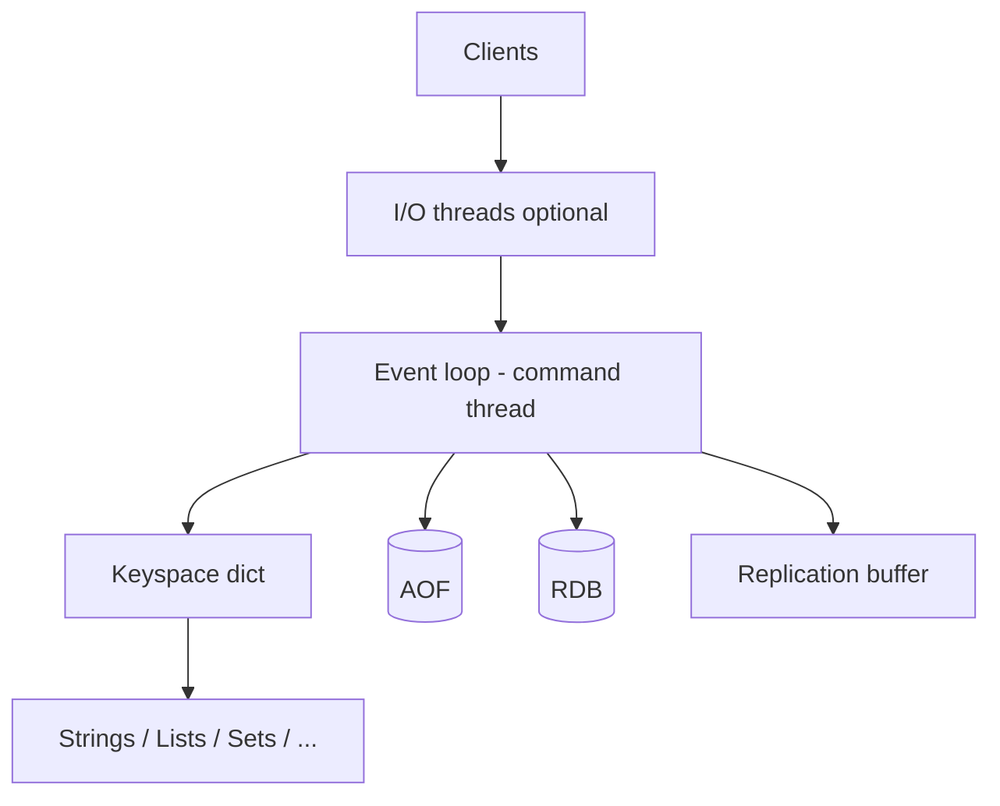

## Executive Summary

**Redis** is an in-memory data structure server: one **primary thread** executes commands, optional **I/O threads** handle networking, and data lives in **RAM** with optional RDB/AOF persistence. Clients speak the **RESP** protocol over TCP (or Unix socket).

---

## Core Concepts



| Component | Recap |
| :--- | :--- |
| **Event loop** | Single thread runs commands — no locks on data structures |
| **I/O threads** (6+) | Read/write sockets in parallel; command execution stays single-threaded |
| **Keyspace** | Global hash table: key → typed object (robj) |
| **RESP** | Simple text protocol; pipelining = many commands, one round trip |
| **Memory** | `used_memory` vs `used_memory_rss`; jemalloc allocator |
| **Modules** | Redis Stack, RediSearch, RedisJSON extend core via API |

---

## Quick Reference

```bash
redis-cli INFO server
redis-cli INFO memory
redis-cli INFO stats
redis-cli CONFIG GET maxmemory
redis-cli CONFIG GET io-threads
redis-cli CLIENT LIST
redis-cli MONITOR          # debug only — kills prod throughput
```

---

## Snippets

### `redis.conf` essentials

```conf
bind 0.0.0.0
protected-mode yes
port 6379
maxmemory 2gb
maxmemory-policy allkeys-lru
io-threads 4
io-threads-do-reads yes
appendonly yes
appendfsync everysec
```

### Connection from app (Lettuce — Java)

```java
RedisClient client = RedisClient.create("redis://localhost:6379");
StatefulRedisConnection<String, String> conn = client.connect();
conn.sync().set("key", "value");
```

---

## Common Gotchas

| Pitfall | Fix |
| :--- | :--- |
| `KEYS *` in production | Use `SCAN` with cursor |
| `MONITOR` on busy instance | Use `LATENCY DOCTOR`, slowlog |
| Assuming multi-threaded command execution | Only one command thread — offload with sharding (Cluster) |
| No `maxmemory` + no eviction | OOM kill at OS level |

---

## Related Topics

- [Next: Data Structures](/redis-cheatsheet/data-structures/)
- [Redis Cheatsheet Index](/redis-cheatsheet/)
- [Redis vs Memcached](/database-handbook/redis-vs-memcached/)
- [Database Handbook](/database-handbook/)
