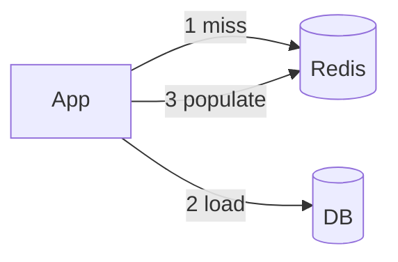

## Executive Summary

Standard cache patterns with Redis: **cache-aside**, **read-through**, **write-through**, **write-behind** — plus **stampede** protection with locks or probabilistic early expiry.

---

## Core Concepts



| Pattern | Flow |
| :--- | :--- |
| **Cache-aside** | App reads cache; on miss loads DB and sets cache |
| **Write-through** | Write DB + cache together |
| **Write-behind** | Write cache; async flush to DB |
| **TTL jitter** | `EX = base + random(0, 60)` avoids thundering herd |

---

## Quick Reference

Cache-aside:
```bash
GET key || (load DB; SET key val EX 300)
```

Invalidate:
```bash
DEL key
# or PUBLISH cache:invalidate key
```

---

## Snippets

### Stampede lock

```bash
SET lock:rebuild:product:99 1 NX EX 10
# winner rebuilds; losers retry GET or wait
```

### Probabilistic early expiration

Refresh cache when `ttl < random_threshold`.

---

## Common Gotchas

| Pitfall | Fix |
| :--- | :--- |
| Cache inconsistency after DB update | Delete/update cache on write |
| Same TTL for all keys | Expiry stampede — add jitter |
| Caching null forever | Short TTL for negative cache |

---

## Related Topics

- [Previous: Eviction](/redis-cheatsheet/eviction-policies/)
- [Next: Distributed Lock](/redis-cheatsheet/distributed-lock/)
- [Redis Cheatsheet Index](/redis-cheatsheet/)
- [Redis vs Memcached](/database-handbook/redis-vs-memcached/)
- [Database Handbook](/database-handbook/)
