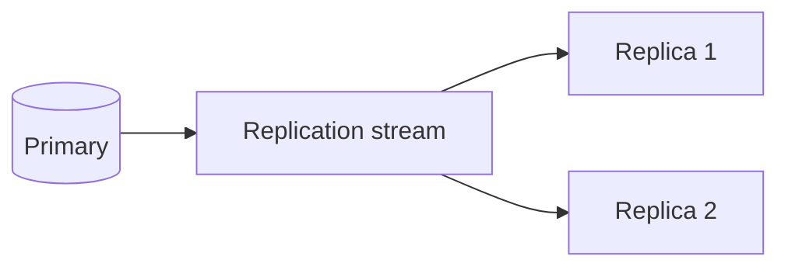

## Executive Summary

**Primary → replica** async replication. Replicas serve **reads** (optional) and provide failover candidates. **Partial resync** via replication backlog on short disconnects.

---

## Core Concepts



| Setting | Purpose |
| :--- | :--- |
| `REPLICAOF host port` | Join as replica |
| `INFO replication` | Lag, offset, role |
| `replica-read-only yes` | Block writes on replica |
| `min-replicas-to-write` | Quorum write safety |

---

## Quick Reference

```bash
INFO replication
ROLE
REPLICAOF 10.0.0.1 6379
REPLICAOF NO ONE    # promote manually
CONFIG GET repl-backlog-size
```

---

## Snippets

### Read from replica (Spring Lettuce)

```java
// configure ReadFrom.REPLICA_PREFERRED for read scaling
```

Monitor `master_repl_offset` vs `slave_repl_offset` for lag.

---

## Common Gotchas

| Pitfall | Fix |
| :--- | :--- |
| Stale reads on replica | `WAIT numreplicas timeout` after write if needed |
| Replica writable | Keep `replica-read-only yes` |
| Full resync after long outage | Increase `repl-backlog-size` |

---

## Related Topics

- [Previous: Persistence](/redis-cheatsheet/persistence/)
- [Next: Sentinel](/redis-cheatsheet/sentinel/)
- [Redis Cheatsheet Index](/redis-cheatsheet/)
- [Redis vs Memcached](/database-handbook/redis-vs-memcached/)
- [Database Handbook](/database-handbook/)
