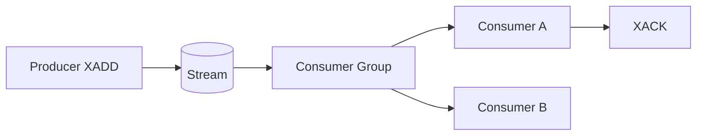

## Executive Summary

**Streams** are append-only logs with **auto IDs** (`milliseconds-sequence`). **Consumer groups** give at-least-once delivery, pending entries, and acknowledgment — Redis's replacement for list-based queues.

---

## Core Concepts



| Command | Purpose |
| :--- | :--- |
| `XADD` | Append entry |
| `XREAD` | Read from ID |
| `XGROUP CREATE` | Consumer group |
| `XREADGROUP` | Group read |
| `XACK` | Ack processed |
| `XPENDING` | Unacked messages |
| `XCLAIM` | Reclaim stale pending |

---

## Quick Reference

```bash
XADD orders * userId 42 amount 99.99
XREAD COUNT 10 STREAMS orders 0
XGROUP CREATE orders processors $ MKSTREAM
XREADGROUP GROUP processors c1 COUNT 1 STREAMS orders >
XACK orders processors 1690000000000-0
XPENDING orders processors
XTRIM orders MAXLEN ~ 10000
```

---

## Snippets

### Producer / consumer sketch

```bash
# producer
XADD events * type ORDER_PLACED id 42
# consumer
XREADGROUP GROUP workers w1 BLOCK 5000 COUNT 10 STREAMS events >
XACK events workers <message-id>
```

---

## Common Gotchas

| Pitfall | Fix |
| :--- | :--- |
| No `XACK` after read | Message stays pending — monitor `XPENDING` |
| Consumer crash | Use `XAUTOCLAIM` / `XCLAIM` with idle time |
| Unbounded stream | `XTRIM` or `MAXLEN ~` on `XADD` |

---

## Related Topics

- [Previous: HyperLogLog](/redis-cheatsheet/hyperloglog/)
- [Next: Pub/Sub](/redis-cheatsheet/pub-sub/)
- [Redis Cheatsheet Index](/redis-cheatsheet/)
- [Redis vs Memcached](/database-handbook/redis-vs-memcached/)
- [Database Handbook](/database-handbook/)
