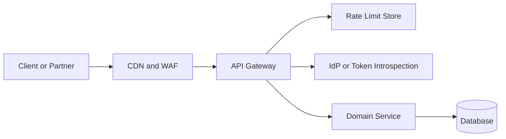

## 1. Production Problem

Public APIs are hit by customers, partners, bots, scanners, broken clients, replay attempts, and real attackers. The API gateway is not the whole security architecture, but it is the first programmable trust boundary for internet traffic.

## 2. Why Existing Approaches Failed

Application-only controls failed because abusive traffic consumed compute before being rejected. IP-only rate limits failed behind NAT, mobile networks, and botnets. WAF-only protection failed because WAFs do not understand business authorization. Idempotency-only designs failed because replay protection and duplicate-safe processing are different problems.

## 3. Architecture Evolution

API security evolved into layered edge controls: CDN/WAF for generic filtering, gateway for authentication and normalization, schema validation for request shape, rate limiting for abuse, signing for high-risk partner calls, and service-level authorization for business decisions.

## 4. Complete Request Flow

For a BookMyShow ticket booking API, the edge blocks known malicious patterns, the gateway validates token and route, schema validation rejects malformed payloads, rate limits apply by user, tenant, route, and risk, idempotency keys protect booking retries, replay nonces protect signed partner calls, and the booking service enforces seat ownership and payment state.

## 5. Production Architecture

Use WAF for generic internet noise. Use gateway auth for token validation and header sanitization. Use schema validation before deserialization reaches services. Use distributed rate limiting with local fast path plus central state. Use HMAC signatures and timestamp/nonce checks for partner APIs where request integrity matters.

## 6. Kubernetes Implementation

Implement controls in Envoy, Kong, NGINX, Istio ingress, or cloud gateway. Keep Redis or rate-limit services isolated and time-bounded. Gateway failure modes must be explicit: auth should fail closed, optional telemetry can fail open, and rate limiting may degrade to local limits during central store outage.

## 7. Cloud Implementation

AWS WAF, CloudFront, API Gateway, ALB, Azure Front Door, GCP Cloud Armor, and managed API gateways can provide pieces of the boundary. The architectural decision is which control is enforced globally at the edge versus locally in services.

## 8. Production Debugging

For unexpected 429s, inspect key design, tenant/user/IP dimensions, Redis latency, local token cache, retry behavior, and gateway clocks. For replay failures, inspect timestamp skew, nonce TTL, canonicalization, body hashing, and duplicate idempotency keys. For gateway bypass, inspect private service exposure, internal load balancers, mTLS policy, and trusted header stripping.

## 9. Failure Scenarios

Redis outage causes gateway latency cascade. Botnet creates millions of rate-limit keys and exhausts memory. Client retry storm turns 429s into a self-inflicted DDoS. Partner signature verification fails because client and gateway canonicalize headers differently.

## 10. Tradeoffs

Strict gateway validation reduces service risk but can slow API evolution. Central rate limits are accurate but add latency and dependency. Local limits are fast but inconsistent. Request signing improves integrity but adds operational friction for partners.

## 11. Interview Questions

What belongs in WAF, gateway, and service code?

Why is rate limiting by IP insufficient?

How does request signing differ from JWT authentication?

What should happen if the rate-limit store is down?

## 12. Common Misconceptions

"Gateway authorization is enough." Gateways lack full domain context.

"Idempotency prevents replay attacks." It prevents duplicate effects for a known operation; replay defense rejects reused signed requests.

"WAF understands the business." It mostly understands patterns, not intent.
