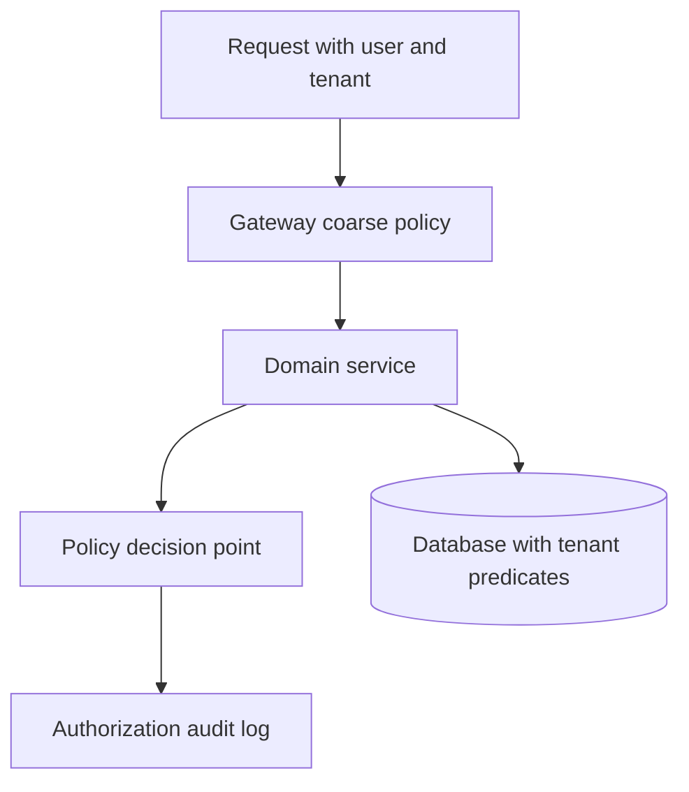

## 1. Production Problem

After authentication, the system knows who the caller is. It still does not know whether Jane can approve payment `pay-9981`, view patient `p-77`, export tenant data, or impersonate a customer for support. Authorization answers: **is this identity allowed to perform this action on this resource in this context?**

## 2. Why Existing Approaches Failed

UI-only authorization failed because APIs could be called directly. Gateway-only authorization failed because business context lived inside services. Role-only authorization failed because roles exploded across tenants, departments, regions, risk levels, and resource ownership. Hardcoded authorization failed because policy changes required code releases and were impossible to audit centrally.

## 3. Architecture Evolution

Production authorization moves from coarse roles to layered decisions: gateway coarse checks, service domain checks, data predicates, policy engines for shared rules, and audit records for every sensitive decision.

## 4. Complete Request Flow

In enterprise SaaS, a user calls `GET /tenants/acme/invoices/123`. The gateway verifies token, tenant route, and required scope. The invoice service loads invoice metadata, asks policy whether this user can read this invoice, applies tenant predicate in the query, returns the record, and writes an audit event containing user, tenant, action, resource, decision, and reason.

## 5. Production Architecture

Use RBAC for coarse job functions. Use ABAC for attributes such as tenant, region, data classification, device posture, and risk. Use relationship checks for ownership and delegated access. Use OPA or another policy decision point when policies must be shared, tested, versioned, and audited.

Do not confuse application authorization with Kubernetes RBAC or cloud IAM. Kubernetes RBAC controls cluster API actions. Cloud IAM controls cloud API actions. Application authorization controls business actions.

## 6. Kubernetes Implementation

Deploy policy engines as sidecars or central services depending on latency and operational needs. Use ConfigMaps or bundles for policy distribution only when integrity and rollout are controlled. Keep service accounts least-privileged; a service's Kubernetes permissions should not imply application permissions.

## 7. Cloud Implementation

Cloud IAM is excellent for infrastructure permissions, such as reading S3, decrypting KMS, or assuming roles. It is not enough for invoice approval, medical record access, or marketplace seller permissions. Some systems combine IAM with application claims, but domain authorization must remain explicit.

## 8. Production Debugging

For unexpected allow or deny, inspect identity claims, tenant context, route mapping, resource ownership, policy version, cached attributes, data predicates, and audit decision reason. Missing reason codes are an architecture defect.

## 9. Failure Scenarios

Missing tenant predicate returns another customer's data. Role explosion creates `admin`, `super_admin`, and `almost_admin` without clear meaning. OPA bundle drift causes one pod to allow a request another pod denies. Support impersonation bypasses audit and becomes invisible privileged access.

## 10. Tradeoffs

Central policy improves consistency but adds latency and availability dependency. Local policy is fast but can drift. RBAC is simple but coarse. ABAC is expressive but harder to explain and test. Deny-by-default is safer but requires careful rollout.

## 11. Interview Questions

Why is a valid JWT not enough to grant access?

Where should tenant isolation be enforced?

When is RBAC insufficient?

How would you design authorization for support impersonation?

What happens if the policy engine is unavailable?

## 12. Common Misconceptions

"Authentication implies authorization." It only proves identity.

"Admin can do everything." Production systems need scoped, audited, time-bound admin powers.

"Tenant ID in the URL is enough." It must be validated against identity and enforced in data access.
