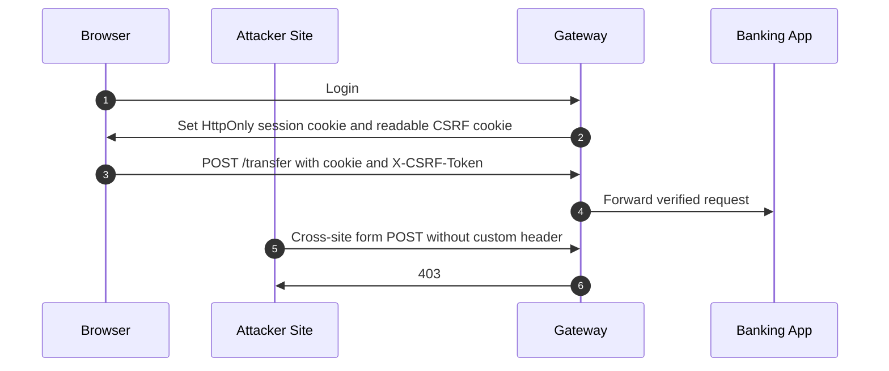

## 1. Production Problem

Banking and enterprise SaaS applications run inside hostile browsers. The browser may have malicious tabs open, extensions installed, cached scripts, third-party redirects, embedded frames, and user-controlled content. The architecture question is: **how do we use browser security boundaries without letting browser behavior become account takeover?**

## 2. Why Existing Approaches Failed

Bearer tokens in localStorage failed because XSS could read them. SameSite-only CSRF defense failed because legacy browsers, unsafe GET actions, and cross-site flows still existed. Per-service security headers failed because one legacy app forgot them. Sanitize-on-input failed because data later rendered in a different context.

## 3. Architecture Evolution

Modern browser security combines HttpOnly cookies, SameSite, CSRF tokens for state-changing requests, CSP, output encoding, secure headers, referrer control, permissions policy, and edge-injected defaults.

## 4. Complete Request Flow

After login, the app sets `__Host-Session` with Secure, HttpOnly, SameSite, and path `/`. It also sets a readable CSRF cookie. JavaScript copies the CSRF value into a custom header for state-changing calls. The gateway rejects missing or mismatched values. Responses receive CSP, HSTS, Referrer-Policy, Permissions-Policy, and `X-Content-Type-Options`.

## 5. Production Architecture

Cookies protect session storage from JavaScript. CSRF tokens prove same-origin script participation. CSP reduces script injection blast radius. Output encoding neutralizes untrusted content at the sink. Secure headers should be enforced at edge/gateway as a platform baseline, with app-specific CSP additions where needed.

## 6. Kubernetes Implementation

Use ingress or gateway policy to inject baseline headers. Keep auth/BFF services behind controlled ingress. Do not let every team paste custom NGINX snippets. Store session keys in a secrets manager. Route CSP violation reports to an async telemetry path, not the payment API.

## 7. Cloud Implementation

CloudFront, Cloudflare, Azure Front Door, API Gateway, or Envoy can inject headers and enforce routing. Object storage downloads need explicit `Content-Type` and `Content-Disposition`; otherwise `nosniff` and browser behavior can break or expose content.

## 8. Production Debugging

For CSRF failures, inspect SameSite, cookie domain, `__Host-` prefix, frontend header injection, CORS, and parallel login/token refresh races. For XSS findings, inspect rendering sink, framework escape bypasses, CSP report samples, uploaded HTML, markdown rendering, and third-party scripts. For broken redirects, inspect Referrer-Policy, SameSite, payment-provider cross-site flow, and cookie domain.

## 9. Failure Scenarios

Subdomain takeover injects a parent-domain CSRF cookie unless `__Host-` cookies are used. Marketing adds a third-party script that violates CSP or leaks tokens in URLs. HSTS `includeSubDomains` breaks an acquired legacy domain still using HTTP. React `dangerouslySetInnerHTML` renders user content without sanitization.

## 10. Tradeoffs

Strict CSP improves safety but requires script inventory and rollout. SameSite Strict is safer but can break federated login and payment redirects. Edge headers improve consistency but must allow application-specific exceptions through controlled policy.

## 11. Interview Questions

Why use HttpOnly cookies for browser sessions?

Why does SameSite not fully remove CSRF tokens?

How does CSP reduce but not eliminate XSS?

Why should secure headers be owned by the platform?

## 12. Common Misconceptions

"CSP prevents all XSS." It is a blast-radius control, not a substitute for safe rendering.

"CSRF is irrelevant for APIs." It matters when browsers attach ambient cookies.

"Sanitize input once." Encode output for the actual sink.
