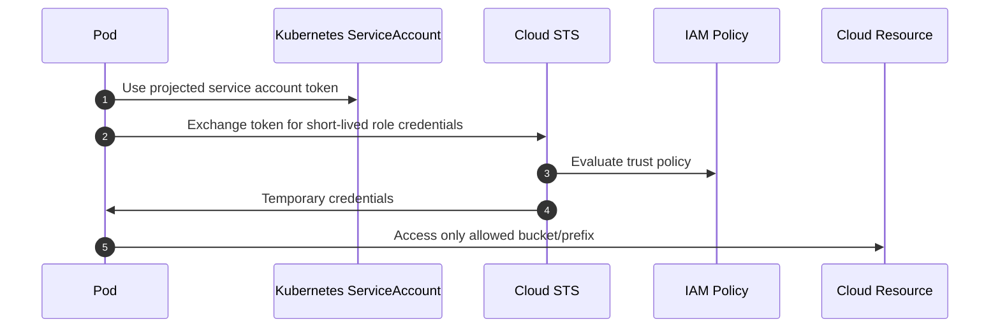

## 1. Production Problem

When an application is compromised, the attacker often wants cloud APIs: read secrets, list buckets, assume roles, create keys, disable logs, or snapshot databases. Cloud IAM decides whether an app compromise becomes a cloud compromise.

## 2. Why Existing Approaches Failed

Static access keys failed because they leaked and never expired. Node-wide permissions failed because every pod inherited the node's power. Wildcard IAM policies failed because one service could touch unrelated resources. Human admin roles failed because daily work and emergency access used the same privilege.

## 3. Architecture Evolution

Cloud identity evolved from static keys to short-lived credentials issued to specific workloads based on Kubernetes service accounts, managed identities, or workload federation.

## 4. Complete Request Flow

An invoice service needs to write PDFs to object storage. The pod runs as `invoice-writer` service account. Cloud STS exchanges its projected token for a role that can write only `s3://company-prod-invoices/acme/*`, cannot list all buckets, cannot read secrets, and cannot assume admin roles.

## 5. Production Architecture

Separate human identity, workload identity, application user identity, and resource policy. Use short-lived credentials. Scope roles by service, environment, tenant/data boundary where possible, and action. Deny privilege escalation paths explicitly.

## 6. Kubernetes Implementation

Use AWS IRSA/EKS Pod Identity, GKE Workload Identity, Azure Workload Identity, or managed identity integrations. Disable broad node-role reliance. Map one Kubernetes service account to one cloud role for high-risk workloads. Use admission policy to prevent default service account usage.

## 7. Cloud Implementation

In AWS, design IAM roles, trust policies, permission boundaries, SCPs, KMS key policies, and CloudTrail. In Azure, use managed identities, Entra ID, RBAC assignments, and Key Vault policies. In GCP, use service accounts, IAM bindings, Workload Identity Federation, and audit logs.

## 8. Production Debugging

For AccessDenied, inspect assumed role ARN, trust policy, permission policy, resource policy, key policy, region, session tags, organization policy, and explicit denies. For over-permission, trace which role was used and what else it can reach.

## 9. Failure Scenarios

Pod uses node role and can read all secrets. CI role can deploy and also modify IAM trust policies. KMS key policy allows decrypt to a broad wildcard role. CloudTrail exists but is not centralized or protected from deletion.

## 10. Tradeoffs

Fine-grained IAM reduces blast radius but increases policy management. Per-service roles are safer but create operational inventory. Session tags support attribution but require consistent propagation.

## 11. Interview Questions

Why are static cloud access keys dangerous in Kubernetes?

How does workload identity reduce blast radius?

What is the difference between IAM and application authorization?

How would you debug an unexpected cloud AccessDenied?

## 12. Common Misconceptions

"Private subnet means cloud APIs are safe." IAM still decides what can be done.

"Read-only is harmless." Read access to secrets, backups, or PII can be catastrophic.

"The node role is good enough." It couples unrelated workloads to one blast radius.
