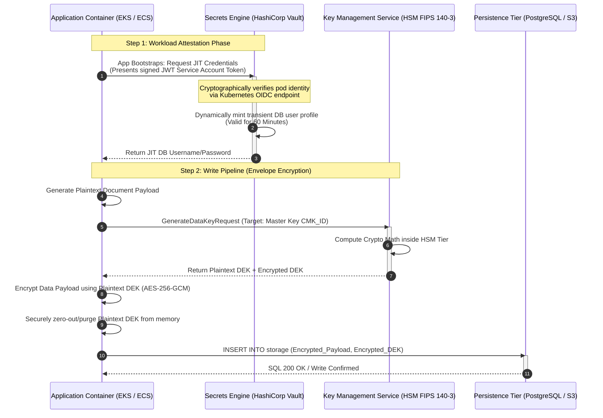

This structural playbook details the cryptographic engineering patterns required to isolate **sensitive static credentials** from application deployments, alongside the mechanics of hardware-backed **envelope encryption** for long-term data persistence.

Workloads never embed long-lived database passwords. They attest identity to a secrets engine for just-in-time credentials, then encrypt data locally with per-record data encryption keys wrapped by a centralized KMS master key — keeping plaintext DEKs out of durable storage and out of configuration templates.

---

## 1. Architectural Topology & Flow

Bootstrapping begins with workload attestation: the pod presents a signed service account JWT to Vault, receives transient database credentials, then requests a data key from KMS for envelope encryption before writing ciphertext and encrypted DEK to persistence.



---

## 2. Production Implementation Mechanics

### The Cryptographic Envelope Pipeline

To protect large blocks of structured or unstructured persistent data without running into HSM bandwidth throttling or network size limits, systems must implement **Envelope Encryption** utilizing authenticated symmetric ciphers.

| Concern | Standard |
| :--- | :--- |
| **Symmetric cipher** | Data Encryption Keys (DEKs) utilize **AES-256-GCM** (Advanced Encryption Standard in Galois/Counter Mode). Provides confidentiality and authenticated data integrity (AEAD), appending a 128-bit authentication tag to prevent ciphertext tampering. |
| **Storage layout** | The data payload is encrypted locally using the plaintext DEK. The database schema stores the encrypted payload alongside the encrypted DEK in a single composite record structure. The plaintext DEK is wiped from application memory using memory-zeroing primitives immediately following cryptographic completion. |

### Cryptographic Configuration Layout

```go
// Production Go snippet illustrating crypto block parameter mapping
import (
    "crypto/aes"
    "crypto/cipher"
    "crypto/rand"
    "io"
)

func EncryptPayload(plaintext []byte, plaintextDEK []byte) ([]byte, error) {
    block, err := aes.NewCipher(plaintextDEK)
    if err != nil { return nil, err }

    // GCM provides AEAD authentication capabilities
    aesGCM, err := cipher.NewGCM(block)
    if err != nil { return nil, err }

    // Nonce must be cryptographically secure and unique per execution
    nonce := make([]byte, aesGCM.NonceSize())
    if _, err = io.ReadFull(rand.Reader, nonce); err != nil { return nil, err }

    // Sealed output prepends the unique initialization vector (nonce) to ciphertext block
    ciphertext := aesGCM.Seal(nonce, nonce, plaintext, nil)
    return ciphertext, nil
}
```

---

## 3. The Security Architect's Interrogation (Hard Q&A)

### Q1: If an attacker gains administrative access to our database instance, what stops them from reading the `Encrypted_DEK` column, calling our KMS API directly, and decrypting every single user record?

**Platform Architect Answer:** Storing the encrypted DEK side-by-side with the payload is expected behavior in an envelope architecture, as the data remains protected by centralized IAM boundaries. The database root user has no implicit permissions to access the cryptographic key plane.

The Key Management Service (KMS) enforces highly restrictive, isolation-aware **Key Policies**. The KMS evaluates the calling identity's specific workload properties (e.g., matching the application container's explicit AWS IAM Execution Role). If an administrator tries to execute a decryption call using a database runtime identity, the KMS rejects the request at the IAM tier, logging an instant security alert before any crypto processing occurs.

### Q2: Why rely on complex Just-In-Time (JIT) dynamic credentials instead of storing long-lived, highly entropic 64-character encrypted static database keys within our configuration templates?

**Platform Architect Answer:** Long-lived static credentials represent a severe security risk. They are vulnerable to developer exposure via diagnostic log traces, backup leakages, inside threats, and configuration drift.

By migrating to **JIT dynamic generation**, static passwords are completely eliminated from the environment. The Secrets Engine dynamically creates transient database users with narrow scopes (e.g., restricted read-write access to table X) on-demand, assigning a hard **60-minute** Time-To-Live (TTL). When the TTL expires, the engine automatically runs a drop command against the database cluster, invalidating the identity and shrinking our vulnerability exposure window to near zero.

---

## 4. Failures at Scale & Operational Runbook

### Scenario A: High-Velocity Autoscaling Scale-Out KMS Throttling (API Exhaustion)

**The failure:** A major customer traffic event triggers sharp application cluster autoscaling, bringing hundreds of new container pods online simultaneously. These containers run initialization lookups to fetch dynamic configurations and invoke data key requests, exceeding cloud provider KMS API rate limits and causing boot-up sequences to fail.

**The runbook architecture:**

1. **Deploy local encrypted key caching:** Implement local, memory-bound caching of decrypted Data Encryption Keys using a local cache wrapper (e.g., the AWS Encryption SDK Cache CMM). This allows the application to reuse verified DEKs for safe encryption operations across a tight time limit (e.g., **5 minutes**) without making synchronous remote network calls to the KMS.
2. **Configure jitter backoff resiliency:** Configure secret lookup client SDKs with mandatory exponential backoff algorithms combined with randomized timing variation (Jitter) to distribute connection spikes during cluster scaling events.

### Scenario B: Dynamic Target Rotation Desynchronization (The Stale-Credential Hang)

**The failure:** The secrets manager executes an automated rotation protocol for an external third-party dependency API token. Due to transient network routing faults, the application container fails to intercept the webhook event notification, continuing to use its cached, stale credential. This triggers widespread downstream authentication failures.

**The runbook architecture:**

- **Enforce multi-version token buffering:** The secrets engine must keep both the old and new token variations active simultaneously during a defined overlapping grace period (e.g., **24 hours**).
- **Implement reactive polling catchers:** When an application thread catches a downstream **HTTP 401 Unauthorized** exception, it must immediately trip a local circuit breaker to bypass the local cache layer. The application then performs an on-demand, synchronous fetch against the secrets engine to pull the latest version before throwing a permanent execution error up the wire.

---

*Previous: [Distributed Rate Limiting Topologies & L7 DDoS Mitigation](/security-architecture/distributed-rate-limiting-l7-ddos/)* · *Next: [Implementing Strict Zero Trust & Mutual TLS (mTLS)](/security-architecture/zero-trust-mtls/)*
