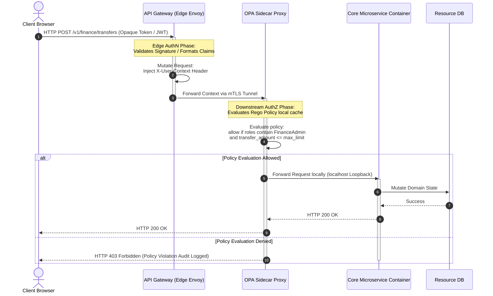

This structural playbook details the architectural bifurcation of **identity validation** at the system ingress layer from **fine-grained authorization policies** executed at the service compute boundary.

Authentication answers *who* the caller is — verified once at the edge. Authorization answers *what* that identity may do — evaluated locally at each service boundary against domain policy, without re-parsing client credentials inside application code.

---

## 1. Architectural Topology & Flow

Traffic crosses two distinct trust phases: the API Gateway performs signature validation and claim extraction, then injects a standardized identity context header. The OPA sidecar evaluates Rego policy against that context before the request reaches the application container on localhost loopback.



---

## 2. Production Implementation Mechanics

### Decoupled Policy Separation Matrix

To build an enterprise-grade perimeterless ecosystem, identity verification (Authentication) must be stripped away from discrete domain policy evaluation (Authorization).

| Layer | Responsibility | Engine behavior |
| :--- | :--- | :--- |
| **Ingress gateway (Authentication)** | Evaluate *who* the user is | Inspects signatures, extracts root claims, enforces broad rate-limiting rules. Mutates the incoming context payload to generate a standardized downstream metadata container header (`X-User-Context`). |
| **Compute container sidecar (Authorization)** | Evaluate *what* that user can do based on application domain state | Runs an instance of Open Policy Agent (OPA) or a specialized compiled WebAssembly policy block inside the service container pod boundary via localhost loopback communication. |

### Standardized Internal Transit Context Structure

The API Gateway drops client-facing credential objects and injects a signed JSON payload containing unambiguous identity facts down the wire:

```json
{
  "user_id": "usr_99812",
  "organization_id": "org_finance_prod",
  "roles": ["FinanceAdmin", "BillingManager"],
  "clearance_level": 3,
  "identity_assurance_level": "IAL2"
}
```

### Gateway JWT Verification Before OPA Evaluation

Standard OPA sidecars evaluate JSON logical policy rules — they do **not** perform cryptographic signature verification on raw input fields out of the box. A forged or tampered `X-User-Context` header would pass straight into Rego evaluation if signature checks are omitted.

The downstream **Envoy proxy must validate the context JWT signature first**, using a local **JWKS filter** block wired to the gateway's internal signing key set (`/.well-known/jwks.json` or an SDS-backed trust bundle). Only after signature, `iss`, `aud`, and `exp` assertions succeed does the sidecar deserialize verified claims and forward the resulting context object to the OPA engine endpoint over **localhost loopback**. OPA never receives unsigned or unvalidated header material.

```
Inbound mTLS request
  → Envoy JWKS filter: verify X-User-Context JWT signature + claims
  → Deserialize verified claims JSON
  → OPA localhost: POST /v1/data/authz/allow (claims as input)
  → Allow/deny → forward to app container or return 403
```

---

## 3. The Security Architect's Interrogation (Hard Q&A)

### Q1: If you decouple authentication from authorization, how do you defend against an internal privilege escalation vulnerability where a compromised service tampers with the `X-User-Context` header to forge roles?

**Platform Architect Answer:** Downstream microservices never accept unauthenticated, raw HTTP transit lines over the network. The `X-User-Context` metadata packet is strictly embedded within an asymmetrically signed cryptographic payload minted exclusively by the API Gateway using an ephemeral internal private signing key.

Alternatively, if a service mesh is active, the context is passed via custom Envoy metadata filters protected by strict internal mTLS assertions. Downstream sidecar proxies reject any incoming connection containing unsigned or unvalidated context markers before the data packet touches the destination application code.

### Q2: Fine-grained Authorization (ABAC) often depends heavily on dynamic data points (e.g., checking if the user is the explicit owner of the resource being edited). Doesn't pulling this data from the DB during authorization introduce heavy latency bottlenecks?

**Platform Architect Answer:** We avoid synchronous, blocking database inquiries within the authorization loop by utilizing a **Hybrid Policy Distribution Pattern**. Static access logic (e.g., matching roles to endpoints) is evaluated instantly using local, compiled Rego policy definitions cached in-memory inside the OPA sidecar proxy.

For dynamic attribute verification, the underlying microservice executes a specialized data-fetch operation after passing the initial role validation gate, embedding the data injection check natively within its internal object-relational query design rather than routing it through external out-of-band proxy dependencies.

---

## 4. Failures at Scale & Operational Runbook

### Scenario A: Local Policy Engine Desynchronization (The Stale-Rule Split)

**The failure:** A critical access revoke patch is broadcast to the global infrastructure layer, but due to network partition faults, a cluster segment fails to fetch the updated OPA policy ruleset. The isolated cluster continues running stale caching patterns, allowing unauthorized user actions.

**The runbook architecture:**

1. **Strict policy version fingerprinting:** Every outbound authorization metadata response must echo back a cryptographic hash indicating the exact version identifier (`policy_bundle_sha`) currently loaded in memory.
2. **Automated gateway drop loop:** The API Gateway monitors these version markers via downstream response tracing. If a service responds with an outdated policy bundle signature exceeding a specific grace period (e.g., older than **60 seconds**), the gateway automatically trips a circuit breaker, routing subsequent client requests away from the compromised node until its policy state synchronizes.

### Scenario B: Context Parsing Crash Vector (Malformed Ingress Vectors)

**The failure:** An edge component encounters an extreme edge-case unicode user character configuration, emitting a corrupt or malformed string layout within the internal identity context block. Downstream JSON standard parsers throw unhandled exceptions, crashing the application workers.

**The runbook architecture:**

- **Schema shielding via JSON-Schema validators:** Run a strict, high-speed declarative structural check against the `X-User-Context` block inside the sidecar ingress wrapper before invoking microservice application processing.
- **Safe fallback serialization execution:** If validation fails, intercept the runtime error immediately, discard the parsing stack context gracefully, pass a generic **HTTP 400 Bad Request** or **HTTP 500 Cryptographic Error** signature up the wire, and log the malformed telemetry snippet safely within a sandboxed SIEM debugging queue.

---

*Previous: [SCIM 2.0 Centralization & Enterprise Lifecycle Provisioning](/security-architecture/scim-enterprise-provisioning/)* · *Next: [Modern CSRF Defenses & The Double-Submit Cookie Pattern](/security-architecture/csrf-double-submit-cookie/)*
