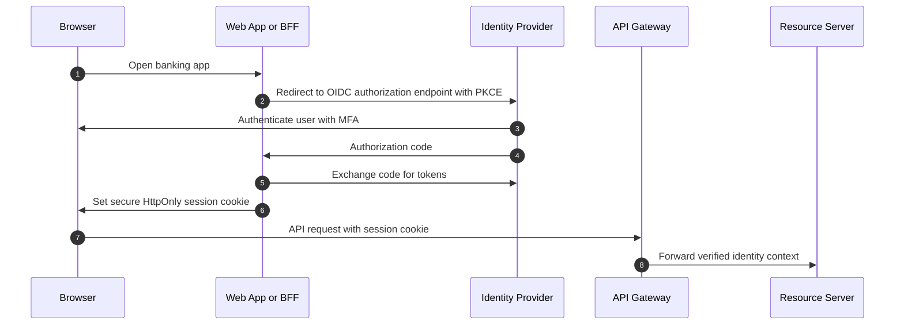

## 1. Production Problem

A banking application must let customers sign in from browsers and mobile apps, let partners call APIs, let internal services call each other, and let security teams revoke access during incidents. The hard question is not "JWT or session?" It is: **how does the system prove the caller, carry identity safely, and revoke access when trust changes?**

## 2. Why Existing Approaches Failed

Password sharing with third-party apps failed because users gave away credentials. Long-lived bearer tokens failed because theft became persistent access. Stateless JWT-only designs failed when teams needed emergency logout and revocation. LocalStorage token storage failed because XSS became account takeover. Repeated token parsing in every service failed because validation and claim interpretation drifted.

## 3. Architecture Evolution

Enterprise authentication combines OIDC login, authorization code with PKCE, server-side sessions or short-lived access tokens, refresh-token rotation, opaque external tokens for high-risk APIs, and controlled internal identity propagation.

## 4. Complete Request Flow

For browser apps, prefer a backend-for-frontend or server session when possible. The browser holds an HttpOnly, Secure, SameSite cookie. The server stores session state or exchanges it for short-lived access tokens. For mobile and machine clients, use OAuth flows appropriate to the client type. For partner APIs, consider opaque tokens at the edge and internal JWTs behind the gateway.

## 5. Production Architecture

Use OIDC for login, OAuth2 for delegated authorization, short-lived access tokens for API calls, refresh-token rotation for continuity, revocation events for emergency control, and key rotation through JWKS with multiple active keys during transition.

Phantom token pattern belongs here: external clients present opaque tokens; the gateway introspects them and mints short-lived internal JWTs. This keeps public tokens non-readable while preserving stateless service validation behind the boundary.

## 6. Kubernetes Implementation

Run IdP connectors, BFFs, and gateways behind controlled ingress. Store client secrets in a secrets manager. Use NetworkPolicy so only gateways/BFFs can call token exchange endpoints. Mount JWKS caches carefully: refresh on unknown `kid`, rate-limit JWKS fetches, and support overlapping keys.

## 7. Cloud Implementation

AWS Cognito, Azure Entra ID, Auth0, Okta, and Keycloak can all participate, but the design remains the same: external identity provider, application session boundary, API resource servers, audit trail, secrets storage, and cloud logging. Do not let cloud IAM substitute for customer application authentication.

## 8. Production Debugging

For login failures, check redirect URI, PKCE verifier, clock skew, cookie domain, SameSite behavior, IdP client configuration, and callback routing. For API 401s, check token expiry, issuer, audience, signature key, JWKS cache, algorithm, tenant claim, and gateway header mutation. For logout failures, check session store, refresh token revocation, access token lifetime, back-channel logout, and service caches.

## 9. Failure Scenarios

JWKS rotation breaks every API because services cached one key forever. Refresh token replay is not detected because rotation state is not stored. An internal JWT leaks into browser logs because edge/header mutation is wrong. Redis session eviction logs out all users during a traffic spike.

## 10. Tradeoffs

Server sessions are revocable but require shared state. JWTs scale verification but complicate revocation. Opaque tokens hide claims but require introspection or exchange. Phantom tokens add gateway complexity but reduce public token exposure.

## 11. Interview Questions

Why is OAuth2 not the same as OIDC?

When would you choose server sessions over JWTs?

How do refresh-token rotation and replay detection work?

How do you revoke access when JWTs are short-lived but stateless?

Why use a phantom token pattern?

## 12. Common Misconceptions

"JWT means stateless authentication." Login, refresh, logout, and revocation still need state somewhere.

"ID tokens are for APIs." ID tokens describe authentication to the client; access tokens authorize API calls.

"PKCE is only for mobile." Modern browser clients also benefit from PKCE.

"LocalStorage is fine because tokens expire." XSS can use the token before it expires.
