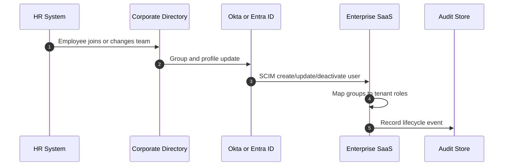

## 1. Production Problem

Enterprise SaaS products do not create user identity in isolation. A customer already has corporate identity in Microsoft Entra ID, Okta, Google Workspace, LDAP, HR systems, and approval workflows. The product must know who the user is, which tenant they belong to, which groups they inherit, and when access must disappear.

## 2. Why Existing Approaches Failed

Manual account creation failed because terminated employees stayed active. Login-only SSO failed because it authenticated users but did not provision or remove accounts. Nightly CSV sync failed because access changes lagged behind real-world employment changes. Application-local roles failed because every SaaS tool drifted from the corporate source of truth.

## 3. Architecture Evolution

Enterprise identity evolved from local accounts to federated login, then to automated lifecycle provisioning.

## 4. Complete Request Flow

A finance employee joins a corporate customer. HR creates the employee record. The directory assigns department and manager. The IdP places the employee in finance groups. SCIM provisions the SaaS user. On first login, OIDC proves identity. The SaaS authorization layer maps group claims and internal policy to actions such as "approve invoice up to limit."

## 5. Production Architecture

Treat the IdP as the authentication authority, SCIM as the lifecycle transport, and the application as the domain authorization authority. Do not let SCIM group names directly become unlimited permissions without mapping, review, and tenant scoping.

## 6. Kubernetes Implementation

Identity lifecycle usually reaches workloads through application APIs, not Kubernetes directly. The Kubernetes part is operational: protect SCIM endpoints with dedicated ingress rules, isolate identity consumers, store SCIM tokens in a secrets manager, and emit audit events from every lifecycle handler.

## 7. Cloud Implementation

Cloud environments need separate workforce identity and workload identity. Entra or Okta may federate humans into AWS IAM Identity Center or GCP Workforce Identity Federation, while applications use workload roles. Do not confuse employee SSO with pod permissions.

## 8. Production Debugging

For "terminated user still has access", inspect HR status, directory group, IdP status, SCIM delivery logs, application user state, active sessions, refresh tokens, cached authorization decisions, and downstream entitlements.

## 9. Failure Scenarios

SCIM webhook fails silently and users remain active. User transfer adds a new group but the old group is not removed. Application caches group claims for hours after termination. Break-glass admin accounts are outside SSO and never reviewed.

## 10. Tradeoffs

Real-time provisioning reduces stale access but increases dependency on IdP availability. Local role mapping supports domain nuance but can drift. Group-based authorization is easy to operate but causes role explosion in large enterprises.

## 11. Interview Questions

What problem does SCIM solve that SSO does not?

How would you design deprovisioning for a healthcare SaaS product?

Why can a disabled IdP account still leave active application risk?

How do transfers differ from joins and leaves?

## 12. Common Misconceptions

"SSO means users are provisioned." SSO proves login; it does not guarantee lifecycle sync.

"Groups are authorization." Groups are input signals; the application still needs domain policy.

"Disabling a user ends all access." Sessions, refresh tokens, API keys, and caches may survive.
