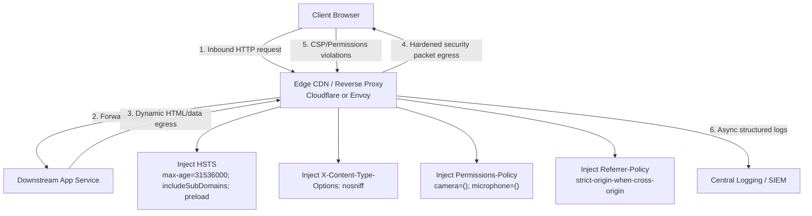

This structural playbook details the architectural implementation of **declarative browser security controls** via HTTP response headers. It outlines how to inject, enforce, and scale runtime isolation policies at the edge to defend against transport downgrades, MIME-sniffing exploits, and unauthorized client-side hardware access.

Headers are enforced uniformly at the CDN or ingress proxy — not left to individual microservices — so every egress response carries the same transport lockout, MIME discipline, referrer isolation, and device API sandbox regardless of which backend served the payload.

---

## 1. Architectural Topology & Flow

Inbound requests pass through the edge proxy to downstream services. On egress, the edge header injection engine appends security directives before the hardened response reaches the browser. Violation telemetry flows back asynchronously to SIEM without touching core transaction pipelines.



---

## 2. Production Implementation Mechanics

### Global Edge Header Enforcement Matrix

HTTP security headers must be handled at the **Edge CDN or Ingress Proxy** tier (e.g., Cloudflare Workers, AWS CloudFront Functions, Envoy global transformation filters) to ensure absolute uniformity across all downstream applications and legacy microservices.

**Production HTTP response configuration (egress payload):**

```http
HTTP/1.1 200 OK
Content-Type: text/html; charset=UTF-8
Strict-Transport-Security: max-age=31536000; includeSubDomains; preload
X-Content-Type-Options: nosniff
Referrer-Policy: strict-origin-when-cross-origin
Permissions-Policy: camera=(), microphone=(), geolocation=(), payment=(self "https://checkout.company.com"), fullscreen=(self)
```

### Engineering Specifications

| Header | Purpose | Production note |
| :--- | :--- | :--- |
| **HSTS** | Transport encryption lockout | `max-age=31536000` commits the browser to exclusive HTTPS for **1 full year** (31,536,000 seconds). The `preload` attribute authorizes browser vendors to hardcode the domain, eliminating the unencrypted 1-RTT redirect on first-ever connection. |
| **X-Content-Type-Options** | MIME sniffing disable | `nosniff` forces strict adherence to the declared `Content-Type`. User-uploaded content masking malicious JavaScript cannot be reinterpreted and executed by the browser. |
| **Permissions-Policy** | Device API feature sandbox | Empty definitions `()` explicitly block peripheral APIs globally across root domains and embedded cross-origin iframes. |
| **Referrer-Policy** | Cross-origin referrer isolation | `strict-origin-when-cross-origin` limits referrer leakage on outbound navigation. |

---

## 3. The Security Architect's Interrogation (Hard Q&A)

### Q1: If we configure HSTS with `includeSubDomains; preload` at our apex domain (`company.com`), what happens if an acquired business unit or legacy system runs an internal tool that requires plain HTTP on a subdomain like `legacy-tool.internal.company.com`?

**Platform Architect Answer:** The application will experience catastrophic connection failure across all modern browsers, as HSTS preloading is high-severity and **irreversible without months of vendor coordinate removal latency**. To safeguard against this operational lock, we execute a multi-phase rollout protocol:

We begin with an ephemeral, low time horizon (`max-age=300`) without the `preload` or `includeSubDomains` flags, and scale iteratively over multi-week telemetry assessment sprints. Concurrently, we deploy cross-organization scanning to transition all legacy workloads to local internal Private CA-issued certificates (e.g., AWS Private CA / Let's Encrypt internal ACME roots) before declaring apex-level preload configurations.

### Q2: How does `X-Content-Type-Options: nosniff` interact with object storage layers (like AWS S3), and what happens if the storage engine returns files without an explicit `Content-Type` mapping header?

**Platform Architect Answer:** If a file lacks an explicit content type, browsers default to asset execution guessing blocks, or trigger text execution if the payload structure looks like script material.

To mitigate this behavior when `nosniff` is enforced, our storage proxy pipelines explicitly assert and inject a defensive fallback header `Content-Type: application/octet-stream` alongside a strict `Content-Disposition: attachment` instruction for all unmapped or user-supplied asset configurations, rendering the potential execution path inert.

---

## 4. Failures at Scale & Operational Runbook

### Scenario A: Telemetry Denial of Service via Overloaded Violation Reporting Platforms

**The failure:** Deploying a highly restrictive `Permissions-Policy` or CSP context across millions of active client page views causes minor browser variant incompatibilities to throw millions of concurrent telemetry error packets down the `report-to` destination endpoints, instantly exhausting server compute capability.

**The runbook architecture:**

1. **Isolate telemetry routing infrastructure:** Ensure the `report-to` configuration targets an independent server endpoint completely decoupled from core transaction pipelines (e.g., routing traffic directly to an AWS SQS queue backed by an asynchronous processing engine).
2. **Edge aggregation & sampling gates:** Deploy an edge traffic-shaping script (e.g., Cloudflare Workers) to sample violation metrics downstream (e.g., processing exactly **1%** of error telemetry signals), dropping uniform redundant records before they hit internal analytical frameworks.

### Scenario B: Cross-Origin Referrer Data Leakage through Payment Gateway Frameworks

**The failure:** A marketing application incorporates dynamic query string vectors within checkout pathways (`checkout?token=secret_value`). When a consumer navigates externally to complete payment operations, loose default browser referrer parameters leak token values to untrusted third-party platforms.

**The runbook architecture:**

- **Enforce strict origin isolation directives:** Hardcode the global egress header configuration to `Referrer-Policy: strict-origin-when-cross-origin`.
- **Downstream parameter scrubbing engines:** For cross-origin boundary targets that require parameter parsing, strip metadata parameters away entirely prior to document location transition execution, passing secure variables statelessly via cryptographically bound single-use authorization session values instead.

---

*Previous: [Modern CSRF Defenses & The Double-Submit Cookie Pattern](/security-architecture/csrf-double-submit-cookie/)* · *Next: [Defensive Input Pipelines: Eradicating SQLi & XSS](/security-architecture/defensive-input-pipelines/)*
