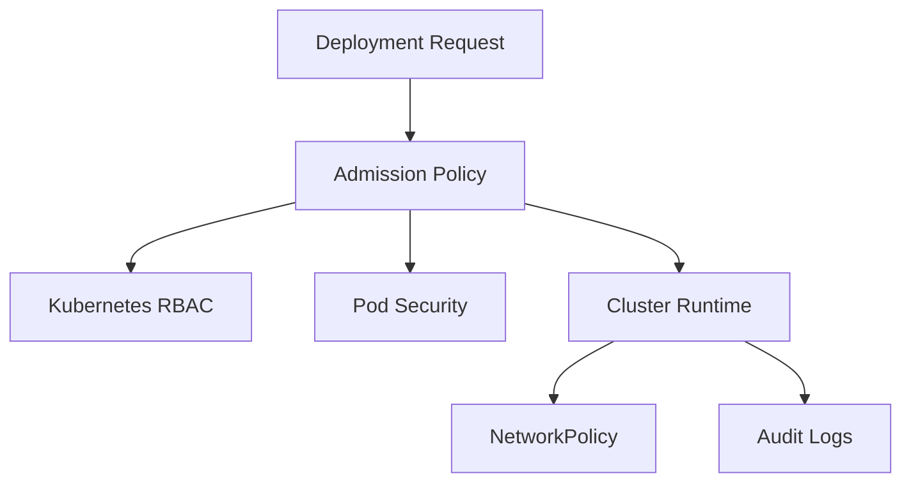

## 1. Production Problem

Kubernetes runs many teams' workloads on shared infrastructure. A single weak deployment can expose secrets, mount host paths, run privileged containers, bypass network boundaries, or use broad service account permissions.

## 2. Why Existing Approaches Failed

Cluster-admin-by-default failed because developers accidentally became platform administrators. Namespace-only isolation failed because RBAC, network, nodes, and admission still crossed boundaries. Image scanning alone failed because runtime privileges determined actual impact. Manual manifest review failed because production changes are continuous.

## 3. Architecture Evolution

Secure platforms combine identity, admission policy, runtime constraints, network segmentation, secrets controls, audit, and managed exceptions.

## 4. Complete Request Flow

A team deploys a payments workload. CI authenticates to the cluster with limited deploy permissions. Admission verifies signed image, non-root user, no privileged mode, approved registry, resource limits, required labels, and allowed service account. NetworkPolicy allows only required service calls. Runtime detection watches for shell, crypto miners, and suspicious file access.

## 5. Production Architecture

Use separate clusters or namespaces based on risk and tenant boundaries. Enforce least-privilege RBAC. Apply Pod Security Standards. Use Gatekeeper, Kyverno, or ValidatingAdmissionPolicy for guardrails. Use NetworkPolicy for east-west segmentation. Centralize audit logs.

## 6. Kubernetes Implementation

Minimum baseline: no default service account token unless needed, no privileged pods, no hostPath except approved platform components, read-only root filesystems where practical, seccomp/AppArmor, resource limits, image provenance, namespace ownership labels, and restricted secret read/list.

## 7. Cloud Implementation

Managed Kubernetes still needs security architecture. EKS, AKS, and GKE differ in IAM integration, audit logging, node identity, private endpoint design, and add-on management. Protect cluster admin access through SSO, MFA, approval, and break-glass logging.

## 8. Production Debugging

For denied deployments, inspect admission policy result, RBAC verb/resource, namespace labels, service account, image signature, pod security settings, and exception process. For suspected compromise, inspect pod exec events, secret reads, service account token use, node activity, runtime alerts, and cloud role activity.

## 9. Failure Scenarios

An app pod mounts Docker socket or host filesystem. A namespace grants developers `list secrets`. A default-deny NetworkPolicy is missing, so compromised pods scan internal services. Admission policy blocks incident hotfixes because no emergency exception path exists.

## 10. Tradeoffs

Strict policy prevents dangerous deployments but needs exception workflow. Shared clusters save cost but increase blast-radius design work. Separate clusters simplify isolation but increase platform overhead.

## 11. Interview Questions

What does Kubernetes RBAC protect, and what does it not protect?

Why is admission control important?

How do NetworkPolicy and service mesh policy differ?

How would you investigate `kubectl exec` into a sensitive pod?

## 12. Common Misconceptions

"Managed Kubernetes is secure by default." The provider manages the control plane; you still own workload security.

"Namespace equals tenant isolation." It is only one boundary.

"Image scanning is platform security." It is one signal before runtime.
