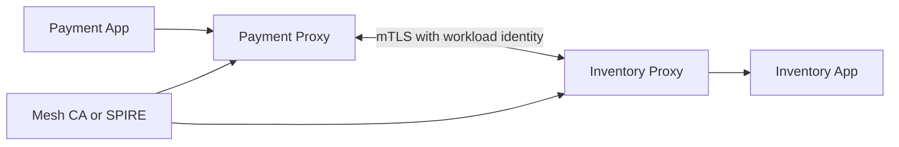

## 1. Production Problem

In Kubernetes, internal services call each other constantly. Payment calls inventory, orders call pricing, support tools call customer profile, and async workers call everything. The dangerous assumption is that internal network location proves trust.

## 2. Why Existing Approaches Failed

Source IP checks failed because pod IPs are ephemeral and reusable. Shared internal API keys failed because one leaked key unlocked many services. Plain HTTPS failed because it usually proved the server, not the calling workload. NetworkPolicy-only designs failed because they constrained paths but did not prove identity at the application boundary.

## 3. Architecture Evolution

Service trust moved from network location to cryptographic workload identity. Each workload receives a short-lived certificate tied to service account, namespace, and cluster identity. Sidecars or libraries perform mTLS and policy checks before traffic reaches application code.

## 4. Complete Request Flow

Payment calls inventory. The payment proxy presents a certificate such as `spiffe://company/prod/ns/payments/sa/payment-service`. Inventory proxy validates the certificate chain, checks policy that payment may call inventory on allowed routes, establishes mTLS, and forwards to the local inventory app with verified peer identity.

## 5. Production Architecture

Use workload identity for who is calling, mTLS for transport proof, service mesh or proxy policy for allowed call paths, and application authorization for domain decisions. mTLS does not decide whether a user can buy a ticket; it decides whether `payment-service` is really calling `inventory-service`.

## 6. Kubernetes Implementation

Use service accounts as workload identity anchors. Meshes such as Istio, Linkerd, Consul, or SPIRE-based systems issue short-lived certs. Enforce strict mTLS namespace by namespace. Add authorization policies for source service account, namespace, method, and port. Roll out in observe/permissive mode before strict mode.

## 7. Cloud Implementation

Cloud options include AWS App Mesh with Envoy, ACM Private CA, GKE service mesh, Azure service mesh integrations, or SPIRE across clusters. Keep cloud IAM separate from service identity: IAM grants cloud API permissions; mTLS proves service-to-service identity.

## 8. Production Debugging

Inspect sidecar injection, certificate issuance, SAN/SPIFFE ID, CA trust bundle, clock skew, policy match, destination service account, port naming, and proxy logs. Many mTLS outages are identity or policy mismatches, not TLS math problems.

## 9. Failure Scenarios

Certificate rotation fails and all calls start returning 503. One namespace remains permissive and becomes the bypass path. Sidecar injection is disabled for a deployment. Policy allows namespace-wide access instead of exact service account access.

## 10. Tradeoffs

Service mesh provides uniform controls but adds operational complexity, latency, and debugging surface. Library-based mTLS avoids sidecars but increases language/team implementation variance. Strict mode is safer but needs staged migration.

## 11. Interview Questions

Why is HTTPS not enough for service-to-service trust?

What does SPIFFE provide?

Does mTLS replace authorization?

How would you migrate a live cluster to strict mTLS?

## 12. Common Misconceptions

"Internal traffic is trusted." Compromised workloads are internal too.

"mTLS means the request is allowed." It proves peer identity; policy still decides access.

"NetworkPolicy and mTLS solve the same problem." NetworkPolicy constrains paths; mTLS proves workload identity.
