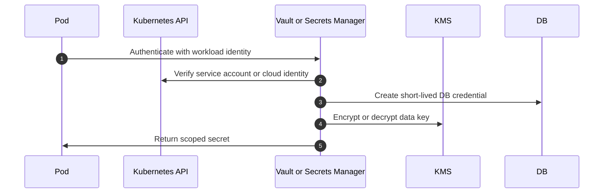

## 1. Production Problem

Applications need database passwords, API keys, signing keys, encryption keys, certificates, and access to sensitive customer data. The architecture question is: **how do workloads get only the secrets and data access they need, without turning one leak into full compromise?**

## 2. Why Existing Approaches Failed

Hardcoded secrets failed because repositories, logs, and images leaked. Shared database passwords failed because one service compromise affected every service. Kubernetes Secrets as source of truth failed because they became copied plaintext distribution objects. Encryption-at-rest-only claims failed because applications still decrypted and exposed data freely.

## 3. Architecture Evolution

Production systems moved to workload identity, central secret managers, dynamic credentials, KMS-backed envelope encryption, key rotation, data classification, masking, and tokenization.

## 4. Complete Request Flow

An orders service starts. It authenticates to Vault or cloud Secrets Manager using workload identity. It receives a short-lived database credential scoped to order tables. For sensitive fields, the service asks KMS to decrypt an envelope data key or uses a crypto service. Logs redact secrets and PII. Rotation occurs without redeploying code.

## 5. Production Architecture

Use a secrets manager for secret storage, retrieval, audit, and rotation. Use KMS for key management and cryptographic operations. Use envelope encryption for high-volume data. Use tokenization or field-level encryption for high-value data such as payment or healthcare identifiers. Classify data before choosing controls.

## 6. Kubernetes Implementation

Prefer external secret operators or CSI drivers over committed Secret manifests. If Kubernetes Secrets are used, enable etcd encryption, strict RBAC, audit secret reads, avoid environment dumps, and prevent broad list permissions. Bind secret access to namespace and service account.

## 7. Cloud Implementation

AWS Secrets Manager, SSM Parameter Store, KMS, Azure Key Vault, GCP Secret Manager, and Cloud KMS solve different parts. Avoid static cloud access keys. Use IRSA, workload identity federation, managed identities, or service accounts.

## 8. Production Debugging

For secret retrieval failures, inspect workload identity, IAM policy, secret resource policy, region, KMS grants, network path, rotation label, and cache behavior. For data exposure, inspect logs, exports, backups, analytics pipelines, support tooling, and object storage permissions.

## 9. Failure Scenarios

Rotation breaks connection pools because apps never refresh credentials. KMS throttling slows scale-out because every pod decrypts on startup. A secret is printed by exception logging. Backups contain plaintext sensitive data outside production controls.

## 10. Tradeoffs

Vault offers powerful dynamic secrets but adds operational burden. Cloud secret managers reduce operations but tie design to cloud IAM and regions. Field-level encryption protects data but complicates querying, indexing, and support workflows.

## 11. Interview Questions

What is the difference between KMS and a secrets manager?

How do you rotate a database password without downtime?

When would you use envelope encryption?

How would you protect healthcare records in a multi-tenant SaaS system?

## 12. Common Misconceptions

"Base64 Kubernetes Secrets are encrypted." Base64 is encoding.

"KMS means we do not need a secrets manager." KMS manages keys; secrets managers manage secret lifecycle.

"Encryption solves data privacy." Access paths, logs, backups, and exports still matter.
