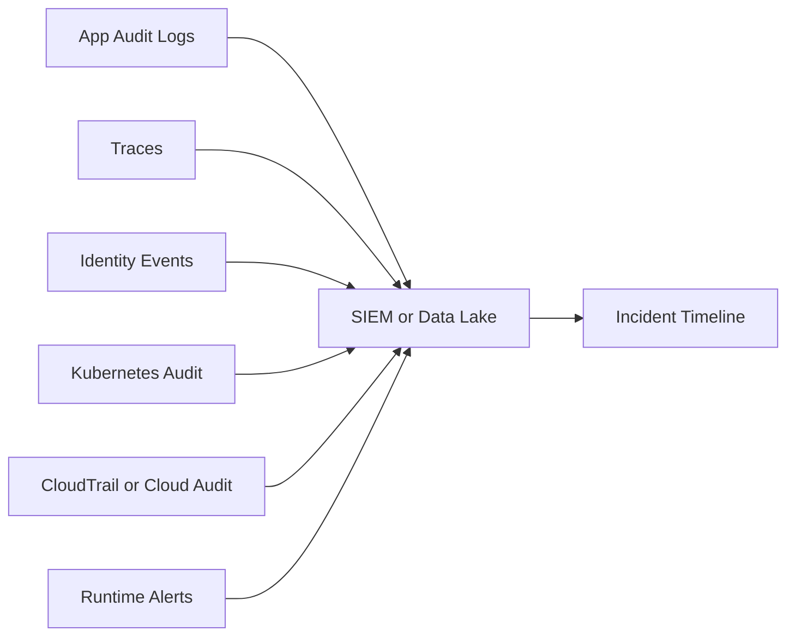

## 1. Production Problem

Even strong controls fail. The production question becomes: **can the team detect the attack, reconstruct what happened, contain blast radius, and prove recovery?**

## 2. Why Existing Approaches Failed

Application logs failed because they lacked user, tenant, and authorization context. SIEM dumps failed because millions of logs had no correlation model. Cloud logs failed because nobody mapped roles back to services. Runtime alerts failed because they had no runbook or owner.

## 3. Architecture Evolution

Security operations moved from log collection to evidence correlation: application audit, request traces, identity events, gateway logs, Kubernetes audit, cloud control-plane logs, runtime signals, and case timelines.

## 4. Complete Request Flow

An attacker steals a session and exports invoices. The SIEM alerts on unusual export volume. Investigators pivot from user to session, session to request trace, trace to pod, pod to Kubernetes service account, service account to cloud role, cloud role to object storage reads, and runtime alerts for shell or unusual process activity.

## 5. Production Architecture

Every sensitive action should emit audit data with user, tenant, action, resource, decision, request ID, trace ID, service, workload identity, and reason. CloudTrail or equivalent must be centralized and protected. Kubernetes audit should capture high-risk API actions. Runtime detection should watch behavior inside containers and hosts.

## 6. Kubernetes Implementation

Enable audit policy for secret reads, RBAC changes, pod exec, privileged pod creation, admission failures, and service account changes. Use Falco or runtime sensors for shells, unexpected network tools, sensitive file reads, and crypto miners. Map pods to owners.

## 7. Cloud Implementation

Centralize CloudTrail, Azure Activity Logs, or GCP Audit Logs across accounts/projects. Alert on access key creation, logging disabled, broad policy changes, secret reads, KMS decrypt spikes, unusual role assumption, and public storage changes.

## 8. Production Debugging

Build a timeline first. Then scope blast radius: which users, tenants, resources, credentials, pods, roles, secrets, and data exports were touched. Contain by revoking sessions, rotating secrets, disabling roles, blocking egress, and freezing affected automation.

## 9. Failure Scenarios

Logs contain request IDs but not tenant IDs. CloudTrail shows an assumed role but no service ownership. Kubernetes audit is too noisy, so high-risk events are ignored. Incident response rotates secrets but forgets refresh tokens and CI credentials.

## 10. Tradeoffs

More telemetry improves investigation but increases cost and privacy risk. High-fidelity audit logs need careful schema design. Alerting should prioritize attacker behavior and sensitive control-plane changes, not every possible anomaly.

## 11. Interview Questions

How would you design audit logging for multi-tenant SaaS?

What is the difference between logs, traces, and audit logs?

How do you investigate suspected data exfiltration?

How do you know an incident is contained?

## 12. Common Misconceptions

"We have logs, so we can investigate." Logs without identity and resource context are weak evidence.

"SIEM detects attacks automatically." It correlates signals that engineers designed.

"Containment is revoking one token." Real containment includes sessions, secrets, roles, workloads, and data paths.
