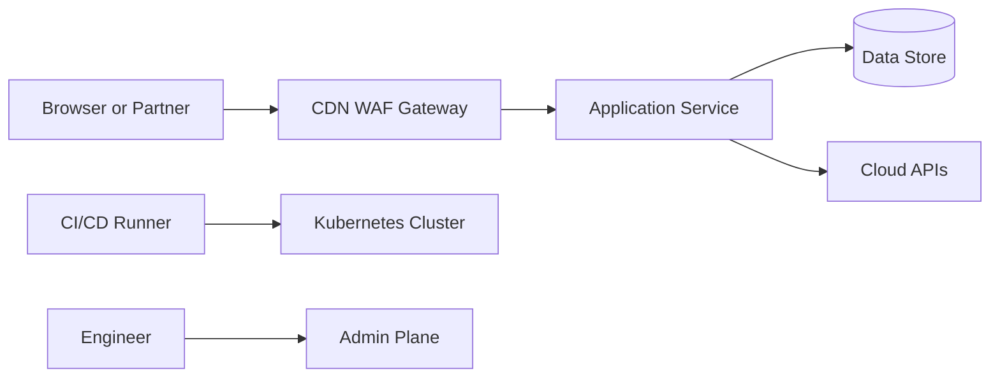

## 1. Production Problem

A payments platform has browsers, mobile apps, API gateways, Kubernetes services, databases, Kafka topics, cloud IAM roles, CI/CD runners, and administrators. Every component wants to call something else. The architecture question is not "Which security tool should we buy?" It is: **which part of this request path is allowed to be trusted, and what proves it?**

Security architecture exists because production systems fail at boundaries: browser to API, API to service, service to database, workload to cloud, engineer to production, and build pipeline to runtime.

## 2. Why Existing Approaches Failed

Flat internal networks failed because compromised internal workloads still looked trusted.

Gateway-only security failed because gateway bypass, async consumers, admin tools, and service-to-service calls still existed.

Library-only security failed because every team implemented the controls differently.

Compliance-only security failed because screenshots of controls did not explain how an attacker would move through the system.

## 3. Architecture Evolution

Early systems trusted network location. Later systems trusted perimeter devices. Modern systems trust verifiable identity, least privilege, explicit policy, short-lived credentials, observable actions, and containment.

## 4. Complete Request Flow

In a banking transfer, the browser proves a user session, the gateway validates request shape and authentication, the transfer service enforces authorization, the ledger service accepts calls only from allowed workload identities, the database role can update only required tables, and audit logs connect user, request, workload, and cloud role.

| Hop | Architectural question |
|---|---|
| Browser to edge | Is this a legitimate client request? |
| Edge to service | Has the request crossed the public boundary safely? |
| Service to service | Which workload is calling? |
| Service to data | What data can this service read or mutate? |
| Workload to cloud | What infrastructure action can this workload perform? |
| Admin to production | Who approved and performed the privileged action? |

## 5. Production Architecture

Place controls where they match the failure mode. WAFs handle generic internet abuse. Gateways normalize and authenticate public traffic. Services enforce domain authorization. Mesh policy constrains internal callers. IAM constrains cloud APIs. Database permissions limit data blast radius. Audit systems make the path reconstructable.

## 6. Kubernetes Implementation

Kubernetes gives primitives, not a secure architecture. Use namespaces for ownership boundaries, service accounts for workload identity, NetworkPolicy for traffic constraints, admission policy for deployment constraints, secrets integrations for runtime credentials, and audit logs for control-plane visibility.

## 7. Cloud Implementation

Cloud security starts with account/project/subscription boundaries, IAM role design, workload identity, logging, KMS keys, private networking, and resource policies. The dangerous mistake is giving an application role enough permissions to become a cloud administrator after compromise.

## 8. Production Debugging

When a security failure happens, reconstruct the chain: identity, boundary, policy, downstream credential, logs, and blast radius. If any link is invisible, the architecture is missing evidence.

## 9. Failure Scenarios

Gateway bypass: a service is reachable through an internal load balancer and trusts headers from any caller.

Tenant leak: code checks `order_id` but forgets `tenant_id`.

Cloud escalation: a pod role can read all secrets and assume a broader role.

Untraceable incident: application logs have request IDs but no user, tenant, workload, or cloud role.

## 10. Tradeoffs

Strong boundaries add operational work. Too many controls create fragile systems. Too few controls create invisible blast radius. The architecture job is to put the strictest controls at the highest-risk boundaries and make the common path boring.

## 11. Interview Questions

How would you define trust boundaries in a multi-tenant SaaS system?

Why is "internal network" not a sufficient trust model?

Where should authorization live if the gateway already authenticates users?

How do you limit blast radius after one service is compromised?

## 12. Common Misconceptions

"Zero trust means no trust." It means no implicit trust.

"The gateway handles security." It handles one boundary.

"Kubernetes is secure by default." Kubernetes exposes primitives that must be composed.

"HTTPS solves trust." HTTPS protects transport; it does not decide business authorization.
