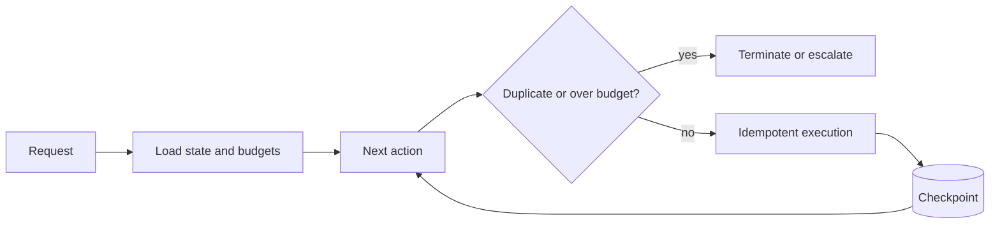

State, idempotency, timeouts, termination, recovery, testing and debugging.

## Core Flow

## Revision Map

| Question | Detailed answer |
|---|---|
| What happens if the LLM generates invalid tool arguments? | A complete answer should explain how Schema validation, deserialization failure, validation, retry/correction, controlled failure participate in the same execution path rather than listing them independently. Define what enters each boundary, what transformation or decision occurs, and what invariant must hold before the result moves forward. Close with limits, failure behavior and observable measures for quality, latency, security and cost. |
| What happens if a tool execution fails? | Use an end-to-end deadline and tracing to locate the failing segment before retrying. Protect capacity with bounded concurrency, backoff and circuit breaking, and make retries idempotent when side effects are possible. Recover through a tested fallback or safe degradation, then verify Timeout, retry, fallback, error propagation, agent decision, user response and add the incident to regression coverage. |
| How do you prevent an agent from entering an infinite tool-calling loop? | A complete answer should explain how Max iterations, state tracking, duplicate detection, timeout, termination conditions participate in the same execution path rather than listing them independently. Define what enters each boundary, what transformation or decision occurs, and what invariant must hold before the result moves forward. Close with limits, failure behavior and observable measures for quality, latency, security and cost. |
| How do you prevent duplicate tool execution? | A complete answer should explain how Idempotency keys, execution state, request IDs, deduplication participate in the same execution path rather than listing them independently. Define what enters each boundary, what transformation or decision occurs, and what invariant must hold before the result moves forward. Close with limits, failure behavior and observable measures for quality, latency, security and cost. |
| How do you handle tool timeouts and slow downstream APIs? | Use an end-to-end deadline and tracing to locate the failing segment before retrying. Protect capacity with bounded concurrency, backoff and circuit breaking, and make retries idempotent when side effects are possible. Recover through a tested fallback or safe degradation, then verify Timeout, retry policy, circuit breaker, async execution, fallback and add the incident to regression coverage. |
| How do you control agent token consumption and cost? | A complete answer should explain how Token budgets, iteration limits, prompt compression, model routing, caching participate in the same execution path rather than listing them independently. Define what enters each boundary, what transformation or decision occurs, and what invariant must hold before the result moves forward. Close with limits, failure behavior and observable measures for quality, latency, security and cost. |
| How would you design an Agent that uses RAG + REST APIs + database tools? | Separate the design into explicit components for Agent orchestration, retrieval, tools, authorization, state, error handling, with a clear contract and owner for each boundary. Show how authenticated context, state and evidence move through the system, and where deterministic policy constrains model decisions. Then explain bottlenecks, partial failures, recovery, scaling signals and the metrics that prove the complete task works. |
| How do you maintain state during multi-step agent execution? | A complete answer should explain how Agent state, conversation state, tool results, workflow state, persistence participate in the same execution path rather than listing them independently. Define what enters each boundary, what transformation or decision occurs, and what invariant must hold before the result moves forward. Close with limits, failure behavior and observable measures for quality, latency, security and cost. |
| How do you observe and debug an Agent execution? | A complete answer should explain how Trace ID, LLM calls, prompts, tool calls, latency, errors, token usage, decisions participate in the same execution path rather than listing them independently. Define what enters each boundary, what transformation or decision occurs, and what invariant must hold before the result moves forward. Close with limits, failure behavior and observable measures for quality, latency, security and cost. |
| How do you test an AI Agent? | Build a versioned dataset of representative, edge and adversarial scenarios and define expected evidence or outcomes before testing. Measure Unit tests, mocked LLM, tool tests, integration tests, scenario tests, evaluation separately so retrieval, generation and end-task failures are distinguishable. Compare against a baseline, inspect failures rather than relying on one aggregate score, and retain every accepted defect as a regression case. |
| How do you handle an LLM provider failure during agent execution? | Use an end-to-end deadline and tracing to locate the failing segment before retrying. Protect capacity with bounded concurrency, backoff and circuit breaking, and make retries idempotent when side effects are possible. Recover through a tested fallback or safe degradation, then verify Timeout, fallback model, provider routing, state preservation, retry and add the incident to regression coverage. |
| What is multi-agent architecture? | Separate the design into explicit components for Specialized agents, coordinator, delegation, communication, shared state, with a clear contract and owner for each boundary. Show how authenticated context, state and evidence move through the system, and where deterministic policy constrains model decisions. Then explain bottlenecks, partial failures, recovery, scaling signals and the metrics that prove the complete task works. |
| What happens when the LLM generates invalid tool arguments? | A complete answer should explain how Validation/recovery participate in the same execution path rather than listing them independently. Define what enters each boundary, what transformation or decision occurs, and what invariant must hold before the result moves forward. Close with limits, failure behavior and observable measures for quality, latency, security and cost. |
| How do you prevent infinite Agent loops? | A complete answer should explain how Iteration/time/token limits participate in the same execution path rather than listing them independently. Define what enters each boundary, what transformation or decision occurs, and what invariant must hold before the result moves forward. Close with limits, failure behavior and observable measures for quality, latency, security and cost. |

## Interview Lens

Keep probabilistic interpretation separate from authorization, policy, transactions and recovery. Explain trade-offs with evidence: task quality, latency, resilience, security, operating cost and auditability.
