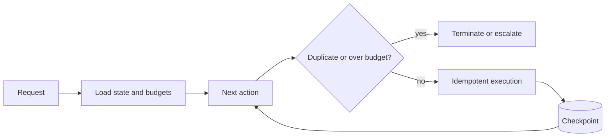

State, idempotency, timeouts, termination, recovery, testing and debugging.

## Core Flow

## Revision Map

| Question | What a strong answer should establish | Priority |
|---|---|---|
| What happens if the LLM generates invalid tool arguments? | Connect Schema validation, deserialization failure, validation, retry/correction, controlled failure; define the contract, limits, measurement and safe failure behavior for the complete path. | Critical |
| What happens if a tool execution fails? | Bound, observe and classify the failure; protect capacity, recover through an idempotent tested path, then verify Timeout, retry, fallback, error propagation, agent decision, user response. | Critical |
| How do you prevent an agent from entering an infinite tool-calling loop? | Connect Max iterations, state tracking, duplicate detection, timeout, termination conditions; define the contract, limits, measurement and safe failure behavior for the complete path. | Critical |
| How do you prevent duplicate tool execution? | Connect Idempotency keys, execution state, request IDs, deduplication; define the contract, limits, measurement and safe failure behavior for the complete path. | Critical |
| How do you handle tool timeouts and slow downstream APIs? | Bound, observe and classify the failure; protect capacity, recover through an idempotent tested path, then verify Timeout, retry policy, circuit breaker, async execution, fallback. | High |
| How do you control agent token consumption and cost? | Connect Token budgets, iteration limits, prompt compression, model routing, caching; define the contract, limits, measurement and safe failure behavior for the complete path. | High |
| How would you design an Agent that uses RAG + REST APIs + database tools? | Make Agent orchestration, retrieval, tools, authorization, state, error handling explicit as independently observable components with clear trust, state and failure boundaries. | Critical |
| How do you maintain state during multi-step agent execution? | Connect Agent state, conversation state, tool results, workflow state, persistence; define the contract, limits, measurement and safe failure behavior for the complete path. | High |
| How do you observe and debug an Agent execution? | Connect Trace ID, LLM calls, prompts, tool calls, latency, errors, token usage, decisions; define the contract, limits, measurement and safe failure behavior for the complete path. | Critical |
| How do you test an AI Agent? | Use versioned representative scenarios and measure Unit tests, mocked LLM, tool tests, integration tests, scenario tests, evaluation; compare against a baseline and retain failures as regressions. | High |
| How do you handle an LLM provider failure during agent execution? | Bound, observe and classify the failure; protect capacity, recover through an idempotent tested path, then verify Timeout, fallback model, provider routing, state preservation, retry. | High |
| What is multi-agent architecture? | Make Specialized agents, coordinator, delegation, communication, shared state explicit as independently observable components with clear trust, state and failure boundaries. | High |
| What happens when the LLM generates invalid tool arguments? | Connect Validation/recovery; define the contract, limits, measurement and safe failure behavior for the complete path. | Critical |
| How do you prevent infinite Agent loops? | Connect Iteration/time/token limits; define the contract, limits, measurement and safe failure behavior for the complete path. | Critical |

## Interview Lens

Keep probabilistic interpretation separate from authorization, policy, transactions and recovery. Explain trade-offs with evidence: task quality, latency, resilience, security, operating cost and auditability.
