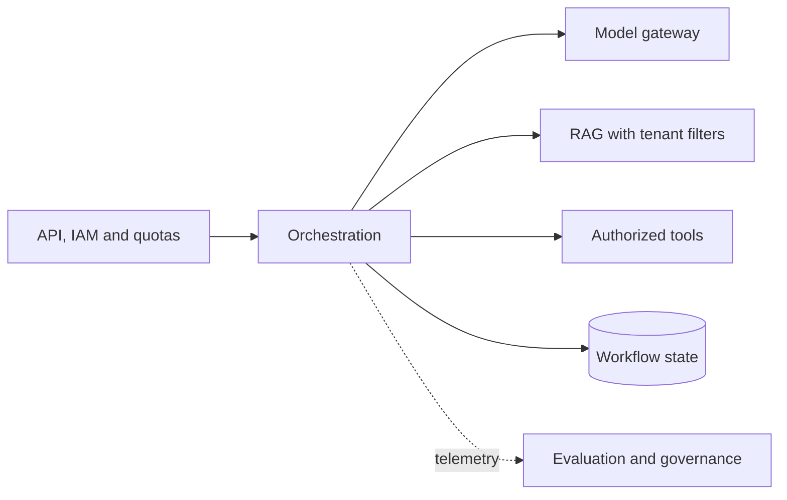

A scalable, governed platform combining IAM, model routing, RAG, tools, state and recovery.

## Core Flow

## Revision Map

### How would you architect an enterprise AI platform supporting multiple AI use cases?

Shared platform services, tenant isolation, model gateway, RAG, tools, governance form a controlled end-to-end capability rather than a set of independent features.

- **Key areas:** Shared platform services, tenant isolation, model gateway, RAG, tools, governance.
- **How it works:** Define what enters each boundary, what transformation or decision occurs, and what invariant must hold before the result moves forward.
- **Production:** In production, make limits and failure behavior explicit and measure quality, latency, security and cost across the complete path.

### How would you make the platform multi-tenant?

Treat Tenant isolation, data partitioning, vector filtering, authorization, quotas as deterministic controls enforced at the application, retrieval and tool boundaries.

- **Key areas:** Tenant isolation, data partitioning, vector filtering, authorization, quotas.
- **How it works:** Identity, tenant scope and permissions must come from authenticated server context, never from prompt text or model output.
- **Production:** Apply least privilege, validate every requested action and preserve an audit trail across fallback and retry paths.

### How would you support multiple LLM providers?

OpenAI, Azure OpenAI, Claude, Gemini, Bedrock, abstraction/routing/fallback form a controlled end-to-end capability rather than a set of independent features.

- **Key areas:** OpenAI, Azure OpenAI, Claude, Gemini, Bedrock, abstraction/routing/fallback.
- **How it works:** Define what enters each boundary, what transformation or decision occurs, and what invariant must hold before the result moves forward.
- **Production:** In production, make limits and failure behavior explicit and measure quality, latency, security and cost across the complete path.

### How would you design LLM provider failover?

Separate the design into explicit components for Health checks, timeout, circuit breaker, fallback, model compatibility, with a clear contract and owner for each boundary.

- **Key areas:** Health checks, timeout, circuit breaker, fallback, model compatibility.
- **How it works:** Show how authenticated context, state and evidence move through the system, and where deterministic policy constrains model decisions.
- **Production:** Then explain bottlenecks, partial failures, recovery, scaling signals and the metrics that prove the complete task works.

### How would you design Agent state and memory?

Separate the design into explicit components for Short-term context, long-term memory, workflow state, Redis/DB, with a clear contract and owner for each boundary.

- **Key areas:** Short-term context, long-term memory, workflow state, Redis/DB.
- **How it works:** Show how authenticated context, state and evidence move through the system, and where deterministic policy constrains model decisions.
- **Production:** Then explain bottlenecks, partial failures, recovery, scaling signals and the metrics that prove the complete task works.

### How would you secure an enterprise Agentic AI platform?

Treat IAM, RBAC, tool authorization, secrets, tenant isolation, data protection as deterministic controls enforced at the application, retrieval and tool boundaries.

- **Key areas:** IAM, RBAC, tool authorization, secrets, tenant isolation, data protection.
- **How it works:** Identity, tenant scope and permissions must come from authenticated server context, never from prompt text or model output.
- **Production:** Apply least privilege, validate every requested action and preserve an audit trail across fallback and retry paths.

### How would you protect the system against prompt injection?

Treat Input/output controls, untrusted context, tool isolation, authorization as deterministic controls enforced at the application, retrieval and tool boundaries.

- **Key areas:** Input/output controls, untrusted context, tool isolation, authorization.
- **How it works:** Identity, tenant scope and permissions must come from authenticated server context, never from prompt text or model output.
- **Production:** Apply least privilege, validate every requested action and preserve an audit trail across fallback and retry paths.

### How would you prevent an Agent from performing dangerous business operations?

Tool permissions, policy engine, confirmation, approval workflow, audit form a controlled end-to-end capability rather than a set of independent features.

- **Key areas:** Tool permissions, policy engine, confirmation, approval workflow, audit.
- **How it works:** Define what enters each boundary, what transformation or decision occurs, and what invariant must hold before the result moves forward.
- **Production:** In production, make limits and failure behavior explicit and measure quality, latency, security and cost across the complete path.

### How would you handle model hallucination in a regulated enterprise workflow?

Separate the design into explicit components for Grounding, deterministic rules, validation, human approval, audit, with a clear contract and owner for each boundary.

- **Key areas:** Grounding, deterministic rules, validation, human approval, audit.
- **How it works:** Show how authenticated context, state and evidence move through the system, and where deterministic policy constrains model decisions.
- **Production:** Then explain bottlenecks, partial failures, recovery, scaling signals and the metrics that prove the complete task works.

### What parts of an Agentic AI system should be deterministic?

Authorization, business rules, validation, transactions, policy enforcement form a controlled end-to-end capability rather than a set of independent features.

- **Key areas:** Authorization, business rules, validation, transactions, policy enforcement.
- **How it works:** Define what enters each boundary, what transformation or decision occurs, and what invariant must hold before the result moves forward.
- **Production:** In production, make limits and failure behavior explicit and measure quality, latency, security and cost across the complete path.

### Explain one GenAI solution you personally implemented.

Ownership, architecture, implementation depth form a controlled end-to-end capability rather than a set of independent features.

- **Key areas:** Ownership, architecture, implementation depth.
- **How it works:** Define what enters each boundary, what transformation or decision occurs, and what invariant must hold before the result moves forward.
- **Production:** In production, make limits and failure behavior explicit and measure quality, latency, security and cost across the complete path.

### Design a production Agentic AI platform for 1,000+ concurrent users.

Separate the design into explicit components for Scalability, resilience, security, with a clear contract and owner for each boundary.

- **Key areas:** Scalability, resilience, security.
- **How it works:** Show how authenticated context, state and evidence move through the system, and where deterministic policy constrains model decisions.
- **Production:** Then explain bottlenecks, partial failures, recovery, scaling signals and the metrics that prove the complete task works.

### When would you reject Agentic AI and use conventional software/workflows instead?

Start from the deterministic alternative and identify exactly where interpretation or dynamic action is required.

- **Key areas:** Senior architect judgment.
- **How it works:** Evaluate Senior architect judgment against latency, compliance, predictability and operating cost.
- **Production:** Use an agent only when measured task-quality improvement outweighs its additional nondeterminism and failure surface.

## Interview Lens

Keep probabilistic interpretation separate from authorization, policy, transactions and recovery. Explain trade-offs with evidence: task quality, latency, resilience, security, operating cost and auditability.
