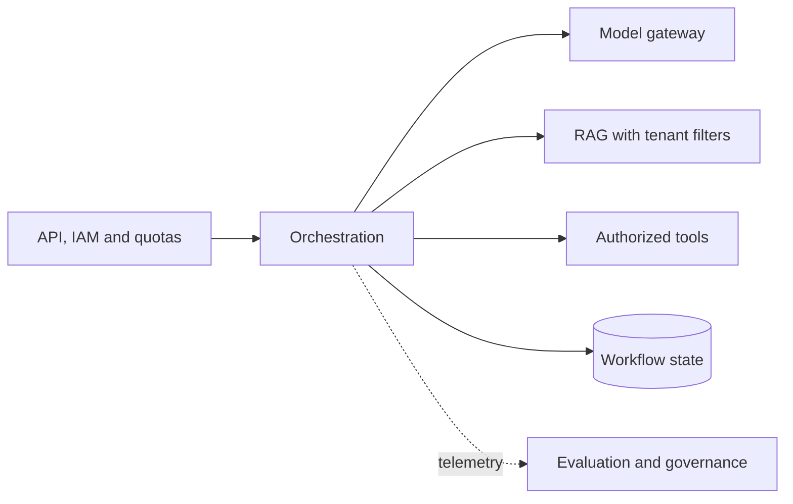

A scalable, governed platform combining IAM, model routing, RAG, tools, state and recovery.

## Core Flow

## Revision Map

| Question | What a strong answer should establish | Priority |
|---|---|---|
| How would you architect an enterprise AI platform supporting multiple AI use cases? | Connect Shared platform services, tenant isolation, model gateway, RAG, tools, governance; define the contract, limits, measurement and safe failure behavior for the complete path. | Critical |
| How would you make the platform multi-tenant? | Enforce Tenant isolation, data partitioning, vector filtering, authorization, quotas in deterministic application and data boundaries; never trust the prompt or model to supply security context. | Critical |
| How would you support multiple LLM providers? | Connect OpenAI, Azure OpenAI, Claude, Gemini, Bedrock, abstraction/routing/fallback; define the contract, limits, measurement and safe failure behavior for the complete path. | Critical |
| How would you design LLM provider failover? | Make Health checks, timeout, circuit breaker, fallback, model compatibility explicit as independently observable components with clear trust, state and failure boundaries. | Critical |
| How would you design Agent state and memory? | Make Short-term context, long-term memory, workflow state, Redis/DB explicit as independently observable components with clear trust, state and failure boundaries. | High |
| How would you secure an enterprise Agentic AI platform? | Enforce IAM, RBAC, tool authorization, secrets, tenant isolation, data protection in deterministic application and data boundaries; never trust the prompt or model to supply security context. | Critical |
| How would you protect the system against prompt injection? | Enforce Input/output controls, untrusted context, tool isolation, authorization in deterministic application and data boundaries; never trust the prompt or model to supply security context. | Critical |
| How would you prevent an Agent from performing dangerous business operations? | Connect Tool permissions, policy engine, confirmation, approval workflow, audit; define the contract, limits, measurement and safe failure behavior for the complete path. | Critical |
| How would you handle model hallucination in a regulated enterprise workflow? | Make Grounding, deterministic rules, validation, human approval, audit explicit as independently observable components with clear trust, state and failure boundaries. | Critical |
| What parts of an Agentic AI system should be deterministic? | Connect Authorization, business rules, validation, transactions, policy enforcement; define the contract, limits, measurement and safe failure behavior for the complete path. | Critical |
| Explain one GenAI solution you personally implemented. | Connect Ownership, architecture, implementation depth; define the contract, limits, measurement and safe failure behavior for the complete path. | Critical |
| Design a production Agentic AI platform for 1,000+ concurrent users. | Make Scalability, resilience, security explicit as independently observable components with clear trust, state and failure boundaries. | Critical |
| When would you reject Agentic AI and use conventional software/workflows instead? | Choose the simpler deterministic design unless Senior architect judgment provide measurable value that justifies AI risk and operating cost. | Critical |

## Interview Lens

Keep probabilistic interpretation separate from authorization, policy, transactions and recovery. Explain trade-offs with evidence: task quality, latency, resilience, security, operating cost and auditability.
