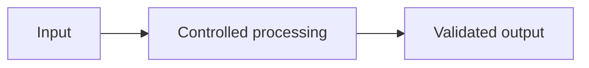

How models generate, use context, represent meaning and differ from retrieval or agents.

## Core Flow

## Revision Map

| Question | What a strong answer should establish | Priority |
|---|---|---|
| What is an LLM, and how does it generate a response? | Connect Transformer, tokens, attention, context, next-token prediction, inference; define the contract, limits, measurement and safe failure behavior for the complete path. | Critical |
| What is the difference between an LLM, embedding model, and reranking model? | Connect Generation vs embeddings vs relevance scoring; define the contract, limits, measurement and safe failure behavior for the complete path. | Medium |
| What is a token, and why does tokenization matter in production? | Connect Context limits, cost, latency, token consumption; define the contract, limits, measurement and safe failure behavior for the complete path. | Medium |
| What is an LLM context window, and why is it important? | Connect Prompt + history + RAG context + tools + tool results; define the contract, limits, measurement and safe failure behavior for the complete path. | High |
| What is hallucination, and why does it happen? | Connect Probabilistic generation, missing knowledge, poor retrieval, conflicting context, prompt injection; define the contract, limits, measurement and safe failure behavior for the complete path. | Critical |
| What is the difference between Prompting, RAG, and Fine-tuning? | Connect When to use each, knowledge vs behavior; define the contract, limits, measurement and safe failure behavior for the complete path. | Critical |
| What are Temperature and Top-P? How do they affect production systems? | Connect Randomness, sampling, determinism, cost/quality trade-off; define the contract, limits, measurement and safe failure behavior for the complete path. | High |
| What are embeddings, and how does semantic similarity work? | Connect Vector representation, cosine similarity, vector DB, dimensions; define the contract, limits, measurement and safe failure behavior for the complete path. | Critical |
| Why can't an LLM directly access enterprise databases/APIs? | Connect Tool/function calling, application-controlled execution, security; define the contract, limits, measurement and safe failure behavior for the complete path. | Critical |
| What is the difference between traditional RAG and an AI Agent? | Connect Retrieval vs reasoning/action/tool selection/orchestration; define the contract, limits, measurement and safe failure behavior for the complete path. | Critical |
| Explain how an LLM generates a response. | Connect LLM fundamentals; define the contract, limits, measurement and safe failure behavior for the complete path. | Medium |
| Explain hallucination and how you mitigate it. | Connect Grounding, reliability; define the contract, limits, measurement and safe failure behavior for the complete path. | Critical |
| How would you handle multiple LLM providers? | Connect Provider abstraction/routing; define the contract, limits, measurement and safe failure behavior for the complete path. | High |

## Interview Lens

Keep probabilistic interpretation separate from authorization, policy, transactions and recovery. Explain trade-offs with evidence: task quality, latency, resilience, security, operating cost and auditability.
