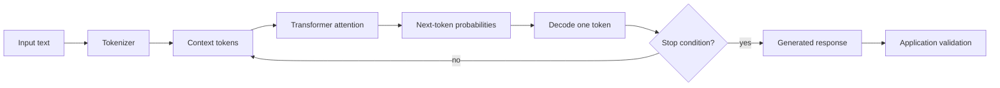

How models generate, use context, represent meaning and differ from retrieval or agents.

## Core Flow

## Revision Map

| Question | Detailed answer |
|---|---|
| What is an LLM, and how does it generate a response? | A large language model is a Transformer-based neural network trained to estimate the probability of the next token from the tokens already in its context. The input is tokenized into numeric IDs, converted into learned representations, and processed through attention layers that relate each token to relevant earlier tokens. During inference, the model produces a probability distribution, selects one token according to its decoding settings, appends it to the context, and repeats until a stop condition is reached. It generates from learned statistical patterns and supplied context; it does not query a factual database unless the application explicitly provides retrieval or tools. |
| What is the difference between an LLM, embedding model, and reranking model? | An LLM generates new token sequences and is used for answering, summarizing or planning. An embedding model converts text into a fixed-length vector so a vector index can retrieve semantically related candidates; it does not generate an answer. A reranking model compares a query with retrieved candidates and produces a stronger relevance ordering, usually at higher per-document cost. In RAG they form a pipeline: embeddings retrieve broadly, reranking improves precision, and the LLM synthesizes from the selected evidence. |
| What is a token, and why does tokenization matter in production? | A token is the model's processing unit and may be a word, part of a word, punctuation or whitespace depending on the tokenizer. The complete request and generated response consume tokens, so tokenization determines whether prompts fit the context window and directly affects provider cost, memory, throughput and latency. Different models can tokenize the same text differently, making character or word counts unreliable. Production systems should measure tokens with the target model's tokenizer and reserve explicit budgets for instructions, history, retrieval, tools and output. |
| What is an LLM context window, and why is it important? | The context window is the maximum token budget the model can consider for one inference request. System instructions, user messages, conversation history, retrieved chunks, tool definitions, tool results and the planned output all compete for this space. Exceeding it causes rejection or truncation, while filling it with weak content increases latency, cost and the chance that important evidence is ignored. A production system therefore allocates token budgets, retrieves selectively, summarizes older history and preserves critical instructions. |
| What is hallucination, and why does it happen? | Hallucination is a plausible-sounding response that is unsupported or false. It occurs because an LLM optimizes next-token likelihood rather than truth, especially when knowledge is missing, instructions are ambiguous, retrieval is weak, context conflicts, or untrusted text manipulates the prompt. Mitigation combines authoritative retrieval, relevance thresholds, citations, abstention, structured validation and deterministic checks for business decisions. No prompt can eliminate hallucination, so risk-sensitive workflows require evaluation and human or rule-based control. |
| What is the difference between Prompting, RAG, and Fine-tuning? | Prompting changes the instructions and context supplied at runtime and is best for defining a task, tone, constraints or response format. RAG retrieves current or private knowledge at request time and grounds the response without changing model weights. Fine-tuning changes model behavior by training on examples and is useful for stable specialized patterns, not as the primary store for frequently changing enterprise facts. Most enterprise systems start with prompting, add RAG for knowledge, and consider fine-tuning only after evaluation shows a persistent behavioral gap. |
| What are Temperature and Top-P? How do they affect production systems? | Temperature reshapes the next-token probability distribution: lower values concentrate choices and higher values increase variation. Top-P limits sampling to the smallest set of tokens whose cumulative probability reaches a threshold, excluding the long tail. They interact, so production systems normally tune one conservatively and hold the other stable. Low-variance settings suit extraction and transactions, but they do not guarantee determinism because providers, model versions and infrastructure can still change outputs. |
| What are embeddings, and how does semantic similarity work? | An embedding model maps text into a fixed-dimensional vector whose geometry represents learned semantic relationships. The query and documents must use the same embedding model and dimension; a vector store then uses cosine similarity, dot product or Euclidean distance to find nearby vectors, often through an approximate nearest-neighbor index. Similarity only ranks related candidates—it does not prove relevance or truth—so production retrieval also uses metadata filters, thresholds and reranking. Changing the embedding model requires a versioned re-embedding and index migration. |
| Why can't an LLM directly access enterprise databases/APIs? | A model receives context and generates text or structured tool-call requests; it has no inherent network identity, database session or authorization to enterprise systems. The application exposes a controlled set of tool schemas, validates model-generated arguments, checks the authenticated user's permissions, executes the operation and returns a bounded result. This separation prevents the model from granting itself access and allows timeouts, idempotency, audit and policy enforcement. Credentials must remain in the execution layer, never in prompts. |
| What is the difference between traditional RAG and an AI Agent? | Traditional RAG follows a mostly fixed path: retrieve evidence, add it to the prompt and generate a grounded answer. An agent can iteratively decide what action to take next, choose tools, observe results, update state and continue until a termination condition is met. RAG is often one capability used by an agent, but it does not itself imply planning or side effects. Use an agent only when dynamic decisions add value; deterministic retrieval or workflows are simpler, faster and safer for predictable tasks. |
| Explain how an LLM generates a response. | The application assembles system instructions, user input, conversation history, retrieved evidence and tool results into a bounded context. The tokenizer converts that text into tokens, and the Transformer uses attention to compute contextual representations and a next-token probability distribution. A decoding strategy selects a token, adds it to the sequence and repeats autoregressively. The final response is therefore probabilistic generation conditioned on the available context, not a deterministic lookup or proof of correctness. |
| Explain hallucination and how you mitigate it. | Hallucination is unsupported generation caused by probabilistic prediction rather than factual verification. I reduce it by grounding answers in authorized evidence, filtering and reranking retrieval, requiring claim-linked citations, instructing the system to abstain when evidence is insufficient, and validating high-impact outputs against deterministic sources. I then measure faithfulness and answer correctness on a representative evaluation set. In regulated workflows, the model may recommend, but rules or humans approve the decision. |
| How would you handle multiple LLM providers? | Place provider-specific clients behind a model gateway that routes by capability, data residency, latency, cost and risk rather than treating every model as interchangeable. Normalize the application contract, but retain provider-specific configuration where capabilities differ. Test prompts, structured output, tool calling, safety behavior and token accounting for every supported model. Fail over only to a semantically compatible model, preserve the request deadline, and record the selected provider and model version for evaluation and audit. |

## Interview Lens

Keep probabilistic interpretation separate from authorization, policy, transactions and recovery. Explain trade-offs with evidence: task quality, latency, resilience, security, operating cost and auditability.
