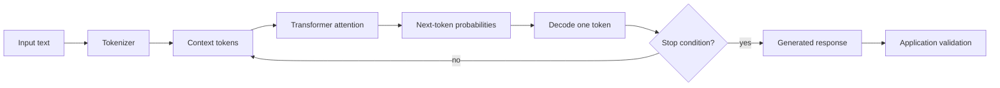

How models generate, use context, represent meaning and differ from retrieval or agents.

## Core Flow

## Revision Map

### What is an LLM, and how does it generate a response?

An **LLM** is a Transformer-based neural network trained to estimate the probability of the next token from the tokens already in its context.

- **Generation flow:**
  1. Tokenize the input into numeric token IDs.
  2. Convert tokens into learned representations.
  3. Process them through **attention layers** that relate each token to relevant earlier tokens.
  4. Produce a probability distribution for the next token.
  5. Select a token using the configured decoding settings, append it to the context, and repeat until a stop condition.
- **Important:** The model generates from learned statistical patterns and supplied context.
- **Boundary:** It does not query a factual database unless the application explicitly supplies retrieval or tools.

### What is the difference between an LLM, embedding model, and reranking model?

The three models serve different stages of an AI pipeline: **generation**, **candidate retrieval**, and **relevance refinement**.

| Model | Primary role | Output |
|---|---|---|
| **LLM** | Answers, summarizes, or plans by generating token sequences | Generated text or structured content |
| **Embedding model** | Converts text into fixed-length vectors for semantic retrieval | Vector representation |
| **Reranking model** | Compares a query with retrieved candidates and improves their relevance order | Relevance scores or reordered candidates |

- **RAG flow:** Embeddings retrieve broadly → reranking improves precision → the LLM synthesizes from selected evidence.
- **Trade-off:** Reranking usually improves relevance but adds per-document latency and cost.
- **Important:** An embedding model retrieves related content; it does not generate an answer.

### What is a token, and why does tokenization matter in production?

A **token** is the model's processing unit and may represent a word, part of a word, punctuation, or whitespace.

- The prompt and generated response both consume tokens.
- Token counts determine whether a request fits the **context window**.
- They directly affect provider cost, memory, throughput, and latency.
- Different models can tokenize identical text differently, so character or word counts are unreliable.
- **Production:** Measure with the target model's tokenizer and reserve budgets for instructions, history, retrieval, tools, and output.

### What is an LLM context window, and why is it important?

The **context window** is the maximum token budget a model can consider during one inference request.

- System instructions, user messages, conversation history, retrieved chunks, tool definitions, tool results, and planned output share the same budget.
- Exceeding the limit causes rejection or truncation.
- Filling it with weak content increases latency, cost, and the chance that important evidence is ignored.
- **Production:** Allocate token budgets, retrieve selectively, summarize older history, and preserve critical instructions.

### What is hallucination, and why does it happen?

**Hallucination** is a plausible-sounding response that is unsupported or false.

- An LLM optimizes **next-token likelihood**, not factual truth.
- Risk increases when knowledge is missing, instructions are ambiguous, retrieval is weak, or context conflicts.
- Untrusted content can also manipulate the prompt and distort the answer.
- Mitigation combines authoritative retrieval, relevance thresholds, citations, abstention, structured validation, and deterministic checks.
- **Important:** No prompt eliminates hallucination; risk-sensitive workflows require evaluation and human or rule-based control.

### What is the difference between Prompting, RAG, and Fine-tuning?

**Prompting** changes runtime instructions, **RAG** supplies runtime knowledge, and **fine-tuning** changes model behavior through training.

| Approach | What it changes | Best fit |
|---|---|---|
| **Prompting** | Instructions and context supplied with a request | Task definition, tone, constraints, and response format |
| **RAG** | Current or private knowledge supplied at request time | Grounded answers without changing model weights |
| **Fine-tuning** | Model behavior learned from training examples | Stable specialized behavior or patterns |

- Fine-tuning is not the primary store for frequently changing enterprise facts.
- **Production path:** Start with prompting, add RAG for knowledge, and consider fine-tuning only when evaluation shows a persistent behavioral gap.

### What are Temperature and Top-P? How do they affect production systems?

**Temperature** and **Top-P** control how tokens are sampled from the model's next-token probability distribution.

- **Temperature:** Lower values concentrate choices; higher values increase variation.
- **Top-P:** Limits sampling to the smallest token set whose cumulative probability reaches the configured threshold.
- The settings interact, so production systems normally tune one conservatively while keeping the other stable.
- Low-variance settings suit extraction and transactional use cases.
- **Trade-off:** Low values improve repeatability but do not guarantee determinism across provider infrastructure or model versions.

### What are embeddings, and how does semantic similarity work?

An **embedding model** maps text into a fixed-dimensional vector whose geometry represents learned semantic relationships.

1. Embed documents and the query using the same model and vector dimension.
2. Store document vectors and metadata in a **vector store**.
3. Compare the query vector using cosine similarity, dot product, or Euclidean distance.
4. Retrieve nearby candidates, often through an approximate nearest-neighbor index.
- **Important:** Similarity ranks related candidates; it does not prove relevance or truth.
- **Production:** Apply metadata filters, thresholds, and reranking. Changing the model requires versioned re-embedding and index migration.

### Why can't an LLM directly access enterprise databases/APIs?

An LLM generates text or structured tool-call requests; it has no inherent network identity, database session, or enterprise authorization.

1. The application exposes a controlled set of tool schemas.
2. The model proposes a tool and arguments.
3. Application code validates the arguments and authenticated user's permissions.
4. The application executes the operation and returns a bounded result.
- This separation supports timeouts, idempotency, policy enforcement, and audit.
- **Security:** Credentials stay in the execution layer and never enter prompts.

### What is the difference between traditional RAG and an AI Agent?

Traditional **RAG** follows a mostly fixed retrieval-and-generation path, while an **AI agent** can iteratively choose actions and tools.

- **RAG:** Retrieve evidence → add it to the prompt → generate a grounded answer.
- **Agent:** Decide the next action → invoke a tool → observe the result → update state → continue until termination.
- RAG can be one capability used by an agent, but retrieval alone does not imply planning or side effects.
- **Trade-off:** Use an agent only when dynamic decisions add value; deterministic retrieval or workflows are simpler, faster, and safer for predictable tasks.

### Explain how an LLM generates a response.

An LLM generates a response by repeatedly predicting the next token from the application-supplied context.

1. Assemble system instructions, user input, history, retrieved evidence, and tool results into a bounded context.
2. Tokenize the context.
3. Use Transformer attention to compute contextual representations and next-token probabilities.
4. Select a token using the decoding strategy and append it to the sequence.
5. Repeat until a stop condition is reached.
- **Important:** The result is probabilistic generation conditioned on context, not a deterministic lookup or proof of correctness.

### Explain hallucination and how you mitigate it.

Hallucination is unsupported generation caused by probabilistic prediction rather than factual verification.

- Ground answers in authorized evidence.
- Filter and rerank retrieval results before context construction.
- Require claim-linked citations and abstention when evidence is insufficient.
- Validate high-impact outputs against deterministic sources.
- Measure **faithfulness** and **answer correctness** on a representative evaluation set.
- **Regulated workflows:** The model may recommend, but rules or humans approve the decision.

### How would you handle multiple LLM providers?

Use a **model gateway** that routes providers by capability, data residency, latency, cost, and risk without assuming models are interchangeable.

- Normalize the application contract while retaining provider-specific configuration where capabilities differ.
- Test prompts, structured output, tool calling, safety behavior, and token accounting for every supported model.
- Fail over only to a semantically compatible model and preserve the request deadline.
- Record the chosen provider and model version for evaluation, observability, and audit.

## Interview Lens

Keep probabilistic interpretation separate from authorization, policy, transactions, and recovery. Explain trade-offs with evidence: task quality, latency, resilience, security, operating cost, and auditability.
