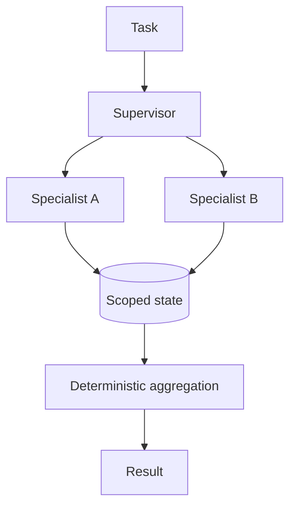

Coordination patterns, communication, memory boundaries, conflict and complexity trade-offs.

## Core Flow

## Revision Map

| Question | Detailed answer |
|---|---|
| What is a Multi-Agent AI system? | A complete answer should explain how Multiple specialized agents, independent responsibilities, orchestration participate in the same execution path rather than listing them independently. Define what enters each boundary, what transformation or decision occurs, and what invariant must hold before the result moves forward. Close with limits, failure behavior and observable measures for quality, latency, security and cost. |
| When would you choose Multi-Agent over a Single Agent? | A complete answer should explain how Domain complexity, specialization, isolation, parallelism vs complexity participate in the same execution path rather than listing them independently. Define what enters each boundary, what transformation or decision occurs, and what invariant must hold before the result moves forward. Close with limits, failure behavior and observable measures for quality, latency, security and cost. |
| What are common Multi-Agent architecture patterns? | Separate the design into explicit components for Supervisor, hierarchical, peer-to-peer, pipeline, parallel agents, with a clear contract and owner for each boundary. Show how authenticated context, state and evidence move through the system, and where deterministic policy constrains model decisions. Then explain bottlenecks, partial failures, recovery, scaling signals and the metrics that prove the complete task works. |
| What is a Supervisor/Orchestrator Agent? | A complete answer should explain how Task decomposition, delegation, aggregation, final decision participate in the same execution path rather than listing them independently. Define what enters each boundary, what transformation or decision occurs, and what invariant must hold before the result moves forward. Close with limits, failure behavior and observable measures for quality, latency, security and cost. |
| How do agents communicate with each other? | A complete answer should explain how Messages, structured state, events, shared context, APIs participate in the same execution path rather than listing them independently. Define what enters each boundary, what transformation or decision occurs, and what invariant must hold before the result moves forward. Close with limits, failure behavior and observable measures for quality, latency, security and cost. |
| Should agents share the same memory? | A complete answer should explain how Shared vs isolated memory, context pollution, security, ownership participate in the same execution path rather than listing them independently. Define what enters each boundary, what transformation or decision occurs, and what invariant must hold before the result moves forward. Close with limits, failure behavior and observable measures for quality, latency, security and cost. |
| How would you design a Multi-Agent system for an enterprise use case? | Separate the design into explicit components for Agent boundaries, coordinator, tools, state, communication, observability, with a clear contract and owner for each boundary. Show how authenticated context, state and evidence move through the system, and where deterministic policy constrains model decisions. Then explain bottlenecks, partial failures, recovery, scaling signals and the metrics that prove the complete task works. |
| How do you prevent agents from duplicating work? | A complete answer should explain how Ownership, task IDs, state, coordination, idempotency participate in the same execution path rather than listing them independently. Define what enters each boundary, what transformation or decision occurs, and what invariant must hold before the result moves forward. Close with limits, failure behavior and observable measures for quality, latency, security and cost. |
| How do you handle failure of one agent? | Use an end-to-end deadline and tracing to locate the failing segment before retrying. Protect capacity with bounded concurrency, backoff and circuit breaking, and make retries idempotent when side effects are possible. Recover through a tested fallback or safe degradation, then verify Retry, fallback, compensation, partial result, escalation and add the incident to regression coverage. |
| How do you prevent circular delegation between agents? | A complete answer should explain how Max hops, execution graph, state tracking, timeout, termination conditions participate in the same execution path rather than listing them independently. Define what enters each boundary, what transformation or decision occurs, and what invariant must hold before the result moves forward. Close with limits, failure behavior and observable measures for quality, latency, security and cost. |
| How do you control the number of agent interactions? | A complete answer should explain how Max iterations, token budget, execution budget, time budget participate in the same execution path rather than listing them independently. Define what enters each boundary, what transformation or decision occurs, and what invariant must hold before the result moves forward. Close with limits, failure behavior and observable measures for quality, latency, security and cost. |
| How do you secure communication between agents? | Treat Identity, authorization, trust boundaries, least privilege, tenant context as deterministic controls enforced at the application, retrieval and tool boundaries. Identity, tenant scope and permissions must come from authenticated server context, never from prompt text or model output. Apply least privilege, validate every requested action and preserve an audit trail across fallback and retry paths. |
| How would you handle conflicting results from two agents? | A complete answer should explain how Confidence, evidence, priority, deterministic arbitration, supervisor participate in the same execution path rather than listing them independently. Define what enters each boundary, what transformation or decision occurs, and what invariant must hold before the result moves forward. Close with limits, failure behavior and observable measures for quality, latency, security and cost. |
| How do you implement parallel agent execution? | A complete answer should explain how Independent tasks, async/concurrent execution, aggregation, timeout participate in the same execution path rather than listing them independently. Define what enters each boundary, what transformation or decision occurs, and what invariant must hold before the result moves forward. Close with limits, failure behavior and observable measures for quality, latency, security and cost. |
| What is the difference between Agent-to-Agent communication and Tool Calling? | A complete answer should explain how Agent delegation vs deterministic capability invocation participate in the same execution path rather than listing them independently. Define what enters each boundary, what transformation or decision occurs, and what invariant must hold before the result moves forward. Close with limits, failure behavior and observable measures for quality, latency, security and cost. |
| How do you maintain state across a multi-agent workflow? | Separate the design into explicit components for Workflow state, correlation ID, persistent state, event/state store, with a clear contract and owner for each boundary. Show how authenticated context, state and evidence move through the system, and where deterministic policy constrains model decisions. Then explain bottlenecks, partial failures, recovery, scaling signals and the metrics that prove the complete task works. |
| How do you observe and debug Multi-Agent execution? | A complete answer should explain how Distributed tracing, agent spans, messages, tool calls, state transitions participate in the same execution path rather than listing them independently. Define what enters each boundary, what transformation or decision occurs, and what invariant must hold before the result moves forward. Close with limits, failure behavior and observable measures for quality, latency, security and cost. |
| How do you evaluate a Multi-Agent system? | Build a versioned dataset of representative, edge and adversarial scenarios and define expected evidence or outcomes before testing. Measure Agent-level + workflow-level success, correctness, latency, cost separately so retrieval, generation and end-task failures are distinguishable. Compare against a baseline, inspect failures rather than relying on one aggregate score, and retain every accepted defect as a regression case. |
| What are the disadvantages of Multi-Agent architecture? | Separate the design into explicit components for Latency, token cost, complexity, nondeterminism, debugging, coordination, with a clear contract and owner for each boundary. Show how authenticated context, state and evidence move through the system, and where deterministic policy constrains model decisions. Then explain bottlenecks, partial failures, recovery, scaling signals and the metrics that prove the complete task works. |
| Design a production Multi-Agent architecture using Java 21 + Spring AI. | Separate the design into explicit components for Complete architecture, orchestration, agents, tools, RAG, state, resilience, with a clear contract and owner for each boundary. Show how authenticated context, state and evidence move through the system, and where deterministic policy constrains model decisions. Then explain bottlenecks, partial failures, recovery, scaling signals and the metrics that prove the complete task works. |
| When would you choose Multi-Agent over a Single Agent? | A complete answer should explain how Architecture judgment participate in the same execution path rather than listing them independently. Define what enters each boundary, what transformation or decision occurs, and what invariant must hold before the result moves forward. Close with limits, failure behavior and observable measures for quality, latency, security and cost. |
| Design a Supervisor-based Multi-Agent architecture. | Separate the design into explicit components for Delegation, state, failures, with a clear contract and owner for each boundary. Show how authenticated context, state and evidence move through the system, and where deterministic policy constrains model decisions. Then explain bottlenecks, partial failures, recovery, scaling signals and the metrics that prove the complete task works. |

## Interview Lens

Keep probabilistic interpretation separate from authorization, policy, transactions and recovery. Explain trade-offs with evidence: task quality, latency, resilience, security, operating cost and auditability.
