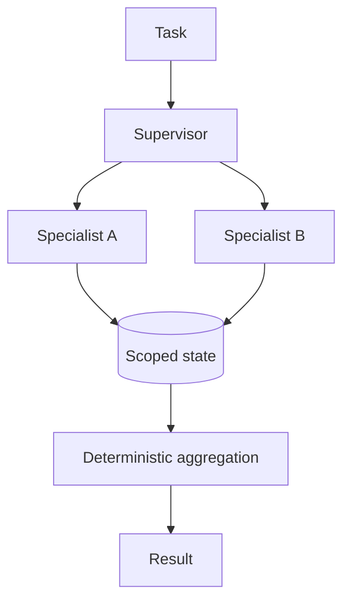

Coordination patterns, communication, memory boundaries, conflict and complexity trade-offs.

## Core Flow

## Revision Map

| Question | What a strong answer should establish | Priority |
|---|---|---|
| What is a Multi-Agent AI system? | Connect Multiple specialized agents, independent responsibilities, orchestration; define the contract, limits, measurement and safe failure behavior for the complete path. | Critical |
| When would you choose Multi-Agent over a Single Agent? | Connect Domain complexity, specialization, isolation, parallelism vs complexity; define the contract, limits, measurement and safe failure behavior for the complete path. | Critical |
| What are common Multi-Agent architecture patterns? | Make Supervisor, hierarchical, peer-to-peer, pipeline, parallel agents explicit as independently observable components with clear trust, state and failure boundaries. | Critical |
| What is a Supervisor/Orchestrator Agent? | Connect Task decomposition, delegation, aggregation, final decision; define the contract, limits, measurement and safe failure behavior for the complete path. | Critical |
| How do agents communicate with each other? | Connect Messages, structured state, events, shared context, APIs; define the contract, limits, measurement and safe failure behavior for the complete path. | High |
| Should agents share the same memory? | Connect Shared vs isolated memory, context pollution, security, ownership; define the contract, limits, measurement and safe failure behavior for the complete path. | High |
| How would you design a Multi-Agent system for an enterprise use case? | Make Agent boundaries, coordinator, tools, state, communication, observability explicit as independently observable components with clear trust, state and failure boundaries. | Critical |
| How do you prevent agents from duplicating work? | Connect Ownership, task IDs, state, coordination, idempotency; define the contract, limits, measurement and safe failure behavior for the complete path. | High |
| How do you handle failure of one agent? | Bound, observe and classify the failure; protect capacity, recover through an idempotent tested path, then verify Retry, fallback, compensation, partial result, escalation. | Critical |
| How do you prevent circular delegation between agents? | Connect Max hops, execution graph, state tracking, timeout, termination conditions; define the contract, limits, measurement and safe failure behavior for the complete path. | Critical |
| How do you control the number of agent interactions? | Connect Max iterations, token budget, execution budget, time budget; define the contract, limits, measurement and safe failure behavior for the complete path. | High |
| How do you secure communication between agents? | Enforce Identity, authorization, trust boundaries, least privilege, tenant context in deterministic application and data boundaries; never trust the prompt or model to supply security context. | Critical |
| How would you handle conflicting results from two agents? | Connect Confidence, evidence, priority, deterministic arbitration, supervisor; define the contract, limits, measurement and safe failure behavior for the complete path. | Critical |
| How do you implement parallel agent execution? | Connect Independent tasks, async/concurrent execution, aggregation, timeout; define the contract, limits, measurement and safe failure behavior for the complete path. | High |
| What is the difference between Agent-to-Agent communication and Tool Calling? | Connect Agent delegation vs deterministic capability invocation; define the contract, limits, measurement and safe failure behavior for the complete path. | Critical |
| How do you maintain state across a multi-agent workflow? | Make Workflow state, correlation ID, persistent state, event/state store explicit as independently observable components with clear trust, state and failure boundaries. | Critical |
| How do you observe and debug Multi-Agent execution? | Connect Distributed tracing, agent spans, messages, tool calls, state transitions; define the contract, limits, measurement and safe failure behavior for the complete path. | Critical |
| How do you evaluate a Multi-Agent system? | Use versioned representative scenarios and measure Agent-level + workflow-level success, correctness, latency, cost; compare against a baseline and retain failures as regressions. | High |
| What are the disadvantages of Multi-Agent architecture? | Make Latency, token cost, complexity, nondeterminism, debugging, coordination explicit as independently observable components with clear trust, state and failure boundaries. | Critical |
| Design a production Multi-Agent architecture using Java 21 + Spring AI. | Make Complete architecture, orchestration, agents, tools, RAG, state, resilience explicit as independently observable components with clear trust, state and failure boundaries. | Critical |
| When would you choose Multi-Agent over a Single Agent? | Connect Architecture judgment; define the contract, limits, measurement and safe failure behavior for the complete path. | Critical |
| Design a Supervisor-based Multi-Agent architecture. | Make Delegation, state, failures explicit as independently observable components with clear trust, state and failure boundaries. | High |

## Interview Lens

Keep probabilistic interpretation separate from authorization, policy, transactions and recovery. Explain trade-offs with evidence: task quality, latency, resilience, security, operating cost and auditability.
