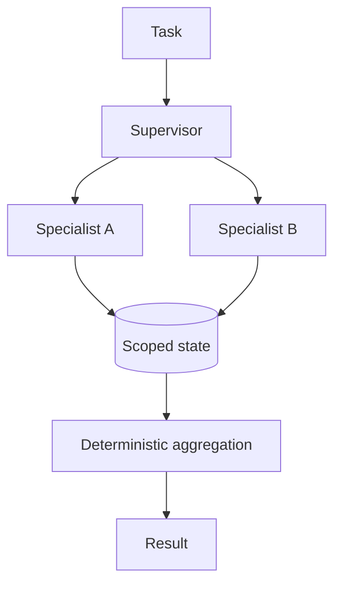

Coordination patterns, communication, memory boundaries, conflict and complexity trade-offs.

## Core Flow

## Revision Map

### What is a Multi-Agent AI system?

Multiple specialized agents, independent responsibilities, orchestration form a controlled end-to-end capability rather than a set of independent features.

- **Key areas:** Multiple specialized agents, independent responsibilities, orchestration.
- **How it works:** Define what enters each boundary, what transformation or decision occurs, and what invariant must hold before the result moves forward.
- **Production:** In production, make limits and failure behavior explicit and measure quality, latency, security and cost across the complete path.

### When would you choose Multi-Agent over a Single Agent?

Domain complexity, specialization, isolation, parallelism vs complexity form a controlled end-to-end capability rather than a set of independent features.

- **Key areas:** Domain complexity, specialization, isolation, parallelism vs complexity.
- **How it works:** Define what enters each boundary, what transformation or decision occurs, and what invariant must hold before the result moves forward.
- **Production:** In production, make limits and failure behavior explicit and measure quality, latency, security and cost across the complete path.

### What are common Multi-Agent architecture patterns?

Separate the design into explicit components for Supervisor, hierarchical, peer-to-peer, pipeline, parallel agents, with a clear contract and owner for each boundary.

- **Key areas:** Supervisor, hierarchical, peer-to-peer, pipeline, parallel agents.
- **How it works:** Show how authenticated context, state and evidence move through the system, and where deterministic policy constrains model decisions.
- **Production:** Then explain bottlenecks, partial failures, recovery, scaling signals and the metrics that prove the complete task works.

### What is a Supervisor/Orchestrator Agent?

Task decomposition, delegation, aggregation, final decision form a controlled end-to-end capability rather than a set of independent features.

- **Key areas:** Task decomposition, delegation, aggregation, final decision.
- **How it works:** Define what enters each boundary, what transformation or decision occurs, and what invariant must hold before the result moves forward.
- **Production:** In production, make limits and failure behavior explicit and measure quality, latency, security and cost across the complete path.

### How do agents communicate with each other?

Messages, structured state, events, shared context, APIs form a controlled end-to-end capability rather than a set of independent features.

- **Key areas:** Messages, structured state, events, shared context, APIs.
- **How it works:** Define what enters each boundary, what transformation or decision occurs, and what invariant must hold before the result moves forward.
- **Production:** In production, make limits and failure behavior explicit and measure quality, latency, security and cost across the complete path.

### Should agents share the same memory?

Shared vs isolated memory, context pollution, security, ownership form a controlled end-to-end capability rather than a set of independent features.

- **Key areas:** Shared vs isolated memory, context pollution, security, ownership.
- **How it works:** Define what enters each boundary, what transformation or decision occurs, and what invariant must hold before the result moves forward.
- **Production:** In production, make limits and failure behavior explicit and measure quality, latency, security and cost across the complete path.

### How would you design a Multi-Agent system for an enterprise use case?

Separate the design into explicit components for Agent boundaries, coordinator, tools, state, communication, observability, with a clear contract and owner for each boundary.

- **Key areas:** Agent boundaries, coordinator, tools, state, communication, observability.
- **How it works:** Show how authenticated context, state and evidence move through the system, and where deterministic policy constrains model decisions.
- **Production:** Then explain bottlenecks, partial failures, recovery, scaling signals and the metrics that prove the complete task works.

### How do you prevent agents from duplicating work?

Ownership, task IDs, state, coordination, idempotency form a controlled end-to-end capability rather than a set of independent features.

- **Key areas:** Ownership, task IDs, state, coordination, idempotency.
- **How it works:** Define what enters each boundary, what transformation or decision occurs, and what invariant must hold before the result moves forward.
- **Production:** In production, make limits and failure behavior explicit and measure quality, latency, security and cost across the complete path.

### How do you handle failure of one agent?

Use an end-to-end deadline and tracing to locate the failing segment before retrying.

- **Key areas:** Retry, fallback, compensation, partial result, escalation.
- **How it works:** Protect capacity with bounded concurrency, backoff and circuit breaking, and make retries idempotent when side effects are possible.
- **Production:** Recover through a tested fallback or safe degradation, then verify Retry, fallback, compensation, partial result, escalation and add the incident to regression coverage.

### How do you prevent circular delegation between agents?

Max hops, execution graph, state tracking, timeout, termination conditions form a controlled end-to-end capability rather than a set of independent features.

- **Key areas:** Max hops, execution graph, state tracking, timeout, termination conditions.
- **How it works:** Define what enters each boundary, what transformation or decision occurs, and what invariant must hold before the result moves forward.
- **Production:** In production, make limits and failure behavior explicit and measure quality, latency, security and cost across the complete path.

### How do you control the number of agent interactions?

Max iterations, token budget, execution budget, time budget form a controlled end-to-end capability rather than a set of independent features.

- **Key areas:** Max iterations, token budget, execution budget, time budget.
- **How it works:** Define what enters each boundary, what transformation or decision occurs, and what invariant must hold before the result moves forward.
- **Production:** In production, make limits and failure behavior explicit and measure quality, latency, security and cost across the complete path.

### How do you secure communication between agents?

Treat Identity, authorization, trust boundaries, least privilege, tenant context as deterministic controls enforced at the application, retrieval and tool boundaries.

- **Key areas:** Identity, authorization, trust boundaries, least privilege, tenant context.
- **How it works:** Identity, tenant scope and permissions must come from authenticated server context, never from prompt text or model output.
- **Production:** Apply least privilege, validate every requested action and preserve an audit trail across fallback and retry paths.

### How would you handle conflicting results from two agents?

Confidence, evidence, priority, deterministic arbitration, supervisor form a controlled end-to-end capability rather than a set of independent features.

- **Key areas:** Confidence, evidence, priority, deterministic arbitration, supervisor.
- **How it works:** Define what enters each boundary, what transformation or decision occurs, and what invariant must hold before the result moves forward.
- **Production:** In production, make limits and failure behavior explicit and measure quality, latency, security and cost across the complete path.

### How do you implement parallel agent execution?

Independent tasks, async/concurrent execution, aggregation, timeout form a controlled end-to-end capability rather than a set of independent features.

- **Key areas:** Independent tasks, async/concurrent execution, aggregation, timeout.
- **How it works:** Define what enters each boundary, what transformation or decision occurs, and what invariant must hold before the result moves forward.
- **Production:** In production, make limits and failure behavior explicit and measure quality, latency, security and cost across the complete path.

### What is the difference between Agent-to-Agent communication and Tool Calling?

Agent delegation vs deterministic capability invocation form a controlled end-to-end capability rather than a set of independent features.

- **Key areas:** Agent delegation vs deterministic capability invocation.
- **How it works:** Define what enters each boundary, what transformation or decision occurs, and what invariant must hold before the result moves forward.
- **Production:** In production, make limits and failure behavior explicit and measure quality, latency, security and cost across the complete path.

### How do you maintain state across a multi-agent workflow?

Separate the design into explicit components for Workflow state, correlation ID, persistent state, event/state store, with a clear contract and owner for each boundary.

- **Key areas:** Workflow state, correlation ID, persistent state, event/state store.
- **How it works:** Show how authenticated context, state and evidence move through the system, and where deterministic policy constrains model decisions.
- **Production:** Then explain bottlenecks, partial failures, recovery, scaling signals and the metrics that prove the complete task works.

### How do you observe and debug Multi-Agent execution?

Distributed tracing, agent spans, messages, tool calls, state transitions form a controlled end-to-end capability rather than a set of independent features.

- **Key areas:** Distributed tracing, agent spans, messages, tool calls, state transitions.
- **How it works:** Define what enters each boundary, what transformation or decision occurs, and what invariant must hold before the result moves forward.
- **Production:** In production, make limits and failure behavior explicit and measure quality, latency, security and cost across the complete path.

### How do you evaluate a Multi-Agent system?

Build a versioned dataset of representative, edge and adversarial scenarios and define expected evidence or outcomes before testing.

- **Key areas:** Agent-level + workflow-level success, correctness, latency, cost.
- **How it works:** Measure Agent-level + workflow-level success, correctness, latency, cost separately so retrieval, generation and end-task failures are distinguishable.
- **Production:** Compare against a baseline, inspect failures rather than relying on one aggregate score, and retain every accepted defect as a regression case.

### What are the disadvantages of Multi-Agent architecture?

Separate the design into explicit components for Latency, token cost, complexity, nondeterminism, debugging, coordination, with a clear contract and owner for each boundary.

- **Key areas:** Latency, token cost, complexity, nondeterminism, debugging, coordination.
- **How it works:** Show how authenticated context, state and evidence move through the system, and where deterministic policy constrains model decisions.
- **Production:** Then explain bottlenecks, partial failures, recovery, scaling signals and the metrics that prove the complete task works.

### Design a production Multi-Agent architecture using Java 21 + Spring AI.

Separate the design into explicit components for Complete architecture, orchestration, agents, tools, RAG, state, resilience, with a clear contract and owner for each boundary.

- **Key areas:** Complete architecture, orchestration, agents, tools, RAG, state, resilience.
- **How it works:** Show how authenticated context, state and evidence move through the system, and where deterministic policy constrains model decisions.
- **Production:** Then explain bottlenecks, partial failures, recovery, scaling signals and the metrics that prove the complete task works.

### When would you choose Multi-Agent over a Single Agent?

Architecture judgment form a controlled end-to-end capability rather than a set of independent features.

- **Key areas:** Architecture judgment.
- **How it works:** Define what enters each boundary, what transformation or decision occurs, and what invariant must hold before the result moves forward.
- **Production:** In production, make limits and failure behavior explicit and measure quality, latency, security and cost across the complete path.

### Design a Supervisor-based Multi-Agent architecture.

Separate the design into explicit components for Delegation, state, failures, with a clear contract and owner for each boundary.

- **Key areas:** Delegation, state, failures.
- **How it works:** Show how authenticated context, state and evidence move through the system, and where deterministic policy constrains model decisions.
- **Production:** Then explain bottlenecks, partial failures, recovery, scaling signals and the metrics that prove the complete task works.

## Interview Lens

Keep probabilistic interpretation separate from authorization, policy, transactions and recovery. Explain trade-offs with evidence: task quality, latency, resilience, security, operating cost and auditability.
