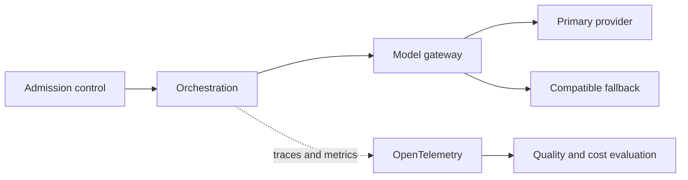

Resilience, observability, evaluation, latency, rate limits, provider changes and cost.

## Core Flow

## Revision Map

### What happens if the LLM provider becomes unavailable?

Use an end-to-end deadline and tracing to locate the failing segment before retrying.

- **Key areas:** Timeout, retry, fallback provider/model, circuit breaker, graceful degradation.
- **How it works:** Protect capacity with bounded concurrency, backoff and circuit breaking, and make retries idempotent when side effects are possible.
- **Production:** Recover through a tested fallback or safe degradation, then verify Timeout, retry, fallback provider/model, circuit breaker, graceful degradation and add the incident to regression coverage.

### How do you handle LLM rate limits such as HTTP 429?

Use an end-to-end deadline and tracing to locate the failing segment before retrying.

- **Key areas:** Exponential backoff, jitter, concurrency limits, quotas, provider fallback.
- **How it works:** Protect capacity with bounded concurrency, backoff and circuit breaking, and make retries idempotent when side effects are possible.
- **Production:** Recover through a tested fallback or safe degradation, then verify Exponential backoff, jitter, concurrency limits, quotas, provider fallback and add the incident to regression coverage.

### How do you handle LLM timeouts?

Use an end-to-end deadline and tracing to locate the failing segment before retrying.

- **Key areas:** Request timeout, cancellation, retry policy, fallback, async patterns.
- **How it works:** Protect capacity with bounded concurrency, backoff and circuit breaking, and make retries idempotent when side effects are possible.
- **Production:** Recover through a tested fallback or safe degradation, then verify Request timeout, cancellation, retry policy, fallback, async patterns and add the incident to regression coverage.

### How do you evaluate a RAG/Agent system in production?

Build a versioned dataset of representative, edge and adversarial scenarios and define expected evidence or outcomes before testing.

- **Key areas:** Retrieval metrics, faithfulness, correctness, task success, latency, cost.
- **How it works:** Measure Retrieval metrics, faithfulness, correctness, task success, latency, cost separately so retrieval, generation and end-task failures are distinguishable.
- **Production:** Compare against a baseline, inspect failures rather than relying on one aggregate score, and retain every accepted defect as a regression case.

### How do you detect that a production Agent is degrading?

Use an end-to-end deadline and tracing to locate the failing segment before retrying.

- **Key areas:** Quality metrics, tool failures, retrieval scores, token usage, latency, user feedback.
- **How it works:** Protect capacity with bounded concurrency, backoff and circuit breaking, and make retries idempotent when side effects are possible.
- **Production:** Recover through a tested fallback or safe degradation, then verify Quality metrics, tool failures, retrieval scores, token usage, latency, user feedback and add the incident to regression coverage.

### How do you implement observability for an Agent?

Distributed tracing, LLM spans, prompts, tool calls, latency, tokens, errors form a controlled end-to-end capability rather than a set of independent features.

- **Key areas:** Distributed tracing, LLM spans, prompts, tool calls, latency, tokens, errors.
- **How it works:** Define what enters each boundary, what transformation or decision occurs, and what invariant must hold before the result moves forward.
- **Production:** In production, make limits and failure behavior explicit and measure quality, latency, security and cost across the complete path.

### How do you control LLM cost in production?

Token budgets, model routing, caching, prompt optimization, rate limits, max iterations form a controlled end-to-end capability rather than a set of independent features.

- **Key areas:** Token budgets, model routing, caching, prompt optimization, rate limits, max iterations.
- **How it works:** Define what enters each boundary, what transformation or decision occurs, and what invariant must hold before the result moves forward.
- **Production:** In production, make limits and failure behavior explicit and measure quality, latency, security and cost across the complete path.

### How do you handle model/version changes?

Regression evaluation, prompt compatibility, embedding migration, canary testing form a controlled end-to-end capability rather than a set of independent features.

- **Key areas:** Regression evaluation, prompt compatibility, embedding migration, canary testing.
- **How it works:** Define what enters each boundary, what transformation or decision occurs, and what invariant must hold before the result moves forward.
- **Production:** In production, make limits and failure behavior explicit and measure quality, latency, security and cost across the complete path.

### Design a production-grade GenAI platform with security, guardrails, resilience and observability.

Separate the design into explicit components for End-to-end architecture and operational controls, with a clear contract and owner for each boundary.

- **Key areas:** End-to-end architecture and operational controls.
- **How it works:** Show how authenticated context, state and evidence move through the system, and where deterministic policy constrains model decisions.
- **Production:** Then explain bottlenecks, partial failures, recovery, scaling signals and the metrics that prove the complete task works.

### Design a production-grade Agentic AI platform using Java 21 + Spring AI.

Separate the design into explicit components for API, agent orchestration, LLM, RAG, tools, state, security, observability, with a clear contract and owner for each boundary.

- **Key areas:** API, agent orchestration, LLM, RAG, tools, state, security, observability.
- **How it works:** Show how authenticated context, state and evidence move through the system, and where deterministic policy constrains model decisions.
- **Production:** Then explain bottlenecks, partial failures, recovery, scaling signals and the metrics that prove the complete task works.

### How would you scale an Agentic AI platform to thousands of concurrent users?

Stateless services, async processing, concurrency limits, queues, caching, rate limits form a controlled end-to-end capability rather than a set of independent features.

- **Key areas:** Stateless services, async processing, concurrency limits, queues, caching, rate limits.
- **How it works:** Define what enters each boundary, what transformation or decision occurs, and what invariant must hold before the result moves forward.
- **Production:** In production, make limits and failure behavior explicit and measure quality, latency, security and cost across the complete path.

### How would you handle long-running Agent workflows?

Separate the design into explicit components for Async jobs, workflow/state persistence, callbacks/events, resumability, with a clear contract and owner for each boundary.

- **Key areas:** Async jobs, workflow/state persistence, callbacks/events, resumability.
- **How it works:** Show how authenticated context, state and evidence move through the system, and where deterministic policy constrains model decisions.
- **Production:** Then explain bottlenecks, partial failures, recovery, scaling signals and the metrics that prove the complete task works.

### How would you design observability for Agentic AI?

Separate the design into explicit components for OpenTelemetry, traces, LLM/tool spans, token metrics, quality metrics, with a clear contract and owner for each boundary.

- **Key areas:** OpenTelemetry, traces, LLM/tool spans, token metrics, quality metrics.
- **How it works:** Show how authenticated context, state and evidence move through the system, and where deterministic policy constrains model decisions.
- **Production:** Then explain bottlenecks, partial failures, recovery, scaling signals and the metrics that prove the complete task works.

### How would you debug a slow Agent request?

Use an end-to-end deadline and tracing to locate the failing segment before retrying.

- **Key areas:** Trace decomposition: API → retrieval → LLM → tools → downstream APIs.
- **How it works:** Protect capacity with bounded concurrency, backoff and circuit breaking, and make retries idempotent when side effects are possible.
- **Production:** Recover through a tested fallback or safe degradation, then verify Trace decomposition: API → retrieval → LLM → tools → downstream APIs and add the incident to regression coverage.

### How would you control GenAI cost?

Token budgets, model routing, caching, prompt optimization, quotas form a controlled end-to-end capability rather than a set of independent features.

- **Key areas:** Token budgets, model routing, caching, prompt optimization, quotas.
- **How it works:** Define what enters each boundary, what transformation or decision occurs, and what invariant must hold before the result moves forward.
- **Production:** In production, make limits and failure behavior explicit and measure quality, latency, security and cost across the complete path.

### How would you evaluate Agent quality before production deployment?

Build a versioned dataset of representative, edge and adversarial scenarios and define expected evidence or outcomes before testing.

- **Key areas:** Golden datasets, RAG evaluation, task success, regression testing, red teaming.
- **How it works:** Measure Golden datasets, RAG evaluation, task success, regression testing, red teaming separately so retrieval, generation and end-task failures are distinguishable.
- **Production:** Compare against a baseline, inspect failures rather than relying on one aggregate score, and retain every accepted defect as a regression case.

### How would you deploy a new prompt/model version safely?

Versioning, A/B, canary, evaluation, rollback form a controlled end-to-end capability rather than a set of independent features.

- **Key areas:** Versioning, A/B, canary, evaluation, rollback.
- **How it works:** Define what enters each boundary, what transformation or decision occurs, and what invariant must hold before the result moves forward.
- **Production:** In production, make limits and failure behavior explicit and measure quality, latency, security and cost across the complete path.

### How would you design disaster recovery for an Agentic AI platform?

Separate the design into explicit components for Stateless recovery, persistent state, vector DB backup, provider failover, with a clear contract and owner for each boundary.

- **Key areas:** Stateless recovery, persistent state, vector DB backup, provider failover.
- **How it works:** Show how authenticated context, state and evidence move through the system, and where deterministic policy constrains model decisions.
- **Production:** Then explain bottlenecks, partial failures, recovery, scaling signals and the metrics that prove the complete task works.

### When would you reject an Agentic AI solution and use conventional software instead?

Start from the deterministic alternative and identify exactly where interpretation or dynamic action is required.

- **Key areas:** Determinism, compliance, latency, cost, risk, predictable workflows.
- **How it works:** Evaluate Determinism, compliance, latency, cost, risk, predictable workflows against latency, compliance, predictability and operating cost.
- **Production:** Use an agent only when measured task-quality improvement outweighs its additional nondeterminism and failure surface.

### Azure OpenAI starts returning 429s. What do you do?

Use an end-to-end deadline and tracing to locate the failing segment before retrying.

- **Key areas:** Rate limiting, backoff, fallback.
- **How it works:** Protect capacity with bounded concurrency, backoff and circuit breaking, and make retries idempotent when side effects are possible.
- **Production:** Recover through a tested fallback or safe degradation, then verify Rate limiting, backoff, fallback and add the incident to regression coverage.

### The LLM provider becomes unavailable. Design the fallback.

Use an end-to-end deadline and tracing to locate the failing segment before retrying.

- **Key areas:** Resilience/provider routing.
- **How it works:** Protect capacity with bounded concurrency, backoff and circuit breaking, and make retries idempotent when side effects are possible.
- **Production:** Recover through a tested fallback or safe degradation, then verify Resilience/provider routing and add the incident to regression coverage.

### Agent latency suddenly increases from 3s to 30s. How do you debug it?

Observability/tracing form a controlled end-to-end capability rather than a set of independent features.

- **Key areas:** Observability/tracing.
- **How it works:** Define what enters each boundary, what transformation or decision occurs, and what invariant must hold before the result moves forward.
- **Production:** In production, make limits and failure behavior explicit and measure quality, latency, security and cost across the complete path.

### Agent cost has increased 5×. How do you investigate and control it?

Use an end-to-end deadline and tracing to locate the failing segment before retrying.

- **Key areas:** Tokens, models, loops, caching.
- **How it works:** Protect capacity with bounded concurrency, backoff and circuit breaking, and make retries idempotent when side effects are possible.
- **Production:** Recover through a tested fallback or safe degradation, then verify Tokens, models, loops, caching and add the incident to regression coverage.

## Interview Lens

Keep probabilistic interpretation separate from authorization, policy, transactions and recovery. Explain trade-offs with evidence: task quality, latency, resilience, security, operating cost and auditability.
