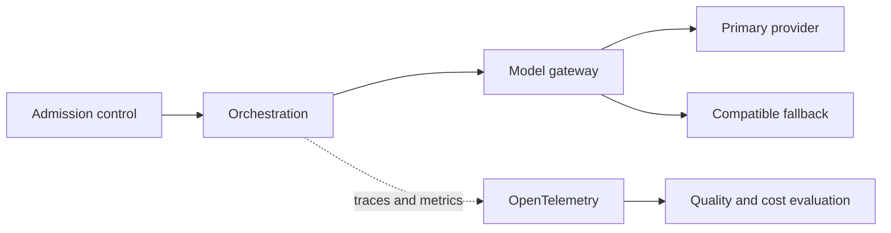

Resilience, observability, evaluation, latency, rate limits, provider changes and cost.

## Core Flow

## Revision Map

| Question | Detailed answer |
|---|---|
| What happens if the LLM provider becomes unavailable? | Use an end-to-end deadline and tracing to locate the failing segment before retrying. Protect capacity with bounded concurrency, backoff and circuit breaking, and make retries idempotent when side effects are possible. Recover through a tested fallback or safe degradation, then verify Timeout, retry, fallback provider/model, circuit breaker, graceful degradation and add the incident to regression coverage. |
| How do you handle LLM rate limits such as HTTP 429? | Use an end-to-end deadline and tracing to locate the failing segment before retrying. Protect capacity with bounded concurrency, backoff and circuit breaking, and make retries idempotent when side effects are possible. Recover through a tested fallback or safe degradation, then verify Exponential backoff, jitter, concurrency limits, quotas, provider fallback and add the incident to regression coverage. |
| How do you handle LLM timeouts? | Use an end-to-end deadline and tracing to locate the failing segment before retrying. Protect capacity with bounded concurrency, backoff and circuit breaking, and make retries idempotent when side effects are possible. Recover through a tested fallback or safe degradation, then verify Request timeout, cancellation, retry policy, fallback, async patterns and add the incident to regression coverage. |
| How do you evaluate a RAG/Agent system in production? | Build a versioned dataset of representative, edge and adversarial scenarios and define expected evidence or outcomes before testing. Measure Retrieval metrics, faithfulness, correctness, task success, latency, cost separately so retrieval, generation and end-task failures are distinguishable. Compare against a baseline, inspect failures rather than relying on one aggregate score, and retain every accepted defect as a regression case. |
| How do you detect that a production Agent is degrading? | Use an end-to-end deadline and tracing to locate the failing segment before retrying. Protect capacity with bounded concurrency, backoff and circuit breaking, and make retries idempotent when side effects are possible. Recover through a tested fallback or safe degradation, then verify Quality metrics, tool failures, retrieval scores, token usage, latency, user feedback and add the incident to regression coverage. |
| How do you implement observability for an Agent? | A complete answer should explain how Distributed tracing, LLM spans, prompts, tool calls, latency, tokens, errors participate in the same execution path rather than listing them independently. Define what enters each boundary, what transformation or decision occurs, and what invariant must hold before the result moves forward. Close with limits, failure behavior and observable measures for quality, latency, security and cost. |
| How do you control LLM cost in production? | A complete answer should explain how Token budgets, model routing, caching, prompt optimization, rate limits, max iterations participate in the same execution path rather than listing them independently. Define what enters each boundary, what transformation or decision occurs, and what invariant must hold before the result moves forward. Close with limits, failure behavior and observable measures for quality, latency, security and cost. |
| How do you handle model/version changes? | A complete answer should explain how Regression evaluation, prompt compatibility, embedding migration, canary testing participate in the same execution path rather than listing them independently. Define what enters each boundary, what transformation or decision occurs, and what invariant must hold before the result moves forward. Close with limits, failure behavior and observable measures for quality, latency, security and cost. |
| Design a production-grade GenAI platform with security, guardrails, resilience and observability. | Separate the design into explicit components for End-to-end architecture and operational controls, with a clear contract and owner for each boundary. Show how authenticated context, state and evidence move through the system, and where deterministic policy constrains model decisions. Then explain bottlenecks, partial failures, recovery, scaling signals and the metrics that prove the complete task works. |
| Design a production-grade Agentic AI platform using Java 21 + Spring AI. | Separate the design into explicit components for API, agent orchestration, LLM, RAG, tools, state, security, observability, with a clear contract and owner for each boundary. Show how authenticated context, state and evidence move through the system, and where deterministic policy constrains model decisions. Then explain bottlenecks, partial failures, recovery, scaling signals and the metrics that prove the complete task works. |
| How would you scale an Agentic AI platform to thousands of concurrent users? | A complete answer should explain how Stateless services, async processing, concurrency limits, queues, caching, rate limits participate in the same execution path rather than listing them independently. Define what enters each boundary, what transformation or decision occurs, and what invariant must hold before the result moves forward. Close with limits, failure behavior and observable measures for quality, latency, security and cost. |
| How would you handle long-running Agent workflows? | Separate the design into explicit components for Async jobs, workflow/state persistence, callbacks/events, resumability, with a clear contract and owner for each boundary. Show how authenticated context, state and evidence move through the system, and where deterministic policy constrains model decisions. Then explain bottlenecks, partial failures, recovery, scaling signals and the metrics that prove the complete task works. |
| How would you design observability for Agentic AI? | Separate the design into explicit components for OpenTelemetry, traces, LLM/tool spans, token metrics, quality metrics, with a clear contract and owner for each boundary. Show how authenticated context, state and evidence move through the system, and where deterministic policy constrains model decisions. Then explain bottlenecks, partial failures, recovery, scaling signals and the metrics that prove the complete task works. |
| How would you debug a slow Agent request? | Use an end-to-end deadline and tracing to locate the failing segment before retrying. Protect capacity with bounded concurrency, backoff and circuit breaking, and make retries idempotent when side effects are possible. Recover through a tested fallback or safe degradation, then verify Trace decomposition: API → retrieval → LLM → tools → downstream APIs and add the incident to regression coverage. |
| How would you control GenAI cost? | A complete answer should explain how Token budgets, model routing, caching, prompt optimization, quotas participate in the same execution path rather than listing them independently. Define what enters each boundary, what transformation or decision occurs, and what invariant must hold before the result moves forward. Close with limits, failure behavior and observable measures for quality, latency, security and cost. |
| How would you evaluate Agent quality before production deployment? | Build a versioned dataset of representative, edge and adversarial scenarios and define expected evidence or outcomes before testing. Measure Golden datasets, RAG evaluation, task success, regression testing, red teaming separately so retrieval, generation and end-task failures are distinguishable. Compare against a baseline, inspect failures rather than relying on one aggregate score, and retain every accepted defect as a regression case. |
| How would you deploy a new prompt/model version safely? | A complete answer should explain how Versioning, A/B, canary, evaluation, rollback participate in the same execution path rather than listing them independently. Define what enters each boundary, what transformation or decision occurs, and what invariant must hold before the result moves forward. Close with limits, failure behavior and observable measures for quality, latency, security and cost. |
| How would you design disaster recovery for an Agentic AI platform? | Separate the design into explicit components for Stateless recovery, persistent state, vector DB backup, provider failover, with a clear contract and owner for each boundary. Show how authenticated context, state and evidence move through the system, and where deterministic policy constrains model decisions. Then explain bottlenecks, partial failures, recovery, scaling signals and the metrics that prove the complete task works. |
| When would you reject an Agentic AI solution and use conventional software instead? | Start from the deterministic alternative and identify exactly where interpretation or dynamic action is required. Evaluate Determinism, compliance, latency, cost, risk, predictable workflows against latency, compliance, predictability and operating cost. Use an agent only when measured task-quality improvement outweighs its additional nondeterminism and failure surface. |
| Azure OpenAI starts returning 429s. What do you do? | Use an end-to-end deadline and tracing to locate the failing segment before retrying. Protect capacity with bounded concurrency, backoff and circuit breaking, and make retries idempotent when side effects are possible. Recover through a tested fallback or safe degradation, then verify Rate limiting, backoff, fallback and add the incident to regression coverage. |
| The LLM provider becomes unavailable. Design the fallback. | Use an end-to-end deadline and tracing to locate the failing segment before retrying. Protect capacity with bounded concurrency, backoff and circuit breaking, and make retries idempotent when side effects are possible. Recover through a tested fallback or safe degradation, then verify Resilience/provider routing and add the incident to regression coverage. |
| Agent latency suddenly increases from 3s to 30s. How do you debug it? | A complete answer should explain how Observability/tracing participate in the same execution path rather than listing them independently. Define what enters each boundary, what transformation or decision occurs, and what invariant must hold before the result moves forward. Close with limits, failure behavior and observable measures for quality, latency, security and cost. |
| Agent cost has increased 5×. How do you investigate and control it? | Use an end-to-end deadline and tracing to locate the failing segment before retrying. Protect capacity with bounded concurrency, backoff and circuit breaking, and make retries idempotent when side effects are possible. Recover through a tested fallback or safe degradation, then verify Tokens, models, loops, caching and add the incident to regression coverage. |

## Interview Lens

Keep probabilistic interpretation separate from authorization, policy, transactions and recovery. Explain trade-offs with evidence: task quality, latency, resilience, security, operating cost and auditability.
