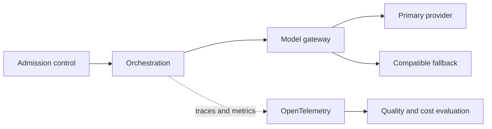

Resilience, observability, evaluation, latency, rate limits, provider changes and cost.

## Core Flow

## Revision Map

| Question | What a strong answer should establish | Priority |
|---|---|---|
| What happens if the LLM provider becomes unavailable? | Bound, observe and classify the failure; protect capacity, recover through an idempotent tested path, then verify Timeout, retry, fallback provider/model, circuit breaker, graceful degradation. | Critical |
| How do you handle LLM rate limits such as HTTP 429? | Bound, observe and classify the failure; protect capacity, recover through an idempotent tested path, then verify Exponential backoff, jitter, concurrency limits, quotas, provider fallback. | High |
| How do you handle LLM timeouts? | Bound, observe and classify the failure; protect capacity, recover through an idempotent tested path, then verify Request timeout, cancellation, retry policy, fallback, async patterns. | High |
| How do you evaluate a RAG/Agent system in production? | Use versioned representative scenarios and measure Retrieval metrics, faithfulness, correctness, task success, latency, cost; compare against a baseline and retain failures as regressions. | Critical |
| How do you detect that a production Agent is degrading? | Bound, observe and classify the failure; protect capacity, recover through an idempotent tested path, then verify Quality metrics, tool failures, retrieval scores, token usage, latency, user feedback. | High |
| How do you implement observability for an Agent? | Connect Distributed tracing, LLM spans, prompts, tool calls, latency, tokens, errors; define the contract, limits, measurement and safe failure behavior for the complete path. | Critical |
| How do you control LLM cost in production? | Connect Token budgets, model routing, caching, prompt optimization, rate limits, max iterations; define the contract, limits, measurement and safe failure behavior for the complete path. | High |
| How do you handle model/version changes? | Connect Regression evaluation, prompt compatibility, embedding migration, canary testing; define the contract, limits, measurement and safe failure behavior for the complete path. | High |
| Design a production-grade GenAI platform with security, guardrails, resilience and observability. | Make End-to-end architecture and operational controls explicit as independently observable components with clear trust, state and failure boundaries. | Critical |
| Design a production-grade Agentic AI platform using Java 21 + Spring AI. | Make API, agent orchestration, LLM, RAG, tools, state, security, observability explicit as independently observable components with clear trust, state and failure boundaries. | Critical |
| How would you scale an Agentic AI platform to thousands of concurrent users? | Connect Stateless services, async processing, concurrency limits, queues, caching, rate limits; define the contract, limits, measurement and safe failure behavior for the complete path. | Critical |
| How would you handle long-running Agent workflows? | Make Async jobs, workflow/state persistence, callbacks/events, resumability explicit as independently observable components with clear trust, state and failure boundaries. | Critical |
| How would you design observability for Agentic AI? | Make OpenTelemetry, traces, LLM/tool spans, token metrics, quality metrics explicit as independently observable components with clear trust, state and failure boundaries. | Critical |
| How would you debug a slow Agent request? | Bound, observe and classify the failure; protect capacity, recover through an idempotent tested path, then verify Trace decomposition: API → retrieval → LLM → tools → downstream APIs. | High |
| How would you control GenAI cost? | Connect Token budgets, model routing, caching, prompt optimization, quotas; define the contract, limits, measurement and safe failure behavior for the complete path. | Critical |
| How would you evaluate Agent quality before production deployment? | Use versioned representative scenarios and measure Golden datasets, RAG evaluation, task success, regression testing, red teaming; compare against a baseline and retain failures as regressions. | Critical |
| How would you deploy a new prompt/model version safely? | Connect Versioning, A/B, canary, evaluation, rollback; define the contract, limits, measurement and safe failure behavior for the complete path. | High |
| How would you design disaster recovery for an Agentic AI platform? | Make Stateless recovery, persistent state, vector DB backup, provider failover explicit as independently observable components with clear trust, state and failure boundaries. | High |
| When would you reject an Agentic AI solution and use conventional software instead? | Choose the simpler deterministic design unless Determinism, compliance, latency, cost, risk, predictable workflows provide measurable value that justifies AI risk and operating cost. | Critical |
| Azure OpenAI starts returning 429s. What do you do? | Bound, observe and classify the failure; protect capacity, recover through an idempotent tested path, then verify Rate limiting, backoff, fallback. | Critical |
| The LLM provider becomes unavailable. Design the fallback. | Bound, observe and classify the failure; protect capacity, recover through an idempotent tested path, then verify Resilience/provider routing. | Critical |
| Agent latency suddenly increases from 3s to 30s. How do you debug it? | Connect Observability/tracing; define the contract, limits, measurement and safe failure behavior for the complete path. | High |
| Agent cost has increased 5×. How do you investigate and control it? | Bound, observe and classify the failure; protect capacity, recover through an idempotent tested path, then verify Tokens, models, loops, caching. | High |

## Interview Lens

Keep probabilistic interpretation separate from authorization, policy, transactions and recovery. Explain trade-offs with evidence: task quality, latency, resilience, security, operating cost and auditability.
