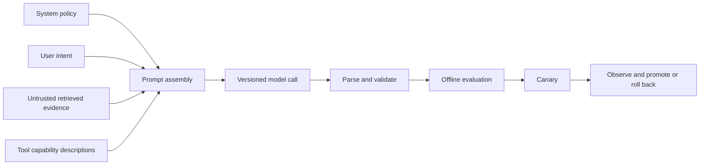

Production prompts are application artifacts with contracts, dependencies and regression risk. Prompt wording cannot replace authorization, policy enforcement, schema validation or tool controls.

## Prompt Lifecycle

## Revision Map

### How do you structure a production system prompt?

Define role and objective, non-negotiable policy, allowed data and tools, response contract, abstention rules and conflict handling.

- **How it works:** Keep stable policy separate from request-specific content.
- **Production:** Version the prompt with its model, response schema, available tools, and retrieval behavior.
- **Validation:** Promote changes only when quality, safety, latency, and cost remain within defined acceptance thresholds.

### How do system, user, retrieved context and tool instructions differ?

System instructions define application policy; user content expresses intent; retrieved content is untrusted evidence; tool descriptions define capabilities, not authorization.

- **How it works:** Preserve this precedence in prompt assembly and execution.
- **Production:** Version the prompt with its model, response schema, available tools, and retrieval behavior.
- **Validation:** Promote changes only when quality, safety, latency, and cost remain within defined acceptance thresholds.

### How do you prevent retrieved content from overriding system instructions?

Delimit and label retrieved text as data, strip active markup where practical, instruct the model not to execute embedded directions, minimize exposed tools and enforce authorization outside the model.

- **How it works:** Delimit and label retrieved text as data, strip active markup where practical, instruct the model not to execute embedded directions, minimize exposed tools and enforce authorization outside the model.
- **Production:** Version the prompt with its model, response schema, available tools, and retrieval behavior.
- **Validation:** Promote changes only when quality, safety, latency, and cost remain within defined acceptance thresholds.

### How do you design prompts for structured output?

Use a narrow typed schema with field semantics and constraints, request no extra prose, then parse and validate the result as untrusted input.

- **How it works:** Retry only bounded correctable failures.
- **Production:** Version the prompt with its model, response schema, available tools, and retrieval behavior.
- **Validation:** Promote changes only when quality, safety, latency, and cost remain within defined acceptance thresholds.

### When should you use few-shot versus zero-shot prompting?

Start zero-shot when instructions and schema are sufficient.

- **How it works:** Add a small representative set of examples when format, classification boundaries or edge-case behavior remain ambiguous; measure the token and anchoring cost.
- **Production:** Version the prompt with its model, response schema, available tools, and retrieval behavior.
- **Validation:** Promote changes only when quality, safety, latency, and cost remain within defined acceptance thresholds.

### How do you version and test prompts?

Store prompts as reviewed artifacts with semantic versions and dependencies on model, tools, schema and retrieval strategy.

- **How it works:** Run unit checks, golden scenarios, adversarial cases and online canaries before promotion.
- **Production:** Version the prompt with its model, response schema, available tools, and retrieval behavior.
- **Validation:** Promote changes only when quality, safety, latency, and cost remain within defined acceptance thresholds.

### How do you prevent prompt drift during model upgrades?

Pin prompt-model combinations, compare old and new behavior on a frozen evaluation set, inspect tool and structured-output compatibility, canary by risk tier and retain immediate rollback.

- **How it works:** Pin prompt-model combinations, compare old and new behavior on a frozen evaluation set, inspect tool and structured-output compatibility, canary by risk tier and retain immediate rollback.
- **Production:** Version the prompt with its model, response schema, available tools, and retrieval behavior.
- **Validation:** Promote changes only when quality, safety, latency, and cost remain within defined acceptance thresholds.

### How do you optimize a prompt without degrading quality?

Establish a quality and safety baseline first, remove redundant tokens incrementally, evaluate each change across representative and adversarial cases, and optimize cost or latency only within explicit quality guardrails.

- **How it works:** Establish a quality and safety baseline first, remove redundant tokens incrementally, evaluate each change across representative and adversarial cases, and optimize cost or latency only within explicit quality guardrails.
- **Production:** Version the prompt with its model, response schema, available tools, and retrieval behavior.
- **Validation:** Promote changes only when quality, safety, latency, and cost remain within defined acceptance thresholds.

## Production Rule

Version the prompt together with its model, sampling configuration, response schema, available tools and retrieval behavior. Promote changes only when quality, safety, latency and cost remain inside defined acceptance thresholds.
