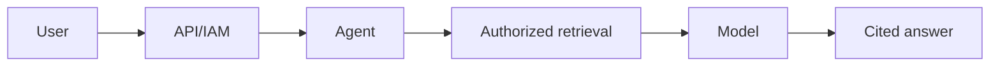
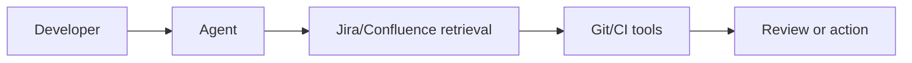
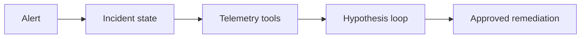
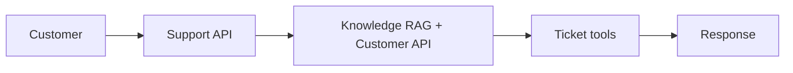
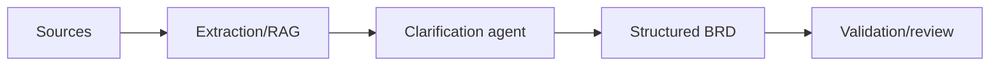
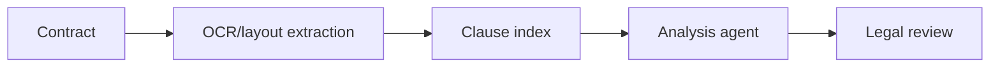
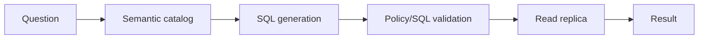
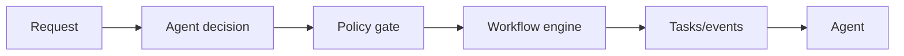
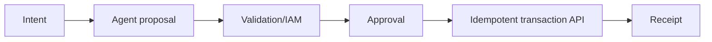
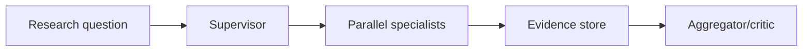

Use an agent only where interpretation, iterative evidence gathering or dynamic tool selection adds measurable value. Keep authorization, policy, transactions, approvals and recovery deterministic.

## 1. Enterprise Knowledge Agent

| Dimension | Production design |
|---|---|
| **Business problem** | Employees lose time searching fragmented policies, procedures and technical knowledge. |
| **Why an agent?** | The request often requires clarification, retrieval across sources and synthesis; use plain RAG when no action or iterative search is needed. |
| **RAG** | Hybrid retrieval over versioned chunks with mandatory tenant/ACL filters, reranking and claim-level citations. |
| **Tools** | Search, document metadata, source preview and access-request workflow; keep write tools out by default. |
| **Agent execution** | Classify intent, derive security scope, retrieve, rerank, answer only from evidence and return citations or abstain. |
| **Failure handling** | On weak retrieval, ask a clarifying question or abstain; preserve the source/index version for diagnosis. |
| **Security** | Document ACLs are enforced during retrieval; prompt-provided identity or tenant values are ignored. |
| **Observability** | Trace parsing, retrieval, reranking and generation; record scores, citations, latency and token usage without logging sensitive content. |
| **Evaluation** | Retrieval recall, citation correctness, faithfulness, answer correctness, abstention quality and search-time reduction. |
| **Production challenges** | Stale documents, inconsistent permissions, duplicate content, poor scans and answers synthesized from conflicting policies. |

## 2. IT / Developer Agent

| Dimension | Production design |
|---|---|
| **Business problem** | Engineering work is distributed across tickets, repositories, documentation, CI systems and operational tools. |
| **Why an agent?** | Multi-step investigation and bounded actions benefit from tool selection; deterministic automation remains preferable for known runbooks. |
| **RAG** | Index architecture docs, runbooks and resolved incidents with repository, service, branch and permission metadata. |
| **Tools** | Jira, Git, Confluence, code search, build and CI status; mutations require scoped credentials and confirmation. |
| **Agent execution** | Build an evidence set, propose a plan, invoke read tools, generate a patch or ticket update, then require review before mutation. |
| **Failure handling** | Sandbox builds, cap iterations, retain tool output and distinguish failed execution from an unknown mutation outcome. |
| **Security** | Use short-lived user-delegated credentials, repository allow-lists, branch protection, secret scanning and approval gates. |
| **Observability** | Correlate model decisions, queries, diffs, build results and approvals using one task ID. |
| **Evaluation** | Issue-resolution rate, accepted suggestions, build/test pass rate, unsafe-action rate, latency and engineer time saved. |
| **Production challenges** | Large repositories, stale documentation, generated insecure code, excessive permissions and non-reproducible tool environments. |

## 3. Incident / Operations Agent

| Dimension | Production design |
|---|---|
| **Business problem** | Responders must correlate alerts, telemetry, deployments and runbooks under severe time pressure. |
| **Why an agent?** | Iterative hypothesis testing across tools adds value, but remediation should remain policy-controlled and deterministic. |
| **RAG** | Retrieve service topology, runbooks, past incidents and change records scoped to the affected environment. |
| **Tools** | Logs, metrics, traces, deployment history, feature flags and remediation workflows; begin read-only. |
| **Agent execution** | Create an incident timeline, test ranked hypotheses, recommend a runbook step and execute only pre-approved bounded actions. |
| **Failure handling** | Stop on conflicting evidence, missing telemetry or tool timeout; preserve state and escalate to the incident commander. |
| **Security** | Separate diagnosis from remediation roles, use break-glass approval and prohibit free-form shell execution. |
| **Observability** | Record every query, hypothesis, evidence link, proposed action, approval and resulting system signal. |
| **Evaluation** | Diagnosis accuracy, false-action rate, MTTA/MTTR, escalation quality and percentage of recommendations accepted. |
| **Production challenges** | Noisy alerts, partial telemetry, cascading failures, stale runbooks and the high cost of a confident wrong action. |

## 4. Customer Support Agent

| Dimension | Production design |
|---|---|
| **Business problem** | Support teams need consistent answers plus customer-specific context and ticket actions. |
| **Why an agent?** | The agent can combine grounded knowledge with authorized customer APIs and choose the next support action. |
| **RAG** | Retrieve approved product documentation, policies and known issues with product/version/locale filters and citations. |
| **Tools** | Customer profile, order/subscription status, ticket creation, escalation and approved remediation actions. |
| **Agent execution** | Authenticate, classify intent, retrieve policy, fetch minimum customer data, propose or perform an allowed action and update the ticket. |
| **Failure handling** | Do not guess account facts; degrade to general guidance or human handoff while carrying evidence and conversation state. |
| **Security** | Apply customer-resource authorization, PII minimization, redacted telemetry and separate permissions for refunds or account changes. |
| **Observability** | Measure retrieval, API/tool latency, handoffs, policy citations, mutations and customer-visible failures. |
| **Evaluation** | Resolution rate, answer correctness, containment, CSAT, policy compliance, escalation precision and unsafe-action rate. |
| **Production challenges** | Identity verification, emotional users, policy changes, multilingual content and adversarial attempts to obtain account data. |

## 5. Requirement / BRD Agent

| Dimension | Production design |
|---|---|
| **Business problem** | Business requirements arrive as incomplete, inconsistent documents and conversations. |
| **Why an agent?** | Iterative clarification and synthesis help, while the final artifact needs a deterministic schema and human ownership. |
| **RAG** | Retrieve domain standards, existing capabilities, glossary terms and prior approved requirements with provenance. |
| **Tools** | Document ingestion, stakeholder directory, requirement repository, glossary and review workflow. |
| **Agent execution** | Extract facts, identify gaps/conflicts, ask targeted questions, generate structured requirements and run rule-based validation. |
| **Failure handling** | Mark unsupported assumptions, retain unresolved conflicts and block publication when mandatory sections or approvals are missing. |
| **Security** | Respect project confidentiality, stakeholder access and retention rules; isolate customer and program data. |
| **Observability** | Track source-to-requirement lineage, clarification cycles, validation failures and reviewer edits. |
| **Evaluation** | Completeness, ambiguity and conflict rates, traceability coverage, reviewer acceptance and downstream change requests. |
| **Production challenges** | Tacit knowledge, contradictory stakeholders, false precision and treating generated text as approved scope. |

## 6. Contract Intelligence Agent

| Dimension | Production design |
|---|---|
| **Business problem** | Legal and procurement teams must locate clauses, compare obligations and identify risk across heterogeneous contracts. |
| **Why an agent?** | The work combines extraction, retrieval and bounded analysis, but legal conclusions require expert review. |
| **RAG** | Use layout-aware clause chunks, document/version/page metadata, approved playbooks and exact citation spans. |
| **Tools** | OCR, document parser, clause classifier, comparison engine, obligation register and review workflow. |
| **Agent execution** | Validate extraction quality, classify clauses, retrieve policy, compare deviations, cite text and route material risks to counsel. |
| **Failure handling** | Surface unreadable pages and low-confidence extraction; never silently analyze missing schedules or signatures. |
| **Security** | Encrypt documents, enforce matter-level access, restrict provider retention and maintain immutable access/audit records. |
| **Observability** | Trace page extraction, clause boundaries, evidence, policy versions, reviewer overrides and export actions. |
| **Evaluation** | Clause extraction recall, citation accuracy, deviation precision/recall, missed-risk rate and reviewer agreement. |
| **Production challenges** | Scans, tables, cross-references, amendments, jurisdiction differences and unauthorized-legal-advice risk. |

## 7. Data / SQL Agent

| Dimension | Production design |
|---|---|
| **Business problem** | Users need governed access to analytical data without manually writing SQL. |
| **Why an agent?** | The model can interpret intent and select datasets, but SQL execution must pass deterministic controls. |
| **RAG** | Retrieve schema, metric definitions, join rules, ownership and approved query patterns rather than raw business rows. |
| **Tools** | Catalog search, SQL parser, query planner/cost estimator, read-only database executor and visualization service. |
| **Agent execution** | Resolve metrics, generate SQL, parse and authorize every relation/column, estimate cost, execute with limits and summarize results. |
| **Failure handling** | Reject ambiguous metrics, unsafe SQL or excessive plans; cancel on deadline and expose validation errors for correction. |
| **Security** | Use read-only identities, row/column policies, tenant predicates, query allow-lists, masking and result-size limits. |
| **Observability** | Capture normalized SQL fingerprints, datasets, policy decisions, query cost, latency and result cardinality—not sensitive row data. |
| **Evaluation** | SQL execution accuracy, metric correctness, policy violations, query cost, clarification rate and analyst acceptance. |
| **Production challenges** | Semantic ambiguity, schema drift, expensive queries, inference attacks and convincing summaries of incorrect aggregates. |

## 8. Enterprise Workflow Agent

| Dimension | Production design |
|---|---|
| **Business problem** | Knowledge-heavy processes need flexible interpretation but dependable execution and audit. |
| **Why an agent?** | Use the agent for classification and next-best-action proposals; use a workflow engine for durable deterministic transitions. |
| **RAG** | Retrieve policies, case history and task instructions using case and tenant authorization. |
| **Tools** | Workflow start/signal, task lookup, document service, notification and human-approval queue. |
| **Agent execution** | The agent proposes a typed command; policy validates it; the workflow executes, checkpoints and returns events for the next decision. |
| **Failure handling** | Workflow retries and compensation own operational recovery; the agent must not improvise transaction semantics. |
| **Security** | Authorize every workflow command, bind it to case state and principal, and require approval for sensitive transitions. |
| **Observability** | Link model/tool spans to workflow instance, state transitions, timers, retries, compensation and approvals. |
| **Evaluation** | Completion rate, exception/escalation rate, invalid transition attempts, cycle time and human rework. |
| **Production challenges** | Long-running state, version migrations, duplicate events, human delays and unclear ownership between agent and workflow. |

## 9. Transaction Agent

| Dimension | Production design |
|---|---|
| **Business problem** | Users want conversational initiation of high-value business operations such as payments, refunds or orders. |
| **Why an agent?** | The agent may gather intent and required fields, but authorization and transaction execution must be deterministic. |
| **RAG** | Retrieve product rules and policies only; authoritative balances, limits and transaction state come from APIs. |
| **Tools** | Quote/preview, beneficiary or order lookup, approval, transaction submission, status and reconciliation. |
| **Agent execution** | Resolve intent, produce a preview, validate limits and authorization, obtain confirmation/approval, execute once and reconcile outcome. |
| **Failure handling** | Treat timeout after submission as unknown state; query by idempotency key before retrying and escalate unresolved outcomes. |
| **Security** | Use step-up authentication, segregation of duties, transaction signing, amount/resource policies and immutable audit. |
| **Observability** | Record proposal, policy decision, confirmation, idempotency key, API result and reconciliation without exposing secrets. |
| **Evaluation** | Successful authorized completion, duplicate rate, fraud/policy violations, abandonment, reconciliation time and false declines. |
| **Production challenges** | Ambiguous intent, social engineering, irreversible side effects, regulatory evidence and provider/tool partial failure. |

## 10. Multi-Agent Research Agent

| Dimension | Production design |
|---|---|
| **Business problem** | Complex research requires independent collection, analysis and critique across domains or data sources. |
| **Why an agent?** | Specialists can work in parallel when tasks are genuinely separable; a single agent is cheaper for tightly coupled research. |
| **RAG** | Each specialist retrieves from an authorized domain corpus; evidence retains source, time, scope and confidence metadata. |
| **Tools** | Search, data-source connectors, document readers, calculators and citation validator with per-agent allow-lists. |
| **Agent execution** | Supervisor creates bounded tasks, specialists return structured claims/evidence, a critic checks conflicts and aggregation produces the report. |
| **Failure handling** | Cap fan-out/hops, tolerate partial results, detect circular delegation and escalate unresolved evidence conflicts. |
| **Security** | Give each agent its own identity and least-privilege tools; do not expose shared memory across tenants or incompatible domains. |
| **Observability** | Trace the task graph, messages, retrieval, tools, tokens, evidence lineage, conflicts and aggregation decisions. |
| **Evaluation** | Evidence coverage, citation/claim correctness, contradiction detection, task success, latency and cost versus a single-agent baseline. |
| **Production challenges** | Coordination overhead, duplicated work, context pollution, nondeterministic synthesis and cost without quality gain. |

