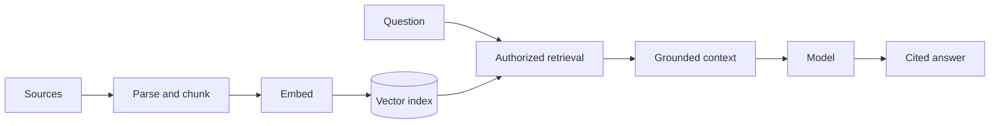

Ingestion, parsing, chunking, embeddings, retrieval, grounding and citations.

## Core Flow

## Revision Map

### Explain a production RAG architecture end-to-end.

Separate the design into explicit components for Ingestion → parsing → chunking → embeddings → vector DB → retrieval → prompt construction → LLM, with a clear contract and owner for each boundary.

- **Key areas:** Ingestion → parsing → chunking → embeddings → vector DB → retrieval → prompt construction → LLM.
- **How it works:** Show how authenticated context, state and evidence move through the system, and where deterministic policy constrains model decisions.
- **Production:** Then explain bottlenecks, partial failures, recovery, scaling signals and the metrics that prove the complete task works.

### What chunking strategies have you used?

Fixed-size, recursive, semantic, structural/hierarchical chunking form a controlled end-to-end capability rather than a set of independent features.

- **Key areas:** Fixed-size, recursive, semantic, structural/hierarchical chunking.
- **How it works:** Define what enters each boundary, what transformation or decision occurs, and what invariant must hold before the result moves forward.
- **Production:** In production, make limits and failure behavior explicit and measure quality, latency, security and cost across the complete path.

### How do you handle hallucination when retrieved documents don't contain the answer?

Grounding, relevance threshold, abstention, "I don't know", citations, guardrails form a controlled end-to-end capability rather than a set of independent features.

- **Key areas:** Grounding, relevance threshold, abstention, "I don't know", citations, guardrails.
- **How it works:** Define what enters each boundary, what transformation or decision occurs, and what invariant must hold before the result moves forward.
- **Production:** In production, make limits and failure behavior explicit and measure quality, latency, security and cost across the complete path.

### How would you implement RAG using Spring AI?

VectorStore, EmbeddingModel, ChatClient, advisors/retrieval flow, configuration form a controlled end-to-end capability rather than a set of independent features.

- **Key areas:** VectorStore, EmbeddingModel, ChatClient, advisors/retrieval flow, configuration.
- **How it works:** Define what enters each boundary, what transformation or decision occurs, and what invariant must hold before the result moves forward.
- **Production:** In production, make limits and failure behavior explicit and measure quality, latency, security and cost across the complete path.

## Interview Lens

Keep probabilistic interpretation separate from authorization, policy, transactions and recovery. Explain trade-offs with evidence: task quality, latency, resilience, security, operating cost and auditability.
