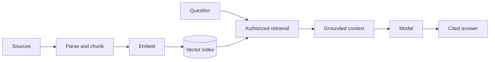

Ingestion, parsing, chunking, embeddings, retrieval, grounding and citations.

## Core Flow

## Revision Map

| Question | What a strong answer should establish | Priority |
|---|---|---|
| Explain a production RAG architecture end-to-end. | Make Ingestion → parsing → chunking → embeddings → vector DB → retrieval → prompt construction → LLM explicit as independently observable components with clear trust, state and failure boundaries. | Critical |
| What chunking strategies have you used? | Connect Fixed-size, recursive, semantic, structural/hierarchical chunking; define the contract, limits, measurement and safe failure behavior for the complete path. | High |
| How do you handle hallucination when retrieved documents don't contain the answer? | Connect Grounding, relevance threshold, abstention, "I don't know", citations, guardrails; define the contract, limits, measurement and safe failure behavior for the complete path. | Critical |
| How would you implement RAG using Spring AI? | Connect VectorStore, EmbeddingModel, ChatClient, advisors/retrieval flow, configuration; define the contract, limits, measurement and safe failure behavior for the complete path. | Critical |

## Interview Lens

Keep probabilistic interpretation separate from authorization, policy, transactions and recovery. Explain trade-offs with evidence: task quality, latency, resilience, security, operating cost and auditability.
