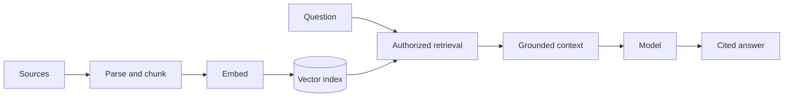

Ingestion, parsing, chunking, embeddings, retrieval, grounding and citations.

## Core Flow

## Revision Map

| Question | Detailed answer |
|---|---|
| Explain a production RAG architecture end-to-end. | Separate the design into explicit components for Ingestion → parsing → chunking → embeddings → vector DB → retrieval → prompt construction → LLM, with a clear contract and owner for each boundary. Show how authenticated context, state and evidence move through the system, and where deterministic policy constrains model decisions. Then explain bottlenecks, partial failures, recovery, scaling signals and the metrics that prove the complete task works. |
| What chunking strategies have you used? | A complete answer should explain how Fixed-size, recursive, semantic, structural/hierarchical chunking participate in the same execution path rather than listing them independently. Define what enters each boundary, what transformation or decision occurs, and what invariant must hold before the result moves forward. Close with limits, failure behavior and observable measures for quality, latency, security and cost. |
| How do you handle hallucination when retrieved documents don't contain the answer? | A complete answer should explain how Grounding, relevance threshold, abstention, "I don't know", citations, guardrails participate in the same execution path rather than listing them independently. Define what enters each boundary, what transformation or decision occurs, and what invariant must hold before the result moves forward. Close with limits, failure behavior and observable measures for quality, latency, security and cost. |
| How would you implement RAG using Spring AI? | A complete answer should explain how VectorStore, EmbeddingModel, ChatClient, advisors/retrieval flow, configuration participate in the same execution path rather than listing them independently. Define what enters each boundary, what transformation or decision occurs, and what invariant must hold before the result moves forward. Close with limits, failure behavior and observable measures for quality, latency, security and cost. |

## Interview Lens

Keep probabilistic interpretation separate from authorization, policy, transactions and recovery. Explain trade-offs with evidence: task quality, latency, resilience, security, operating cost and auditability.
