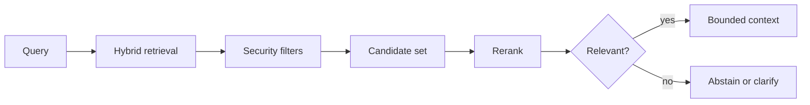

Search quality, metadata, reranking, evaluation, updates, deletion and tenant isolation.

## Core Flow

## Revision Map

| Question | What a strong answer should establish | Priority |
|---|---|---|
| How does document ingestion work in your RAG system? | Connect Document discovery, parsing, metadata extraction, transformation, chunking, embedding, indexing; define the contract, limits, measurement and safe failure behavior for the complete path. | Critical |
| How do you decide the right chunk size and chunk overlap? | Connect Semantic boundaries, token limits, retrieval quality, overlap trade-offs; define the contract, limits, measurement and safe failure behavior for the complete path. | Critical |
| What metadata would you store along with an embedding? | Connect Tenant, document ID, source, page, section, version, timestamp, permissions, document type; define the contract, limits, measurement and safe failure behavior for the complete path. | Critical |
| How does vector similarity search work? | Connect Embeddings, nearest-neighbor search, cosine similarity/distance, top-K; define the contract, limits, measurement and safe failure behavior for the complete path. | Critical |
| Why did you choose your Vector DB? | Connect pgVector / OpenSearch / Chroma / Pinecone etc.; scale, filtering, operational complexity, latency; define the contract, limits, measurement and safe failure behavior for the complete path. | Critical |
| How do you improve retrieval quality when the top-K results are poor? | Use versioned representative scenarios and measure Query transformation, metadata filtering, hybrid search, reranking, chunking improvements; compare against a baseline and retain failures as regressions. | Critical |
| What is hybrid search, and when would you use it? | Connect Keyword/BM25 + vector search, exact terms, IDs, domain terminology; define the contract, limits, measurement and safe failure behavior for the complete path. | High |
| What is reranking and why is it useful? | Connect Initial retrieval → reranker → best context; precision vs latency; define the contract, limits, measurement and safe failure behavior for the complete path. | High |
| How do you prevent irrelevant documents from entering the LLM context? | Connect Similarity threshold, top-K, metadata filters, reranking, relevance evaluation; define the contract, limits, measurement and safe failure behavior for the complete path. | Critical |
| How do you handle document updates and deletions? | Connect Versioning, document IDs, re-indexing, stale embeddings, deletion propagation; define the contract, limits, measurement and safe failure behavior for the complete path. | Critical |
| How do you implement multi-tenant RAG securely? | Enforce Tenant isolation, metadata filters, authorization, vector namespace/index strategy in deterministic application and data boundaries; never trust the prompt or model to supply security context. | Critical |
| How do you handle large documents such as PDFs, tables, images and diagrams? | Connect Parsing, OCR, structure preservation, multimodal content, metadata; define the contract, limits, measurement and safe failure behavior for the complete path. | High |
| How do you evaluate RAG quality? | Use versioned representative scenarios and measure Retrieval precision/recall, context relevance, faithfulness, answer correctness, evaluation datasets; compare against a baseline and retain failures as regressions. | Critical |
| How would you optimize RAG latency in production? | Connect Embedding latency, vector search, reranking, caching, parallel retrieval, context size, model latency; define the contract, limits, measurement and safe failure behavior for the complete path. | High |
| How would you monitor a production RAG pipeline? | Connect Retrieval latency, LLM latency, token usage, retrieval scores, failures, hallucination/evaluation metrics; define the contract, limits, measurement and safe failure behavior for the complete path. | High |
| What are the major failure modes of a production RAG system? | Bound, observe and classify the failure; protect capacity, recover through an idempotent tested path, then verify Bad parsing, bad chunks, stale index, poor retrieval, wrong metadata, prompt injection, model failure, vector DB failure. | Critical |
| Walk me through your RAG architecture end-to-end. | Make Ingestion → retrieval → generation explicit as independently observable components with clear trust, state and failure boundaries. | Critical |
| Why did you choose your chunking strategy? | Connect Practical RAG knowledge; define the contract, limits, measurement and safe failure behavior for the complete path. | Critical |
| How do you improve poor retrieval results? | Use versioned representative scenarios and measure Hybrid search, reranking, metadata; compare against a baseline and retain failures as regressions. | Critical |
| How do you handle document updates/deletions? | Connect Index lifecycle, consistency; define the contract, limits, measurement and safe failure behavior for the complete path. | High |
| How do you implement secure multi-tenant RAG? | Enforce Isolation, authorization in deterministic application and data boundaries; never trust the prompt or model to supply security context. | Critical |
| How would you implement RAG using Spring AI? | Connect ChatClient, VectorStore, retrieval; define the contract, limits, measurement and safe failure behavior for the complete path. | Critical |
| What is an AI Agent? | Connect Agent vs RAG; define the contract, limits, measurement and safe failure behavior for the complete path. | Critical |

## Interview Lens

Keep probabilistic interpretation separate from authorization, policy, transactions and recovery. Explain trade-offs with evidence: task quality, latency, resilience, security, operating cost and auditability.
