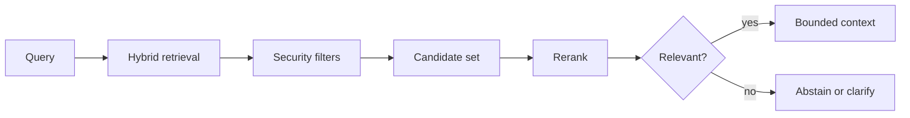

Search quality, metadata, reranking, evaluation, updates, deletion and tenant isolation.

## Core Flow

## Revision Map

### How does document ingestion work in your RAG system?

Document discovery, parsing, metadata extraction, transformation, chunking, embedding, indexing form a controlled end-to-end capability rather than a set of independent features.

- **Key areas:** Document discovery, parsing, metadata extraction, transformation, chunking, embedding, indexing.
- **How it works:** Define what enters each boundary, what transformation or decision occurs, and what invariant must hold before the result moves forward.
- **Production:** In production, make limits and failure behavior explicit and measure quality, latency, security and cost across the complete path.

### How do you decide the right chunk size and chunk overlap?

Semantic boundaries, token limits, retrieval quality, overlap trade-offs form a controlled end-to-end capability rather than a set of independent features.

- **Key areas:** Semantic boundaries, token limits, retrieval quality, overlap trade-offs.
- **How it works:** Define what enters each boundary, what transformation or decision occurs, and what invariant must hold before the result moves forward.
- **Production:** In production, make limits and failure behavior explicit and measure quality, latency, security and cost across the complete path.

### What metadata would you store along with an embedding?

Tenant, document ID, source, page, section, version, timestamp, permissions, document type form a controlled end-to-end capability rather than a set of independent features.

- **Key areas:** Tenant, document ID, source, page, section, version, timestamp, permissions, document type.
- **How it works:** Define what enters each boundary, what transformation or decision occurs, and what invariant must hold before the result moves forward.
- **Production:** In production, make limits and failure behavior explicit and measure quality, latency, security and cost across the complete path.

### How does vector similarity search work?

Embeddings, nearest-neighbor search, cosine similarity/distance, top-K form a controlled end-to-end capability rather than a set of independent features.

- **Key areas:** Embeddings, nearest-neighbor search, cosine similarity/distance, top-K.
- **How it works:** Define what enters each boundary, what transformation or decision occurs, and what invariant must hold before the result moves forward.
- **Production:** In production, make limits and failure behavior explicit and measure quality, latency, security and cost across the complete path.

### Why did you choose your Vector DB?

pgVector / OpenSearch / Chroma / Pinecone etc.; scale, filtering, operational complexity, latency form a controlled end-to-end capability rather than a set of independent features.

- **Key areas:** pgVector / OpenSearch / Chroma / Pinecone etc.; scale, filtering, operational complexity, latency.
- **How it works:** Define what enters each boundary, what transformation or decision occurs, and what invariant must hold before the result moves forward.
- **Production:** In production, make limits and failure behavior explicit and measure quality, latency, security and cost across the complete path.

### How do you improve retrieval quality when the top-K results are poor?

Build a versioned dataset of representative, edge and adversarial scenarios and define expected evidence or outcomes before testing.

- **Key areas:** Query transformation, metadata filtering, hybrid search, reranking, chunking improvements.
- **How it works:** Measure Query transformation, metadata filtering, hybrid search, reranking, chunking improvements separately so retrieval, generation and end-task failures are distinguishable.
- **Production:** Compare against a baseline, inspect failures rather than relying on one aggregate score, and retain every accepted defect as a regression case.

### What is hybrid search, and when would you use it?

Keyword/BM25 + vector search, exact terms, IDs, domain terminology form a controlled end-to-end capability rather than a set of independent features.

- **Key areas:** Keyword/BM25 + vector search, exact terms, IDs, domain terminology.
- **How it works:** Define what enters each boundary, what transformation or decision occurs, and what invariant must hold before the result moves forward.
- **Production:** In production, make limits and failure behavior explicit and measure quality, latency, security and cost across the complete path.

### What is reranking and why is it useful?

Initial retrieval → reranker → best context; precision vs latency form a controlled end-to-end capability rather than a set of independent features.

- **Key areas:** Initial retrieval → reranker → best context; precision vs latency.
- **How it works:** Define what enters each boundary, what transformation or decision occurs, and what invariant must hold before the result moves forward.
- **Production:** In production, make limits and failure behavior explicit and measure quality, latency, security and cost across the complete path.

### How do you prevent irrelevant documents from entering the LLM context?

Similarity threshold, top-K, metadata filters, reranking, relevance evaluation form a controlled end-to-end capability rather than a set of independent features.

- **Key areas:** Similarity threshold, top-K, metadata filters, reranking, relevance evaluation.
- **How it works:** Define what enters each boundary, what transformation or decision occurs, and what invariant must hold before the result moves forward.
- **Production:** In production, make limits and failure behavior explicit and measure quality, latency, security and cost across the complete path.

### How do you handle document updates and deletions?

Versioning, document IDs, re-indexing, stale embeddings, deletion propagation form a controlled end-to-end capability rather than a set of independent features.

- **Key areas:** Versioning, document IDs, re-indexing, stale embeddings, deletion propagation.
- **How it works:** Define what enters each boundary, what transformation or decision occurs, and what invariant must hold before the result moves forward.
- **Production:** In production, make limits and failure behavior explicit and measure quality, latency, security and cost across the complete path.

### How do you implement multi-tenant RAG securely?

Treat Tenant isolation, metadata filters, authorization, vector namespace/index strategy as deterministic controls enforced at the application, retrieval and tool boundaries.

- **Key areas:** Tenant isolation, metadata filters, authorization, vector namespace/index strategy.
- **How it works:** Identity, tenant scope and permissions must come from authenticated server context, never from prompt text or model output.
- **Production:** Apply least privilege, validate every requested action and preserve an audit trail across fallback and retry paths.

### How do you handle large documents such as PDFs, tables, images and diagrams?

Parsing, OCR, structure preservation, multimodal content, metadata form a controlled end-to-end capability rather than a set of independent features.

- **Key areas:** Parsing, OCR, structure preservation, multimodal content, metadata.
- **How it works:** Define what enters each boundary, what transformation or decision occurs, and what invariant must hold before the result moves forward.
- **Production:** In production, make limits and failure behavior explicit and measure quality, latency, security and cost across the complete path.

### How do you evaluate RAG quality?

Build a versioned dataset of representative, edge and adversarial scenarios and define expected evidence or outcomes before testing.

- **Key areas:** Retrieval precision/recall, context relevance, faithfulness, answer correctness, evaluation datasets.
- **How it works:** Measure Retrieval precision/recall, context relevance, faithfulness, answer correctness, evaluation datasets separately so retrieval, generation and end-task failures are distinguishable.
- **Production:** Compare against a baseline, inspect failures rather than relying on one aggregate score, and retain every accepted defect as a regression case.

### How would you optimize RAG latency in production?

Embedding latency, vector search, reranking, caching, parallel retrieval, context size, model latency form a controlled end-to-end capability rather than a set of independent features.

- **Key areas:** Embedding latency, vector search, reranking, caching, parallel retrieval, context size, model latency.
- **How it works:** Define what enters each boundary, what transformation or decision occurs, and what invariant must hold before the result moves forward.
- **Production:** In production, make limits and failure behavior explicit and measure quality, latency, security and cost across the complete path.

### How would you monitor a production RAG pipeline?

Retrieval latency, LLM latency, token usage, retrieval scores, failures, hallucination/evaluation metrics form a controlled end-to-end capability rather than a set of independent features.

- **Key areas:** Retrieval latency, LLM latency, token usage, retrieval scores, failures, hallucination/evaluation metrics.
- **How it works:** Define what enters each boundary, what transformation or decision occurs, and what invariant must hold before the result moves forward.
- **Production:** In production, make limits and failure behavior explicit and measure quality, latency, security and cost across the complete path.

### What are the major failure modes of a production RAG system?

Use an end-to-end deadline and tracing to locate the failing segment before retrying.

- **Key areas:** Bad parsing, bad chunks, stale index, poor retrieval, wrong metadata, prompt injection, model failure, vector DB failure.
- **How it works:** Protect capacity with bounded concurrency, backoff and circuit breaking, and make retries idempotent when side effects are possible.
- **Production:** Recover through a tested fallback or safe degradation, then verify Bad parsing, bad chunks, stale index, poor retrieval, wrong metadata, prompt injection, model failure, vector DB failure and add the incident to regression coverage.

### Walk me through your RAG architecture end-to-end.

Separate the design into explicit components for Ingestion → retrieval → generation, with a clear contract and owner for each boundary.

- **Key areas:** Ingestion → retrieval → generation.
- **How it works:** Show how authenticated context, state and evidence move through the system, and where deterministic policy constrains model decisions.
- **Production:** Then explain bottlenecks, partial failures, recovery, scaling signals and the metrics that prove the complete task works.

### Why did you choose your chunking strategy?

Practical RAG knowledge form a controlled end-to-end capability rather than a set of independent features.

- **Key areas:** Practical RAG knowledge.
- **How it works:** Define what enters each boundary, what transformation or decision occurs, and what invariant must hold before the result moves forward.
- **Production:** In production, make limits and failure behavior explicit and measure quality, latency, security and cost across the complete path.

### How do you improve poor retrieval results?

Build a versioned dataset of representative, edge and adversarial scenarios and define expected evidence or outcomes before testing.

- **Key areas:** Hybrid search, reranking, metadata.
- **How it works:** Measure Hybrid search, reranking, metadata separately so retrieval, generation and end-task failures are distinguishable.
- **Production:** Compare against a baseline, inspect failures rather than relying on one aggregate score, and retain every accepted defect as a regression case.

### How do you handle document updates/deletions?

Index lifecycle, consistency form a controlled end-to-end capability rather than a set of independent features.

- **Key areas:** Index lifecycle, consistency.
- **How it works:** Define what enters each boundary, what transformation or decision occurs, and what invariant must hold before the result moves forward.
- **Production:** In production, make limits and failure behavior explicit and measure quality, latency, security and cost across the complete path.

### How do you implement secure multi-tenant RAG?

Treat Isolation, authorization as deterministic controls enforced at the application, retrieval and tool boundaries.

- **Key areas:** Isolation, authorization.
- **How it works:** Identity, tenant scope and permissions must come from authenticated server context, never from prompt text or model output.
- **Production:** Apply least privilege, validate every requested action and preserve an audit trail across fallback and retry paths.

### How would you implement RAG using Spring AI?

ChatClient, VectorStore, retrieval form a controlled end-to-end capability rather than a set of independent features.

- **Key areas:** ChatClient, VectorStore, retrieval.
- **How it works:** Define what enters each boundary, what transformation or decision occurs, and what invariant must hold before the result moves forward.
- **Production:** In production, make limits and failure behavior explicit and measure quality, latency, security and cost across the complete path.

### What is an AI Agent?

Agent vs RAG form a controlled end-to-end capability rather than a set of independent features.

- **Key areas:** Agent vs RAG.
- **How it works:** Define what enters each boundary, what transformation or decision occurs, and what invariant must hold before the result moves forward.
- **Production:** In production, make limits and failure behavior explicit and measure quality, latency, security and cost across the complete path.

## Interview Lens

Keep probabilistic interpretation separate from authorization, policy, transactions and recovery. Explain trade-offs with evidence: task quality, latency, resilience, security, operating cost and auditability.
