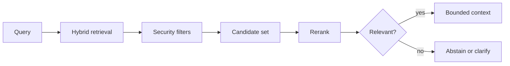

Search quality, metadata, reranking, evaluation, updates, deletion and tenant isolation.

## Core Flow

## Revision Map

| Question | Detailed answer |
|---|---|
| How does document ingestion work in your RAG system? | A complete answer should explain how Document discovery, parsing, metadata extraction, transformation, chunking, embedding, indexing participate in the same execution path rather than listing them independently. Define what enters each boundary, what transformation or decision occurs, and what invariant must hold before the result moves forward. Close with limits, failure behavior and observable measures for quality, latency, security and cost. |
| How do you decide the right chunk size and chunk overlap? | A complete answer should explain how Semantic boundaries, token limits, retrieval quality, overlap trade-offs participate in the same execution path rather than listing them independently. Define what enters each boundary, what transformation or decision occurs, and what invariant must hold before the result moves forward. Close with limits, failure behavior and observable measures for quality, latency, security and cost. |
| What metadata would you store along with an embedding? | A complete answer should explain how Tenant, document ID, source, page, section, version, timestamp, permissions, document type participate in the same execution path rather than listing them independently. Define what enters each boundary, what transformation or decision occurs, and what invariant must hold before the result moves forward. Close with limits, failure behavior and observable measures for quality, latency, security and cost. |
| How does vector similarity search work? | A complete answer should explain how Embeddings, nearest-neighbor search, cosine similarity/distance, top-K participate in the same execution path rather than listing them independently. Define what enters each boundary, what transformation or decision occurs, and what invariant must hold before the result moves forward. Close with limits, failure behavior and observable measures for quality, latency, security and cost. |
| Why did you choose your Vector DB? | A complete answer should explain how pgVector / OpenSearch / Chroma / Pinecone etc.; scale, filtering, operational complexity, latency participate in the same execution path rather than listing them independently. Define what enters each boundary, what transformation or decision occurs, and what invariant must hold before the result moves forward. Close with limits, failure behavior and observable measures for quality, latency, security and cost. |
| How do you improve retrieval quality when the top-K results are poor? | Build a versioned dataset of representative, edge and adversarial scenarios and define expected evidence or outcomes before testing. Measure Query transformation, metadata filtering, hybrid search, reranking, chunking improvements separately so retrieval, generation and end-task failures are distinguishable. Compare against a baseline, inspect failures rather than relying on one aggregate score, and retain every accepted defect as a regression case. |
| What is hybrid search, and when would you use it? | A complete answer should explain how Keyword/BM25 + vector search, exact terms, IDs, domain terminology participate in the same execution path rather than listing them independently. Define what enters each boundary, what transformation or decision occurs, and what invariant must hold before the result moves forward. Close with limits, failure behavior and observable measures for quality, latency, security and cost. |
| What is reranking and why is it useful? | A complete answer should explain how Initial retrieval → reranker → best context; precision vs latency participate in the same execution path rather than listing them independently. Define what enters each boundary, what transformation or decision occurs, and what invariant must hold before the result moves forward. Close with limits, failure behavior and observable measures for quality, latency, security and cost. |
| How do you prevent irrelevant documents from entering the LLM context? | A complete answer should explain how Similarity threshold, top-K, metadata filters, reranking, relevance evaluation participate in the same execution path rather than listing them independently. Define what enters each boundary, what transformation or decision occurs, and what invariant must hold before the result moves forward. Close with limits, failure behavior and observable measures for quality, latency, security and cost. |
| How do you handle document updates and deletions? | A complete answer should explain how Versioning, document IDs, re-indexing, stale embeddings, deletion propagation participate in the same execution path rather than listing them independently. Define what enters each boundary, what transformation or decision occurs, and what invariant must hold before the result moves forward. Close with limits, failure behavior and observable measures for quality, latency, security and cost. |
| How do you implement multi-tenant RAG securely? | Treat Tenant isolation, metadata filters, authorization, vector namespace/index strategy as deterministic controls enforced at the application, retrieval and tool boundaries. Identity, tenant scope and permissions must come from authenticated server context, never from prompt text or model output. Apply least privilege, validate every requested action and preserve an audit trail across fallback and retry paths. |
| How do you handle large documents such as PDFs, tables, images and diagrams? | A complete answer should explain how Parsing, OCR, structure preservation, multimodal content, metadata participate in the same execution path rather than listing them independently. Define what enters each boundary, what transformation or decision occurs, and what invariant must hold before the result moves forward. Close with limits, failure behavior and observable measures for quality, latency, security and cost. |
| How do you evaluate RAG quality? | Build a versioned dataset of representative, edge and adversarial scenarios and define expected evidence or outcomes before testing. Measure Retrieval precision/recall, context relevance, faithfulness, answer correctness, evaluation datasets separately so retrieval, generation and end-task failures are distinguishable. Compare against a baseline, inspect failures rather than relying on one aggregate score, and retain every accepted defect as a regression case. |
| How would you optimize RAG latency in production? | A complete answer should explain how Embedding latency, vector search, reranking, caching, parallel retrieval, context size, model latency participate in the same execution path rather than listing them independently. Define what enters each boundary, what transformation or decision occurs, and what invariant must hold before the result moves forward. Close with limits, failure behavior and observable measures for quality, latency, security and cost. |
| How would you monitor a production RAG pipeline? | A complete answer should explain how Retrieval latency, LLM latency, token usage, retrieval scores, failures, hallucination/evaluation metrics participate in the same execution path rather than listing them independently. Define what enters each boundary, what transformation or decision occurs, and what invariant must hold before the result moves forward. Close with limits, failure behavior and observable measures for quality, latency, security and cost. |
| What are the major failure modes of a production RAG system? | Use an end-to-end deadline and tracing to locate the failing segment before retrying. Protect capacity with bounded concurrency, backoff and circuit breaking, and make retries idempotent when side effects are possible. Recover through a tested fallback or safe degradation, then verify Bad parsing, bad chunks, stale index, poor retrieval, wrong metadata, prompt injection, model failure, vector DB failure and add the incident to regression coverage. |
| Walk me through your RAG architecture end-to-end. | Separate the design into explicit components for Ingestion → retrieval → generation, with a clear contract and owner for each boundary. Show how authenticated context, state and evidence move through the system, and where deterministic policy constrains model decisions. Then explain bottlenecks, partial failures, recovery, scaling signals and the metrics that prove the complete task works. |
| Why did you choose your chunking strategy? | A complete answer should explain how Practical RAG knowledge participate in the same execution path rather than listing them independently. Define what enters each boundary, what transformation or decision occurs, and what invariant must hold before the result moves forward. Close with limits, failure behavior and observable measures for quality, latency, security and cost. |
| How do you improve poor retrieval results? | Build a versioned dataset of representative, edge and adversarial scenarios and define expected evidence or outcomes before testing. Measure Hybrid search, reranking, metadata separately so retrieval, generation and end-task failures are distinguishable. Compare against a baseline, inspect failures rather than relying on one aggregate score, and retain every accepted defect as a regression case. |
| How do you handle document updates/deletions? | A complete answer should explain how Index lifecycle, consistency participate in the same execution path rather than listing them independently. Define what enters each boundary, what transformation or decision occurs, and what invariant must hold before the result moves forward. Close with limits, failure behavior and observable measures for quality, latency, security and cost. |
| How do you implement secure multi-tenant RAG? | Treat Isolation, authorization as deterministic controls enforced at the application, retrieval and tool boundaries. Identity, tenant scope and permissions must come from authenticated server context, never from prompt text or model output. Apply least privilege, validate every requested action and preserve an audit trail across fallback and retry paths. |
| How would you implement RAG using Spring AI? | A complete answer should explain how ChatClient, VectorStore, retrieval participate in the same execution path rather than listing them independently. Define what enters each boundary, what transformation or decision occurs, and what invariant must hold before the result moves forward. Close with limits, failure behavior and observable measures for quality, latency, security and cost. |
| What is an AI Agent? | A complete answer should explain how Agent vs RAG participate in the same execution path rather than listing them independently. Define what enters each boundary, what transformation or decision occurs, and what invariant must hold before the result moves forward. Close with limits, failure behavior and observable measures for quality, latency, security and cost. |

## Interview Lens

Keep probabilistic interpretation separate from authorization, policy, transactions and recovery. Explain trade-offs with evidence: task quality, latency, resilience, security, operating cost and auditability.
