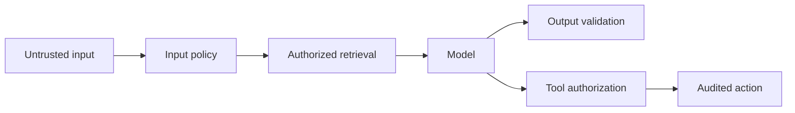

Prompt injection, data protection, authorization, grounding and safe business actions.

## Core Flow

## Revision Map

| Question | Detailed answer |
|---|---|
| Why do LLMs hallucinate? | A complete answer should explain how Probabilistic generation, missing knowledge, weak retrieval, conflicting context, prompt ambiguity participate in the same execution path rather than listing them independently. Define what enters each boundary, what transformation or decision occurs, and what invariant must hold before the result moves forward. Close with limits, failure behavior and observable measures for quality, latency, security and cost. |
| How would you reduce hallucinations in a production RAG system? | A complete answer should explain how Grounding, retrieval thresholds, citations, constrained prompts, abstention, validation participate in the same execution path rather than listing them independently. Define what enters each boundary, what transformation or decision occurs, and what invariant must hold before the result moves forward. Close with limits, failure behavior and observable measures for quality, latency, security and cost. |
| What are guardrails in GenAI systems? | A complete answer should explain how Input/output/tool guardrails, policy enforcement, validation, safety controls participate in the same execution path rather than listing them independently. Define what enters each boundary, what transformation or decision occurs, and what invariant must hold before the result moves forward. Close with limits, failure behavior and observable measures for quality, latency, security and cost. |
| How would you implement input guardrails? | A complete answer should explain how Prompt injection detection, PII, malicious input, length/token limits, content policy participate in the same execution path rather than listing them independently. Define what enters each boundary, what transformation or decision occurs, and what invariant must hold before the result moves forward. Close with limits, failure behavior and observable measures for quality, latency, security and cost. |
| How would you implement output guardrails? | A complete answer should explain how Schema validation, factual grounding, toxicity/safety checks, sensitive-data filtering participate in the same execution path rather than listing them independently. Define what enters each boundary, what transformation or decision occurs, and what invariant must hold before the result moves forward. Close with limits, failure behavior and observable measures for quality, latency, security and cost. |
| What is prompt injection? How would you defend against it? | A complete answer should explain how Direct/indirect injection, untrusted documents, instruction hierarchy, isolation, validation participate in the same execution path rather than listing them independently. Define what enters each boundary, what transformation or decision occurs, and what invariant must hold before the result moves forward. Close with limits, failure behavior and observable measures for quality, latency, security and cost. |
| How can a malicious document attack a RAG system? | A complete answer should explain how Indirect prompt injection, poisoned content, retrieved instructions participate in the same execution path rather than listing them independently. Define what enters each boundary, what transformation or decision occurs, and what invariant must hold before the result moves forward. Close with limits, failure behavior and observable measures for quality, latency, security and cost. |
| What happens when RAG returns no relevant documents? | A complete answer should explain how Similarity threshold, abstention, fallback search, clarification, controlled response participate in the same execution path rather than listing them independently. Define what enters each boundary, what transformation or decision occurs, and what invariant must hold before the result moves forward. Close with limits, failure behavior and observable measures for quality, latency, security and cost. |
| How do you verify that an LLM answer is actually grounded in retrieved documents? | A complete answer should explain how Citation mapping, entailment/faithfulness checks, claim validation, evaluation participate in the same execution path rather than listing them independently. Define what enters each boundary, what transformation or decision occurs, and what invariant must hold before the result moves forward. Close with limits, failure behavior and observable measures for quality, latency, security and cost. |
| How do you prevent the LLM from inventing information not present in your knowledge base? | A complete answer should explain how Grounded prompts, retrieval threshold, answer constraints, citations, abstention participate in the same execution path rather than listing them independently. Define what enters each boundary, what transformation or decision occurs, and what invariant must hold before the result moves forward. Close with limits, failure behavior and observable measures for quality, latency, security and cost. |
| How do you handle malformed LLM responses? | A complete answer should explain how Structured output, schema validation, retry, correction prompt, fallback participate in the same execution path rather than listing them independently. Define what enters each boundary, what transformation or decision occurs, and what invariant must hold before the result moves forward. Close with limits, failure behavior and observable measures for quality, latency, security and cost. |
| How do you prevent an Agent from repeatedly executing the same tool? | A complete answer should explain how Iteration limits, state tracking, duplicate detection, idempotency participate in the same execution path rather than listing them independently. Define what enters each boundary, what transformation or decision occurs, and what invariant must hold before the result moves forward. Close with limits, failure behavior and observable measures for quality, latency, security and cost. |
| How do you prevent unauthorized tool execution? | Treat RBAC, tool allow-list, authorization before execution, tenant context as deterministic controls enforced at the application, retrieval and tool boundaries. Identity, tenant scope and permissions must come from authenticated server context, never from prompt text or model output. Apply least privilege, validate every requested action and preserve an audit trail across fallback and retry paths. |
| How do you safely execute tools that modify enterprise data? | A complete answer should explain how Authorization, validation, confirmation, idempotency, transactions, audit participate in the same execution path rather than listing them independently. Define what enters each boundary, what transformation or decision occurs, and what invariant must hold before the result moves forward. Close with limits, failure behavior and observable measures for quality, latency, security and cost. |
| How do you protect sensitive information in prompts and LLM responses? | Treat PII detection/redaction, access control, data minimization, encryption, logging controls as deterministic controls enforced at the application, retrieval and tool boundaries. Identity, tenant scope and permissions must come from authenticated server context, never from prompt text or model output. Apply least privilege, validate every requested action and preserve an audit trail across fallback and retry paths. |
| What should and shouldn't be logged from an LLM application? | A complete answer should explain how PII/secrets, prompts, responses, tool arguments, redaction, audit requirements participate in the same execution path rather than listing them independently. Define what enters each boundary, what transformation or decision occurs, and what invariant must hold before the result moves forward. Close with limits, failure behavior and observable measures for quality, latency, security and cost. |
| How would you protect an Agent from prompt injection? | Treat Direct + indirect injection as deterministic controls enforced at the application, retrieval and tool boundaries. Identity, tenant scope and permissions must come from authenticated server context, never from prompt text or model output. Apply least privilege, validate every requested action and preserve an audit trail across fallback and retry paths. |
| How do you prevent hallucinated business decisions? | A complete answer should explain how Grounding + deterministic controls participate in the same execution path rather than listing them independently. Define what enters each boundary, what transformation or decision occurs, and what invariant must hold before the result moves forward. Close with limits, failure behavior and observable measures for quality, latency, security and cost. |
| How would you protect sensitive enterprise data? | Treat PII, authorization, logging as deterministic controls enforced at the application, retrieval and tool boundaries. Identity, tenant scope and permissions must come from authenticated server context, never from prompt text or model output. Apply least privilege, validate every requested action and preserve an audit trail across fallback and retry paths. |

## Interview Lens

Keep probabilistic interpretation separate from authorization, policy, transactions and recovery. Explain trade-offs with evidence: task quality, latency, resilience, security, operating cost and auditability.
