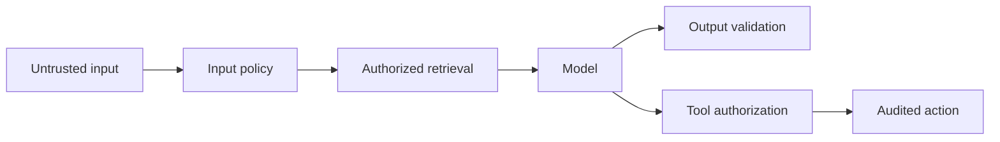

Prompt injection, data protection, authorization, grounding and safe business actions.

## Core Flow

## Revision Map

| Question | What a strong answer should establish | Priority |
|---|---|---|
| Why do LLMs hallucinate? | Connect Probabilistic generation, missing knowledge, weak retrieval, conflicting context, prompt ambiguity; define the contract, limits, measurement and safe failure behavior for the complete path. | Critical |
| How would you reduce hallucinations in a production RAG system? | Connect Grounding, retrieval thresholds, citations, constrained prompts, abstention, validation; define the contract, limits, measurement and safe failure behavior for the complete path. | Critical |
| What are guardrails in GenAI systems? | Connect Input/output/tool guardrails, policy enforcement, validation, safety controls; define the contract, limits, measurement and safe failure behavior for the complete path. | Critical |
| How would you implement input guardrails? | Connect Prompt injection detection, PII, malicious input, length/token limits, content policy; define the contract, limits, measurement and safe failure behavior for the complete path. | Critical |
| How would you implement output guardrails? | Connect Schema validation, factual grounding, toxicity/safety checks, sensitive-data filtering; define the contract, limits, measurement and safe failure behavior for the complete path. | Critical |
| What is prompt injection? How would you defend against it? | Connect Direct/indirect injection, untrusted documents, instruction hierarchy, isolation, validation; define the contract, limits, measurement and safe failure behavior for the complete path. | Critical |
| How can a malicious document attack a RAG system? | Connect Indirect prompt injection, poisoned content, retrieved instructions; define the contract, limits, measurement and safe failure behavior for the complete path. | Critical |
| What happens when RAG returns no relevant documents? | Connect Similarity threshold, abstention, fallback search, clarification, controlled response; define the contract, limits, measurement and safe failure behavior for the complete path. | Critical |
| How do you verify that an LLM answer is actually grounded in retrieved documents? | Connect Citation mapping, entailment/faithfulness checks, claim validation, evaluation; define the contract, limits, measurement and safe failure behavior for the complete path. | Critical |
| How do you prevent the LLM from inventing information not present in your knowledge base? | Connect Grounded prompts, retrieval threshold, answer constraints, citations, abstention; define the contract, limits, measurement and safe failure behavior for the complete path. | Critical |
| How do you handle malformed LLM responses? | Connect Structured output, schema validation, retry, correction prompt, fallback; define the contract, limits, measurement and safe failure behavior for the complete path. | High |
| How do you prevent an Agent from repeatedly executing the same tool? | Connect Iteration limits, state tracking, duplicate detection, idempotency; define the contract, limits, measurement and safe failure behavior for the complete path. | Critical |
| How do you prevent unauthorized tool execution? | Enforce RBAC, tool allow-list, authorization before execution, tenant context in deterministic application and data boundaries; never trust the prompt or model to supply security context. | Critical |
| How do you safely execute tools that modify enterprise data? | Connect Authorization, validation, confirmation, idempotency, transactions, audit; define the contract, limits, measurement and safe failure behavior for the complete path. | Critical |
| How do you protect sensitive information in prompts and LLM responses? | Enforce PII detection/redaction, access control, data minimization, encryption, logging controls in deterministic application and data boundaries; never trust the prompt or model to supply security context. | Critical |
| What should and shouldn't be logged from an LLM application? | Connect PII/secrets, prompts, responses, tool arguments, redaction, audit requirements; define the contract, limits, measurement and safe failure behavior for the complete path. | Critical |
| How would you protect an Agent from prompt injection? | Enforce Direct + indirect injection in deterministic application and data boundaries; never trust the prompt or model to supply security context. | Critical |
| How do you prevent hallucinated business decisions? | Connect Grounding + deterministic controls; define the contract, limits, measurement and safe failure behavior for the complete path. | Critical |
| How would you protect sensitive enterprise data? | Enforce PII, authorization, logging in deterministic application and data boundaries; never trust the prompt or model to supply security context. | Critical |

## Interview Lens

Keep probabilistic interpretation separate from authorization, policy, transactions and recovery. Explain trade-offs with evidence: task quality, latency, resilience, security, operating cost and auditability.
