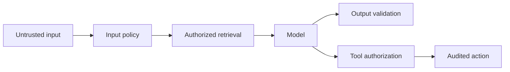

Prompt injection, data protection, authorization, grounding and safe business actions.

## Core Flow

## Revision Map

### Why do LLMs hallucinate?

Probabilistic generation, missing knowledge, weak retrieval, conflicting context, prompt ambiguity form a controlled end-to-end capability rather than a set of independent features.

- **Key areas:** Probabilistic generation, missing knowledge, weak retrieval, conflicting context, prompt ambiguity.
- **How it works:** Define what enters each boundary, what transformation or decision occurs, and what invariant must hold before the result moves forward.
- **Production:** In production, make limits and failure behavior explicit and measure quality, latency, security and cost across the complete path.

### How would you reduce hallucinations in a production RAG system?

Grounding, retrieval thresholds, citations, constrained prompts, abstention, validation form a controlled end-to-end capability rather than a set of independent features.

- **Key areas:** Grounding, retrieval thresholds, citations, constrained prompts, abstention, validation.
- **How it works:** Define what enters each boundary, what transformation or decision occurs, and what invariant must hold before the result moves forward.
- **Production:** In production, make limits and failure behavior explicit and measure quality, latency, security and cost across the complete path.

### What are guardrails in GenAI systems?

Input/output/tool guardrails, policy enforcement, validation, safety controls form a controlled end-to-end capability rather than a set of independent features.

- **Key areas:** Input/output/tool guardrails, policy enforcement, validation, safety controls.
- **How it works:** Define what enters each boundary, what transformation or decision occurs, and what invariant must hold before the result moves forward.
- **Production:** In production, make limits and failure behavior explicit and measure quality, latency, security and cost across the complete path.

### How would you implement input guardrails?

Prompt injection detection, PII, malicious input, length/token limits, content policy form a controlled end-to-end capability rather than a set of independent features.

- **Key areas:** Prompt injection detection, PII, malicious input, length/token limits, content policy.
- **How it works:** Define what enters each boundary, what transformation or decision occurs, and what invariant must hold before the result moves forward.
- **Production:** In production, make limits and failure behavior explicit and measure quality, latency, security and cost across the complete path.

### How would you implement output guardrails?

Schema validation, factual grounding, toxicity/safety checks, sensitive-data filtering form a controlled end-to-end capability rather than a set of independent features.

- **Key areas:** Schema validation, factual grounding, toxicity/safety checks, sensitive-data filtering.
- **How it works:** Define what enters each boundary, what transformation or decision occurs, and what invariant must hold before the result moves forward.
- **Production:** In production, make limits and failure behavior explicit and measure quality, latency, security and cost across the complete path.

### What is prompt injection? How would you defend against it?

Direct/indirect injection, untrusted documents, instruction hierarchy, isolation, validation form a controlled end-to-end capability rather than a set of independent features.

- **Key areas:** Direct/indirect injection, untrusted documents, instruction hierarchy, isolation, validation.
- **How it works:** Define what enters each boundary, what transformation or decision occurs, and what invariant must hold before the result moves forward.
- **Production:** In production, make limits and failure behavior explicit and measure quality, latency, security and cost across the complete path.

### How can a malicious document attack a RAG system?

Indirect prompt injection, poisoned content, retrieved instructions form a controlled end-to-end capability rather than a set of independent features.

- **Key areas:** Indirect prompt injection, poisoned content, retrieved instructions.
- **How it works:** Define what enters each boundary, what transformation or decision occurs, and what invariant must hold before the result moves forward.
- **Production:** In production, make limits and failure behavior explicit and measure quality, latency, security and cost across the complete path.

### What happens when RAG returns no relevant documents?

Similarity threshold, abstention, fallback search, clarification, controlled response form a controlled end-to-end capability rather than a set of independent features.

- **Key areas:** Similarity threshold, abstention, fallback search, clarification, controlled response.
- **How it works:** Define what enters each boundary, what transformation or decision occurs, and what invariant must hold before the result moves forward.
- **Production:** In production, make limits and failure behavior explicit and measure quality, latency, security and cost across the complete path.

### How do you verify that an LLM answer is actually grounded in retrieved documents?

Citation mapping, entailment/faithfulness checks, claim validation, evaluation form a controlled end-to-end capability rather than a set of independent features.

- **Key areas:** Citation mapping, entailment/faithfulness checks, claim validation, evaluation.
- **How it works:** Define what enters each boundary, what transformation or decision occurs, and what invariant must hold before the result moves forward.
- **Production:** In production, make limits and failure behavior explicit and measure quality, latency, security and cost across the complete path.

### How do you prevent the LLM from inventing information not present in your knowledge base?

Grounded prompts, retrieval threshold, answer constraints, citations, abstention form a controlled end-to-end capability rather than a set of independent features.

- **Key areas:** Grounded prompts, retrieval threshold, answer constraints, citations, abstention.
- **How it works:** Define what enters each boundary, what transformation or decision occurs, and what invariant must hold before the result moves forward.
- **Production:** In production, make limits and failure behavior explicit and measure quality, latency, security and cost across the complete path.

### How do you handle malformed LLM responses?

Structured output, schema validation, retry, correction prompt, fallback form a controlled end-to-end capability rather than a set of independent features.

- **Key areas:** Structured output, schema validation, retry, correction prompt, fallback.
- **How it works:** Define what enters each boundary, what transformation or decision occurs, and what invariant must hold before the result moves forward.
- **Production:** In production, make limits and failure behavior explicit and measure quality, latency, security and cost across the complete path.

### How do you prevent an Agent from repeatedly executing the same tool?

Iteration limits, state tracking, duplicate detection, idempotency form a controlled end-to-end capability rather than a set of independent features.

- **Key areas:** Iteration limits, state tracking, duplicate detection, idempotency.
- **How it works:** Define what enters each boundary, what transformation or decision occurs, and what invariant must hold before the result moves forward.
- **Production:** In production, make limits and failure behavior explicit and measure quality, latency, security and cost across the complete path.

### How do you prevent unauthorized tool execution?

Treat RBAC, tool allow-list, authorization before execution, tenant context as deterministic controls enforced at the application, retrieval and tool boundaries.

- **Key areas:** RBAC, tool allow-list, authorization before execution, tenant context.
- **How it works:** Identity, tenant scope and permissions must come from authenticated server context, never from prompt text or model output.
- **Production:** Apply least privilege, validate every requested action and preserve an audit trail across fallback and retry paths.

### How do you safely execute tools that modify enterprise data?

Authorization, validation, confirmation, idempotency, transactions, audit form a controlled end-to-end capability rather than a set of independent features.

- **Key areas:** Authorization, validation, confirmation, idempotency, transactions, audit.
- **How it works:** Define what enters each boundary, what transformation or decision occurs, and what invariant must hold before the result moves forward.
- **Production:** In production, make limits and failure behavior explicit and measure quality, latency, security and cost across the complete path.

### How do you protect sensitive information in prompts and LLM responses?

Treat PII detection/redaction, access control, data minimization, encryption, logging controls as deterministic controls enforced at the application, retrieval and tool boundaries.

- **Key areas:** PII detection/redaction, access control, data minimization, encryption, logging controls.
- **How it works:** Identity, tenant scope and permissions must come from authenticated server context, never from prompt text or model output.
- **Production:** Apply least privilege, validate every requested action and preserve an audit trail across fallback and retry paths.

### What should and shouldn't be logged from an LLM application?

PII/secrets, prompts, responses, tool arguments, redaction, audit requirements form a controlled end-to-end capability rather than a set of independent features.

- **Key areas:** PII/secrets, prompts, responses, tool arguments, redaction, audit requirements.
- **How it works:** Define what enters each boundary, what transformation or decision occurs, and what invariant must hold before the result moves forward.
- **Production:** In production, make limits and failure behavior explicit and measure quality, latency, security and cost across the complete path.

### How would you protect an Agent from prompt injection?

Treat Direct + indirect injection as deterministic controls enforced at the application, retrieval and tool boundaries.

- **Key areas:** Direct + indirect injection.
- **How it works:** Identity, tenant scope and permissions must come from authenticated server context, never from prompt text or model output.
- **Production:** Apply least privilege, validate every requested action and preserve an audit trail across fallback and retry paths.

### How do you prevent hallucinated business decisions?

Grounding + deterministic controls form a controlled end-to-end capability rather than a set of independent features.

- **Key areas:** Grounding + deterministic controls.
- **How it works:** Define what enters each boundary, what transformation or decision occurs, and what invariant must hold before the result moves forward.
- **Production:** In production, make limits and failure behavior explicit and measure quality, latency, security and cost across the complete path.

### How would you protect sensitive enterprise data?

Treat PII, authorization, logging as deterministic controls enforced at the application, retrieval and tool boundaries.

- **Key areas:** PII, authorization, logging.
- **How it works:** Identity, tenant scope and permissions must come from authenticated server context, never from prompt text or model output.
- **Production:** Apply least privilege, validate every requested action and preserve an audit trail across fallback and retry paths.

## Interview Lens

Keep probabilistic interpretation separate from authorization, policy, transactions and recovery. Explain trade-offs with evidence: task quality, latency, resilience, security, operating cost and auditability.
