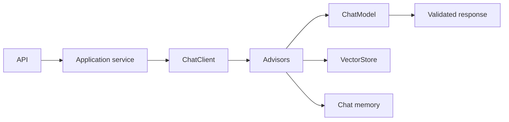

Portable model access, Advisors, memory, structured output, streaming and provider integration.

## Core Flow

## Revision Map

| Question | Detailed answer |
|---|---|
| What is Spring AI, and what problem does it solve? | A complete answer should explain how ChatClient, model abstraction, EmbeddingModel, VectorStore, tools, advisors participate in the same execution path rather than listing them independently. Define what enters each boundary, what transformation or decision occurs, and what invariant must hold before the result moves forward. Close with limits, failure behavior and observable measures for quality, latency, security and cost. |
| Walk me through your Spring AI application architecture. | Separate the design into explicit components for Controller → service → ChatClient → retrieval/tools → LLM → response, with a clear contract and owner for each boundary. Show how authenticated context, state and evidence move through the system, and where deterministic policy constrains model decisions. Then explain bottlenecks, partial failures, recovery, scaling signals and the metrics that prove the complete task works. |
| How do you use ChatClient in Spring AI? | A complete answer should explain how Fluent API, system/user messages, structured response, model configuration participate in the same execution path rather than listing them independently. Define what enters each boundary, what transformation or decision occurs, and what invariant must hold before the result moves forward. Close with limits, failure behavior and observable measures for quality, latency, security and cost. |
| How do you implement RAG using Spring AI? | A complete answer should explain how VectorStore, retrieval, context injection, advisors/retrieval flow participate in the same execution path rather than listing them independently. Define what enters each boundary, what transformation or decision occurs, and what invariant must hold before the result moves forward. Close with limits, failure behavior and observable measures for quality, latency, security and cost. |
| How do you configure different LLM providers in Spring AI? | A complete answer should explain how OpenAI/Azure OpenAI/Anthropic/etc., provider abstraction, configuration participate in the same execution path rather than listing them independently. Define what enters each boundary, what transformation or decision occurs, and what invariant must hold before the result moves forward. Close with limits, failure behavior and observable measures for quality, latency, security and cost. |
| How do you implement embeddings in Spring AI? | A complete answer should explain how EmbeddingModel, batch embedding, dimensions, model consistency participate in the same execution path rather than listing them independently. Define what enters each boundary, what transformation or decision occurs, and what invariant must hold before the result moves forward. Close with limits, failure behavior and observable measures for quality, latency, security and cost. |
| How do you integrate pgVector/OpenSearch with Spring AI? | A complete answer should explain how VectorStore, indexing, similarity search, metadata filtering participate in the same execution path rather than listing them independently. Define what enters each boundary, what transformation or decision occurs, and what invariant must hold before the result moves forward. Close with limits, failure behavior and observable measures for quality, latency, security and cost. |
| How do you implement metadata filtering in Spring AI RAG? | A complete answer should explain how Tenant/document/security filters, retrieval constraints participate in the same execution path rather than listing them independently. Define what enters each boundary, what transformation or decision occurs, and what invariant must hold before the result moves forward. Close with limits, failure behavior and observable measures for quality, latency, security and cost. |
| How do you implement structured output from an LLM? | A complete answer should explain how JSON schema, typed Java objects, validation, malformed output handling participate in the same execution path rather than listing them independently. Define what enters each boundary, what transformation or decision occurs, and what invariant must hold before the result moves forward. Close with limits, failure behavior and observable measures for quality, latency, security and cost. |
| How do you handle LLM failures in a Spring Boot application? | Use an end-to-end deadline and tracing to locate the failing segment before retrying. Protect capacity with bounded concurrency, backoff and circuit breaking, and make retries idempotent when side effects are possible. Recover through a tested fallback or safe degradation, then verify Timeout, retry, fallback, circuit breaker, provider failure, controlled response and add the incident to regression coverage. |
| How do you manage conversation memory? | A complete answer should explain how Conversation ID, persistence, context window, summarization, Redis/DB participate in the same execution path rather than listing them independently. Define what enters each boundary, what transformation or decision occurs, and what invariant must hold before the result moves forward. Close with limits, failure behavior and observable measures for quality, latency, security and cost. |
| How do you prevent conversation history from consuming the entire context window? | A complete answer should explain how Sliding window, summarization, selective history, token budgeting participate in the same execution path rather than listing them independently. Define what enters each boundary, what transformation or decision occurs, and what invariant must hold before the result moves forward. Close with limits, failure behavior and observable measures for quality, latency, security and cost. |
| How do you observe a Spring AI application? | A complete answer should explain how Logs, metrics, tracing, LLM latency, token usage, retrieval/tool spans participate in the same execution path rather than listing them independently. Define what enters each boundary, what transformation or decision occurs, and what invariant must hold before the result moves forward. Close with limits, failure behavior and observable measures for quality, latency, security and cost. |
| How do you test a Spring AI application? | Build a versioned dataset of representative, edge and adversarial scenarios and define expected evidence or outcomes before testing. Measure Unit tests, mocked LLM, integration tests, retrieval tests, evaluation datasets separately so retrieval, generation and end-task failures are distinguishable. Compare against a baseline, inspect failures rather than relying on one aggregate score, and retain every accepted defect as a regression case. |
| How do you control LLM cost in a production Spring AI application? | A complete answer should explain how Model selection, token limits, caching, prompt optimization, routing participate in the same execution path rather than listing them independently. Define what enters each boundary, what transformation or decision occurs, and what invariant must hold before the result moves forward. Close with limits, failure behavior and observable measures for quality, latency, security and cost. |
| How would you implement multi-model/provider fallback? | A complete answer should explain how Provider abstraction, routing, timeout, fallback, semantic differences participate in the same execution path rather than listing them independently. Define what enters each boundary, what transformation or decision occurs, and what invariant must hold before the result moves forward. Close with limits, failure behavior and observable measures for quality, latency, security and cost. |
| Why would you choose Spring AI instead of LangChain/LangGraph/LangChain4j? | A complete answer should explain how Java ecosystem, Spring integration, abstraction, agent/workflow requirements, trade-offs participate in the same execution path rather than listing them independently. Define what enters each boundary, what transformation or decision occurs, and what invariant must hold before the result moves forward. Close with limits, failure behavior and observable measures for quality, latency, security and cost. |
| Explain your Java 21 + Spring AI architecture. | Separate the design into explicit components for Framework + implementation, with a clear contract and owner for each boundary. Show how authenticated context, state and evidence move through the system, and where deterministic policy constrains model decisions. Then explain bottlenecks, partial failures, recovery, scaling signals and the metrics that prove the complete task works. |
| How would you implement tool calling using Spring AI? | A complete answer should explain how @Tool, schema, execution participate in the same execution path rather than listing them independently. Define what enters each boundary, what transformation or decision occurs, and what invariant must hold before the result moves forward. Close with limits, failure behavior and observable measures for quality, latency, security and cost. |

## Interview Lens

Keep probabilistic interpretation separate from authorization, policy, transactions and recovery. Explain trade-offs with evidence: task quality, latency, resilience, security, operating cost and auditability.
