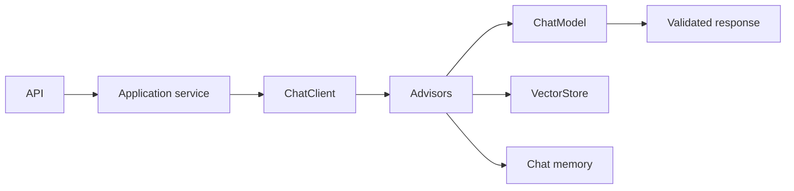

Portable model access, Advisors, memory, structured output, streaming and provider integration.

## Core Flow

## Revision Map

| Question | What a strong answer should establish | Priority |
|---|---|---|
| What is Spring AI, and what problem does it solve? | Connect ChatClient, model abstraction, EmbeddingModel, VectorStore, tools, advisors; define the contract, limits, measurement and safe failure behavior for the complete path. | Critical |
| Walk me through your Spring AI application architecture. | Make Controller → service → ChatClient → retrieval/tools → LLM → response explicit as independently observable components with clear trust, state and failure boundaries. | Critical |
| How do you use ChatClient in Spring AI? | Connect Fluent API, system/user messages, structured response, model configuration; define the contract, limits, measurement and safe failure behavior for the complete path. | Critical |
| How do you implement RAG using Spring AI? | Connect VectorStore, retrieval, context injection, advisors/retrieval flow; define the contract, limits, measurement and safe failure behavior for the complete path. | Critical |
| How do you configure different LLM providers in Spring AI? | Connect OpenAI/Azure OpenAI/Anthropic/etc., provider abstraction, configuration; define the contract, limits, measurement and safe failure behavior for the complete path. | High |
| How do you implement embeddings in Spring AI? | Connect EmbeddingModel, batch embedding, dimensions, model consistency; define the contract, limits, measurement and safe failure behavior for the complete path. | High |
| How do you integrate pgVector/OpenSearch with Spring AI? | Connect VectorStore, indexing, similarity search, metadata filtering; define the contract, limits, measurement and safe failure behavior for the complete path. | Critical |
| How do you implement metadata filtering in Spring AI RAG? | Connect Tenant/document/security filters, retrieval constraints; define the contract, limits, measurement and safe failure behavior for the complete path. | Critical |
| How do you implement structured output from an LLM? | Connect JSON schema, typed Java objects, validation, malformed output handling; define the contract, limits, measurement and safe failure behavior for the complete path. | High |
| How do you handle LLM failures in a Spring Boot application? | Bound, observe and classify the failure; protect capacity, recover through an idempotent tested path, then verify Timeout, retry, fallback, circuit breaker, provider failure, controlled response. | Critical |
| How do you manage conversation memory? | Connect Conversation ID, persistence, context window, summarization, Redis/DB; define the contract, limits, measurement and safe failure behavior for the complete path. | High |
| How do you prevent conversation history from consuming the entire context window? | Connect Sliding window, summarization, selective history, token budgeting; define the contract, limits, measurement and safe failure behavior for the complete path. | High |
| How do you observe a Spring AI application? | Connect Logs, metrics, tracing, LLM latency, token usage, retrieval/tool spans; define the contract, limits, measurement and safe failure behavior for the complete path. | Critical |
| How do you test a Spring AI application? | Use versioned representative scenarios and measure Unit tests, mocked LLM, integration tests, retrieval tests, evaluation datasets; compare against a baseline and retain failures as regressions. | High |
| How do you control LLM cost in a production Spring AI application? | Connect Model selection, token limits, caching, prompt optimization, routing; define the contract, limits, measurement and safe failure behavior for the complete path. | High |
| How would you implement multi-model/provider fallback? | Connect Provider abstraction, routing, timeout, fallback, semantic differences; define the contract, limits, measurement and safe failure behavior for the complete path. | High |
| Why would you choose Spring AI instead of LangChain/LangGraph/LangChain4j? | Connect Java ecosystem, Spring integration, abstraction, agent/workflow requirements, trade-offs; define the contract, limits, measurement and safe failure behavior for the complete path. | Critical |
| Explain your Java 21 + Spring AI architecture. | Make Framework + implementation explicit as independently observable components with clear trust, state and failure boundaries. | Critical |
| How would you implement tool calling using Spring AI? | Connect @Tool, schema, execution; define the contract, limits, measurement and safe failure behavior for the complete path. | Critical |

## Interview Lens

Keep probabilistic interpretation separate from authorization, policy, transactions and recovery. Explain trade-offs with evidence: task quality, latency, resilience, security, operating cost and auditability.
