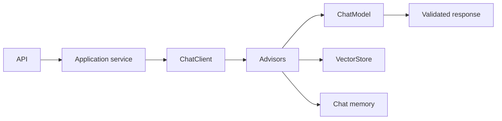

Portable model access, Advisors, memory, structured output, streaming and provider integration.

## Core Flow

## Revision Map

### What is Spring AI, and what problem does it solve?

ChatClient, model abstraction, EmbeddingModel, VectorStore, tools, advisors form a controlled end-to-end capability rather than a set of independent features.

- **Key areas:** ChatClient, model abstraction, EmbeddingModel, VectorStore, tools, advisors.
- **How it works:** Define what enters each boundary, what transformation or decision occurs, and what invariant must hold before the result moves forward.
- **Production:** In production, make limits and failure behavior explicit and measure quality, latency, security and cost across the complete path.

### Walk me through your Spring AI application architecture.

Separate the design into explicit components for Controller → service → ChatClient → retrieval/tools → LLM → response, with a clear contract and owner for each boundary.

- **Key areas:** Controller → service → ChatClient → retrieval/tools → LLM → response.
- **How it works:** Show how authenticated context, state and evidence move through the system, and where deterministic policy constrains model decisions.
- **Production:** Then explain bottlenecks, partial failures, recovery, scaling signals and the metrics that prove the complete task works.

### How do you use ChatClient in Spring AI?

Fluent API, system/user messages, structured response, model configuration form a controlled end-to-end capability rather than a set of independent features.

- **Key areas:** Fluent API, system/user messages, structured response, model configuration.
- **How it works:** Define what enters each boundary, what transformation or decision occurs, and what invariant must hold before the result moves forward.
- **Production:** In production, make limits and failure behavior explicit and measure quality, latency, security and cost across the complete path.

### How do you implement RAG using Spring AI?

VectorStore, retrieval, context injection, advisors/retrieval flow form a controlled end-to-end capability rather than a set of independent features.

- **Key areas:** VectorStore, retrieval, context injection, advisors/retrieval flow.
- **How it works:** Define what enters each boundary, what transformation or decision occurs, and what invariant must hold before the result moves forward.
- **Production:** In production, make limits and failure behavior explicit and measure quality, latency, security and cost across the complete path.

### How do you configure different LLM providers in Spring AI?

OpenAI/Azure OpenAI/Anthropic/etc., provider abstraction, configuration form a controlled end-to-end capability rather than a set of independent features.

- **Key areas:** OpenAI/Azure OpenAI/Anthropic/etc., provider abstraction, configuration.
- **How it works:** Define what enters each boundary, what transformation or decision occurs, and what invariant must hold before the result moves forward.
- **Production:** In production, make limits and failure behavior explicit and measure quality, latency, security and cost across the complete path.

### How do you implement embeddings in Spring AI?

EmbeddingModel, batch embedding, dimensions, model consistency form a controlled end-to-end capability rather than a set of independent features.

- **Key areas:** EmbeddingModel, batch embedding, dimensions, model consistency.
- **How it works:** Define what enters each boundary, what transformation or decision occurs, and what invariant must hold before the result moves forward.
- **Production:** In production, make limits and failure behavior explicit and measure quality, latency, security and cost across the complete path.

### How do you integrate pgVector/OpenSearch with Spring AI?

VectorStore, indexing, similarity search, metadata filtering form a controlled end-to-end capability rather than a set of independent features.

- **Key areas:** VectorStore, indexing, similarity search, metadata filtering.
- **How it works:** Define what enters each boundary, what transformation or decision occurs, and what invariant must hold before the result moves forward.
- **Production:** In production, make limits and failure behavior explicit and measure quality, latency, security and cost across the complete path.

### How do you implement metadata filtering in Spring AI RAG?

Tenant/document/security filters, retrieval constraints form a controlled end-to-end capability rather than a set of independent features.

- **Key areas:** Tenant/document/security filters, retrieval constraints.
- **How it works:** Define what enters each boundary, what transformation or decision occurs, and what invariant must hold before the result moves forward.
- **Production:** In production, make limits and failure behavior explicit and measure quality, latency, security and cost across the complete path.

### How do you implement structured output from an LLM?

JSON schema, typed Java objects, validation, malformed output handling form a controlled end-to-end capability rather than a set of independent features.

- **Key areas:** JSON schema, typed Java objects, validation, malformed output handling.
- **How it works:** Define what enters each boundary, what transformation or decision occurs, and what invariant must hold before the result moves forward.
- **Production:** In production, make limits and failure behavior explicit and measure quality, latency, security and cost across the complete path.

### How do you handle LLM failures in a Spring Boot application?

Use an end-to-end deadline and tracing to locate the failing segment before retrying.

- **Key areas:** Timeout, retry, fallback, circuit breaker, provider failure, controlled response.
- **How it works:** Protect capacity with bounded concurrency, backoff and circuit breaking, and make retries idempotent when side effects are possible.
- **Production:** Recover through a tested fallback or safe degradation, then verify Timeout, retry, fallback, circuit breaker, provider failure, controlled response and add the incident to regression coverage.

### How do you manage conversation memory?

Conversation ID, persistence, context window, summarization, Redis/DB form a controlled end-to-end capability rather than a set of independent features.

- **Key areas:** Conversation ID, persistence, context window, summarization, Redis/DB.
- **How it works:** Define what enters each boundary, what transformation or decision occurs, and what invariant must hold before the result moves forward.
- **Production:** In production, make limits and failure behavior explicit and measure quality, latency, security and cost across the complete path.

### How do you prevent conversation history from consuming the entire context window?

Sliding window, summarization, selective history, token budgeting form a controlled end-to-end capability rather than a set of independent features.

- **Key areas:** Sliding window, summarization, selective history, token budgeting.
- **How it works:** Define what enters each boundary, what transformation or decision occurs, and what invariant must hold before the result moves forward.
- **Production:** In production, make limits and failure behavior explicit and measure quality, latency, security and cost across the complete path.

### How do you observe a Spring AI application?

Logs, metrics, tracing, LLM latency, token usage, retrieval/tool spans form a controlled end-to-end capability rather than a set of independent features.

- **Key areas:** Logs, metrics, tracing, LLM latency, token usage, retrieval/tool spans.
- **How it works:** Define what enters each boundary, what transformation or decision occurs, and what invariant must hold before the result moves forward.
- **Production:** In production, make limits and failure behavior explicit and measure quality, latency, security and cost across the complete path.

### How do you test a Spring AI application?

Build a versioned dataset of representative, edge and adversarial scenarios and define expected evidence or outcomes before testing.

- **Key areas:** Unit tests, mocked LLM, integration tests, retrieval tests, evaluation datasets.
- **How it works:** Measure Unit tests, mocked LLM, integration tests, retrieval tests, evaluation datasets separately so retrieval, generation and end-task failures are distinguishable.
- **Production:** Compare against a baseline, inspect failures rather than relying on one aggregate score, and retain every accepted defect as a regression case.

### How do you control LLM cost in a production Spring AI application?

Model selection, token limits, caching, prompt optimization, routing form a controlled end-to-end capability rather than a set of independent features.

- **Key areas:** Model selection, token limits, caching, prompt optimization, routing.
- **How it works:** Define what enters each boundary, what transformation or decision occurs, and what invariant must hold before the result moves forward.
- **Production:** In production, make limits and failure behavior explicit and measure quality, latency, security and cost across the complete path.

### How would you implement multi-model/provider fallback?

Provider abstraction, routing, timeout, fallback, semantic differences form a controlled end-to-end capability rather than a set of independent features.

- **Key areas:** Provider abstraction, routing, timeout, fallback, semantic differences.
- **How it works:** Define what enters each boundary, what transformation or decision occurs, and what invariant must hold before the result moves forward.
- **Production:** In production, make limits and failure behavior explicit and measure quality, latency, security and cost across the complete path.

### Why would you choose Spring AI instead of LangChain/LangGraph/LangChain4j?

Java ecosystem, Spring integration, abstraction, agent/workflow requirements, trade-offs form a controlled end-to-end capability rather than a set of independent features.

- **Key areas:** Java ecosystem, Spring integration, abstraction, agent/workflow requirements, trade-offs.
- **How it works:** Define what enters each boundary, what transformation or decision occurs, and what invariant must hold before the result moves forward.
- **Production:** In production, make limits and failure behavior explicit and measure quality, latency, security and cost across the complete path.

### Explain your Java 21 + Spring AI architecture.

Separate the design into explicit components for Framework + implementation, with a clear contract and owner for each boundary.

- **Key areas:** Framework + implementation.
- **How it works:** Show how authenticated context, state and evidence move through the system, and where deterministic policy constrains model decisions.
- **Production:** Then explain bottlenecks, partial failures, recovery, scaling signals and the metrics that prove the complete task works.

### How would you implement tool calling using Spring AI?

@Tool, schema, execution form a controlled end-to-end capability rather than a set of independent features.

- **Key areas:** @Tool, schema, execution.
- **How it works:** Define what enters each boundary, what transformation or decision occurs, and what invariant must hold before the result moves forward.
- **Production:** In production, make limits and failure behavior explicit and measure quality, latency, security and cost across the complete path.

## Interview Lens

Keep probabilistic interpretation separate from authorization, policy, transactions and recovery. Explain trade-offs with evidence: task quality, latency, resilience, security, operating cost and auditability.
