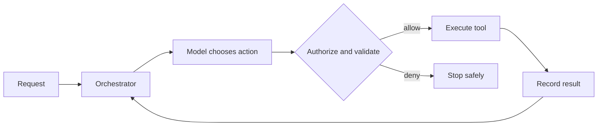

Tool selection, controlled execution, agent loops and the boundary between agents and workflows.

## Core Flow

## Revision Map

| Question | What a strong answer should establish | Priority |
|---|---|---|
| How do you implement tool/function calling in Spring AI? | Connect @Tool, tool registration, arguments, execution, results; define the contract, limits, measurement and safe failure behavior for the complete path. | Critical |
| How does Spring AI handle the interaction between the LLM and tools? | Connect Tool definitions → model selection → tool call → Java execution → tool result → model; define the contract, limits, measurement and safe failure behavior for the complete path. | Critical |
| How do you secure Spring AI tools? | Enforce Authentication, authorization, RBAC, input validation, tool allow-list in deterministic application and data boundaries; never trust the prompt or model to supply security context. | Critical |
| What is an AI Agent? How is it different from a traditional RAG application? | Connect Reasoning, planning, tool selection, action, observation, iteration; define the contract, limits, measurement and safe failure behavior for the complete path. | Critical |
| Walk me through the complete execution flow of an AI Agent. | Make User → LLM → tool selection → tool execution → result → LLM → next action/final answer explicit as independently observable components with clear trust, state and failure boundaries. | Critical |
| What is tool/function calling? | Connect Tool schema, function name, parameters, model-generated tool call, application execution; define the contract, limits, measurement and safe failure behavior for the complete path. | Critical |
| How does the LLM decide which tool to call? | Connect Tool descriptions, schemas, model capability, context, prompt/instructions; define the contract, limits, measurement and safe failure behavior for the complete path. | Critical |
| How do you define tools in Spring AI? | Connect @Tool, tool methods, descriptions, parameters, registration; define the contract, limits, measurement and safe failure behavior for the complete path. | Critical |
| How do you decide which operations should become Agent tools? | Connect Business value, determinism, security, side effects, idempotency, authorization; define the contract, limits, measurement and safe failure behavior for the complete path. | Critical |
| How do you secure AI Agent tools? | Enforce Authentication, authorization, RBAC, allow-list, input validation, tenant isolation in deterministic application and data boundaries; never trust the prompt or model to supply security context. | Critical |
| How do you handle tools that modify data? | Connect Confirmation, authorization, idempotency, transaction boundaries, audit trail; define the contract, limits, measurement and safe failure behavior for the complete path. | Critical |
| How do you control the number of tools exposed to an LLM? | Connect Tool allow-list, context size, domain-specific tools, dynamic tool selection; define the contract, limits, measurement and safe failure behavior for the complete path. | High |
| What is the difference between an Agent, Workflow, and Orchestrator? | Make Autonomous decision-making vs deterministic flow vs coordination explicit as independently observable components with clear trust, state and failure boundaries. | Critical |
| When should you NOT use an AI Agent? | Choose the simpler deterministic design unless Deterministic business logic, strict compliance, predictable workflows, latency-sensitive operations provide measurable value that justifies AI risk and operating cost. | Critical |
| When would you choose multi-agent over a single agent? | Connect Complexity, domain separation, independent capabilities, parallelism vs overhead; define the contract, limits, measurement and safe failure behavior for the complete path. | Critical |
| Design a production Agentic AI architecture using Java 21 + Spring AI. | Make All components + security + observability + resilience + scaling explicit as independently observable components with clear trust, state and failure boundaries. | Critical |
| Walk me through the complete Agent execution flow. | Make Reason → tool → result → next action explicit as independently observable components with clear trust, state and failure boundaries. | Critical |
| How does an LLM decide which tool to call? | Connect Function/tool calling; define the contract, limits, measurement and safe failure behavior for the complete path. | Critical |
| How do you secure Agent tools? | Enforce IAM/RBAC/authorization in deterministic application and data boundaries; never trust the prompt or model to supply security context. | Critical |
| A tool call times out. What happens next? | Connect Retry, idempotency, unknown state; define the contract, limits, measurement and safe failure behavior for the complete path. | Critical |

## Interview Lens

Keep probabilistic interpretation separate from authorization, policy, transactions and recovery. Explain trade-offs with evidence: task quality, latency, resilience, security, operating cost and auditability.
