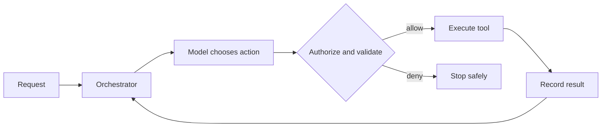

Tool selection, controlled execution, agent loops and the boundary between agents and workflows.

## Core Flow

## Revision Map

| Question | Detailed answer |
|---|---|
| How do you implement tool/function calling in Spring AI? | A complete answer should explain how @Tool, tool registration, arguments, execution, results participate in the same execution path rather than listing them independently. Define what enters each boundary, what transformation or decision occurs, and what invariant must hold before the result moves forward. Close with limits, failure behavior and observable measures for quality, latency, security and cost. |
| How does Spring AI handle the interaction between the LLM and tools? | A complete answer should explain how Tool definitions → model selection → tool call → Java execution → tool result → model participate in the same execution path rather than listing them independently. Define what enters each boundary, what transformation or decision occurs, and what invariant must hold before the result moves forward. Close with limits, failure behavior and observable measures for quality, latency, security and cost. |
| How do you secure Spring AI tools? | Treat Authentication, authorization, RBAC, input validation, tool allow-list as deterministic controls enforced at the application, retrieval and tool boundaries. Identity, tenant scope and permissions must come from authenticated server context, never from prompt text or model output. Apply least privilege, validate every requested action and preserve an audit trail across fallback and retry paths. |
| What is an AI Agent? How is it different from a traditional RAG application? | A complete answer should explain how Reasoning, planning, tool selection, action, observation, iteration participate in the same execution path rather than listing them independently. Define what enters each boundary, what transformation or decision occurs, and what invariant must hold before the result moves forward. Close with limits, failure behavior and observable measures for quality, latency, security and cost. |
| Walk me through the complete execution flow of an AI Agent. | Separate the design into explicit components for User → LLM → tool selection → tool execution → result → LLM → next action/final answer, with a clear contract and owner for each boundary. Show how authenticated context, state and evidence move through the system, and where deterministic policy constrains model decisions. Then explain bottlenecks, partial failures, recovery, scaling signals and the metrics that prove the complete task works. |
| What is tool/function calling? | A complete answer should explain how Tool schema, function name, parameters, model-generated tool call, application execution participate in the same execution path rather than listing them independently. Define what enters each boundary, what transformation or decision occurs, and what invariant must hold before the result moves forward. Close with limits, failure behavior and observable measures for quality, latency, security and cost. |
| How does the LLM decide which tool to call? | A complete answer should explain how Tool descriptions, schemas, model capability, context, prompt/instructions participate in the same execution path rather than listing them independently. Define what enters each boundary, what transformation or decision occurs, and what invariant must hold before the result moves forward. Close with limits, failure behavior and observable measures for quality, latency, security and cost. |
| How do you define tools in Spring AI? | A complete answer should explain how @Tool, tool methods, descriptions, parameters, registration participate in the same execution path rather than listing them independently. Define what enters each boundary, what transformation or decision occurs, and what invariant must hold before the result moves forward. Close with limits, failure behavior and observable measures for quality, latency, security and cost. |
| How do you decide which operations should become Agent tools? | A complete answer should explain how Business value, determinism, security, side effects, idempotency, authorization participate in the same execution path rather than listing them independently. Define what enters each boundary, what transformation or decision occurs, and what invariant must hold before the result moves forward. Close with limits, failure behavior and observable measures for quality, latency, security and cost. |
| How do you secure AI Agent tools? | Treat Authentication, authorization, RBAC, allow-list, input validation, tenant isolation as deterministic controls enforced at the application, retrieval and tool boundaries. Identity, tenant scope and permissions must come from authenticated server context, never from prompt text or model output. Apply least privilege, validate every requested action and preserve an audit trail across fallback and retry paths. |
| How do you handle tools that modify data? | A complete answer should explain how Confirmation, authorization, idempotency, transaction boundaries, audit trail participate in the same execution path rather than listing them independently. Define what enters each boundary, what transformation or decision occurs, and what invariant must hold before the result moves forward. Close with limits, failure behavior and observable measures for quality, latency, security and cost. |
| How do you control the number of tools exposed to an LLM? | A complete answer should explain how Tool allow-list, context size, domain-specific tools, dynamic tool selection participate in the same execution path rather than listing them independently. Define what enters each boundary, what transformation or decision occurs, and what invariant must hold before the result moves forward. Close with limits, failure behavior and observable measures for quality, latency, security and cost. |
| What is the difference between an Agent, Workflow, and Orchestrator? | Separate the design into explicit components for Autonomous decision-making vs deterministic flow vs coordination, with a clear contract and owner for each boundary. Show how authenticated context, state and evidence move through the system, and where deterministic policy constrains model decisions. Then explain bottlenecks, partial failures, recovery, scaling signals and the metrics that prove the complete task works. |
| When should you NOT use an AI Agent? | Start from the deterministic alternative and identify exactly where interpretation or dynamic action is required. Evaluate Deterministic business logic, strict compliance, predictable workflows, latency-sensitive operations against latency, compliance, predictability and operating cost. Use an agent only when measured task-quality improvement outweighs its additional nondeterminism and failure surface. |
| When would you choose multi-agent over a single agent? | A complete answer should explain how Complexity, domain separation, independent capabilities, parallelism vs overhead participate in the same execution path rather than listing them independently. Define what enters each boundary, what transformation or decision occurs, and what invariant must hold before the result moves forward. Close with limits, failure behavior and observable measures for quality, latency, security and cost. |
| Design a production Agentic AI architecture using Java 21 + Spring AI. | Separate the design into explicit components for All components + security + observability + resilience + scaling, with a clear contract and owner for each boundary. Show how authenticated context, state and evidence move through the system, and where deterministic policy constrains model decisions. Then explain bottlenecks, partial failures, recovery, scaling signals and the metrics that prove the complete task works. |
| Walk me through the complete Agent execution flow. | Separate the design into explicit components for Reason → tool → result → next action, with a clear contract and owner for each boundary. Show how authenticated context, state and evidence move through the system, and where deterministic policy constrains model decisions. Then explain bottlenecks, partial failures, recovery, scaling signals and the metrics that prove the complete task works. |
| How does an LLM decide which tool to call? | A complete answer should explain how Function/tool calling participate in the same execution path rather than listing them independently. Define what enters each boundary, what transformation or decision occurs, and what invariant must hold before the result moves forward. Close with limits, failure behavior and observable measures for quality, latency, security and cost. |
| How do you secure Agent tools? | Treat IAM/RBAC/authorization as deterministic controls enforced at the application, retrieval and tool boundaries. Identity, tenant scope and permissions must come from authenticated server context, never from prompt text or model output. Apply least privilege, validate every requested action and preserve an audit trail across fallback and retry paths. |
| A tool call times out. What happens next? | A complete answer should explain how Retry, idempotency, unknown state participate in the same execution path rather than listing them independently. Define what enters each boundary, what transformation or decision occurs, and what invariant must hold before the result moves forward. Close with limits, failure behavior and observable measures for quality, latency, security and cost. |

## Interview Lens

Keep probabilistic interpretation separate from authorization, policy, transactions and recovery. Explain trade-offs with evidence: task quality, latency, resilience, security, operating cost and auditability.
